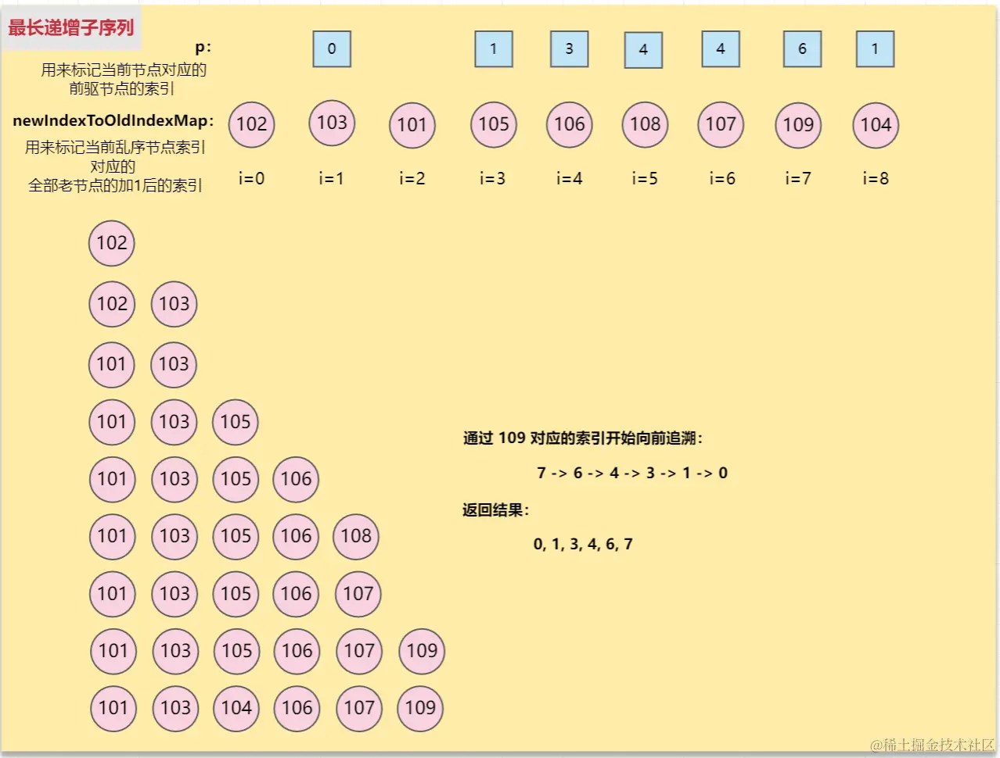

# 最长上升子序列

## 零、参考
* [Vue3 Diff算法之最长递增子序列，学不会来砍我](https://juejin.cn/post/7324862242335834164)
* [多图讲解Vue3的diff算法最长递增子序列实现原理](https://juejin.cn/post/7341007339217354764)

## 一、大体思路
规律(思路)是：(注：结果集中存储的是都是下标，不是原数组的数据)
1. 遍历原数组，比对当前值与结果集最后一位
2. 如果当前值大，则推入结果集(注意，是推入，即拓宽结果集)
3. 如果当前值小，则用二分法(这也是一个优化)去找结果集中比当前值大的项，然后(用当前值在原数组中的下标)替换掉结果集中的结果
4. 前驱节点追溯，替换掉错误的节点 - 这是对第 3 步的修正

## 二、最简单(理想)的情况
```js
let origin = [10, 11, 12, 13, 14, 15, 16, 0];

function getSequence(origin = []) {
  const result = [0]; // 默认以数组中第 0 个为基准来做序列，注意[存放的是数组索引]
  const len = origin.length;
  let resultLastIndex; // 结果集中最后一位的数据，而结果集记录的是数据在 origin 数组中的下标

  for (let i = 0; i < len; i++) {
    const current = origin[i];
    
    // if (arrI !== 0) { // 在vue newIndexToOldIndexMap 中，0代表需要创建新元素，无需进行位置移动操作，此处不需要，先行注释掉
    resultLastIndex = result[result.length - 1];
    
    if (current > origin[resultLastIndex]) { // 对应规律(思路) 2
      result.push(i);
      
      continue;
    }
    // }
  }

  return result;
}

let idxArr = getSequence(origin);
let rst = idxArr.map(idx => origin[idx]);

console.log(rst);
```

## 三、贪心 + 二分处理的情况
在最理想的情况之上处理规律(思路) 3
```js
let origin = [10, 11, 12, 13, 14, 15, 16, 0];

function getSequence(origin = []) {
  const result = [0]; // 默认以数组中第 0 个为基准来做序列，注意[存放的是数组索引]
  const len = origin.length;
  let resultLastIndex; // 结果集中最后一位的数据，而结果集记录的是数据在 origin 数组中的下标
  let start, end, middle;

  for (let i = 0; i < len; i++) {
    const current = origin[i];
    
    // if (arrI !== 0) { // 在vue newIndexToOldIndexMap 中，0代表需要创建新元素，无需进行位置移动操作，此处不需要，先行注释掉
    resultLastIndex = result[result.length - 1];
    
    if (current > origin[resultLastIndex]) { // 对应规律(思路) 2
      result.push(i);
      
      continue;
    }

    // 通过二分查找，在结果集中找到仅大于当前值的（所有大于当前值的结果中的最小值），用当前值的索引将其替换掉
    // 二分运算，对应规律(思路) 3
    start = 0;
    end = result.length - 1;

    while (start < end) {
      middle = ((start + end) / 2) | 0; // 向下取整

      if (current > origin[result[middle]]) {
        start = middle + 1;
      } else {
        end = middle;
      }
    }

    // 进行替换
    if (current < origin[result[end]]) {
      result[end] = i;
    }
    // }
  }

  return result;
}


let idxArr = getSequence(origin);
let rst = idxArr.map(idx => origin[idx]);

console.log(rst);
```

## 四、前驱节点追溯处理的情况
贪心 + 二分处理的场景覆盖了所有情况，但是这里有个问题：如果源数组是 ```[102, 103, 101, 105, 106, 108, 107, 109, 104] ，那么筛选出的子序列是 [101, 103, 104, 106, 107, 109]```，
而正确的应该是 ```[102, 103, 105, 106, 107, 109]``` ，即长度没问题，内部数据确是错的

所以，需要引入一个回溯列表 p，来记录一些数据，其长度和 origin 数组长度一致，所有位置上均为 0，这个数组记录的也是数据在 origin 中的下标，如果当前数据进入到了结果集，则记录下(结果集中)前值(具体看代码和图示)


```js
let origin = [102, 103, 101, 105, 106, 108, 107, 109, 104];

function getSequence(origin = []) {
  const result = [0]; // 默认以数组中第 0 个为基准来做序列，注意[存放的是数组索引]
  const len = origin.length;
  const p = new Array(len).fill(0);  // 最后要标记索引，放的东西不用关心，但是要和源数组一样长
  // const p = Array.from({ length: len }, () => 0); // 另外一种写法
  let resultLastIndex; // 结果集中最后一位的数据，而结果集记录的是数据在 origin 数组中的下标
  let start, end, middle;

  for (let i = 0; i < len; i++) {
    const current = origin[i];
    
    // if (current !== 0) { // 在vue newIndexToOldIndexMap 中，0代表需要创建新元素，无需进行位置移动操作，此处不需要，先行注释掉
    resultLastIndex = result[result.length - 1];
    
    if (current > origin[resultLastIndex]) { // 对应规律(思路) 2
      result.push(i);
      p[i] = resultLastIndex; // 当前放到末尾的要记录他前面的索引，用于追溯

      continue;
    }

    // 通过二分查找，在结果集中找到仅大于当前值的（所有大于当前值的结果中的最小值），用当前值的索引将其替换掉
    start = 0;
    end = result.length - 1;

    while (start < end) {
      middle = ((start + end) / 2) | 0; // 向下取整

      if (current > origin[result[middle]]) {
        start = middle + 1;
      } else {
        end = middle;
      }
    }

    if (current < origin[result[end]]) {
      result[end] = i;

      p[i] = result[end - 1]; // 记住前值, 其实就是和 p[i] = resultLastIndex; 这句在不同的逻辑分支上
    }
    // }
  }

  // 对应规律(思路) 4，从 p 的末尾开始回溯修正
  let i = result.length;
  let last = result[i - 1];

  while(i-- > 0) {
    result[i] = last;
    last = p[last];
  }

  return result;
}

let result = getSequence(origin);

console.log(result.map(r => origin[r]))
```
