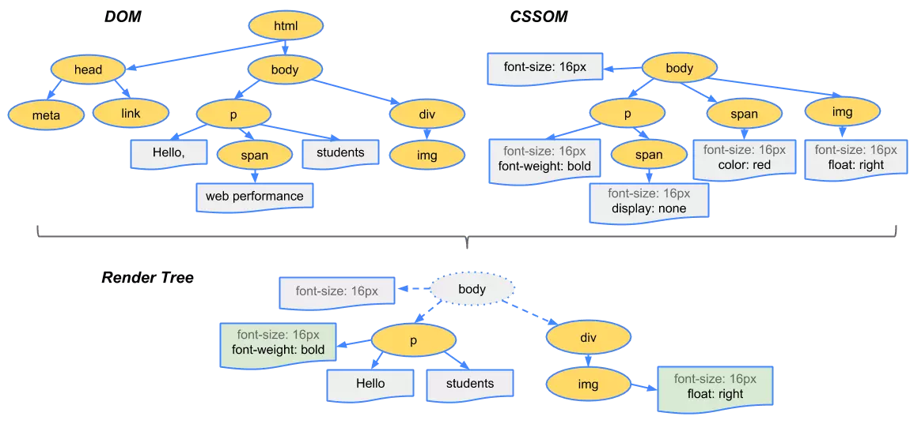

# 浏览器 回流与重绘

## 零、参考
* [你真的了解回流与重绘吗](https://www.cnblogs.com/chenjg/p/10099886.html) - [陈纪庚](https://juejin.cn/post/6844903779700047885)

## 一、序言
回流和重绘，浏览器(客户端)优化的重要思考方向之一，同时也将会是面试隐藏 boss，不过，要说难，排除掉浏览器底层渲染原理后也并不是那么困难。作为进阶资料，还是有必要掌握的  

先说核心结论：<strong><font color=red>回流一定会触发重绘，而重绘不一定会回流</font></strong>

## 二、浏览器的渲染过程
  

上图是浏览器的渲染过程模型，我们可以看到过程：
* 解析 HTML ，生成 DOM 树，解析 CSS，生成 CSSOM 树；
* 将 DOM 树和 CSSOM 树结合，生成渲染树(Render Tree)；
* Layout(回流)：根据渲染树，进行回流(Layout)，得到节点的几何信息(位置， 大小等)；
* Painting(重绘)：根据渲染树以及回流得到的几何信息，得到节点的绝对像素；
* Display：将像素发送给 GPU，展示在页面上。（这一步其实还有很多内容，比如会在GPU将多个合成层合并为同一个层，并展示在页面中。而css3硬件加速的原理则是新建合成层，这里不展开）

### 生成渲染树
  

在构建渲染树的过程中，浏览器会遍历 DOM 树的<strong>可见节点</strong>并在 CSSOM 中找到对应的规则后应用，然后生成渲染树（渲染树上只存在可见节点）  

其中，不可见节点有：
* 不会渲染的节点，比如 script、meta、link 等
* 通过 CSS 进行隐藏的节点，如 ```display:none```。在这里需要注意的是，只有 ```display:none``` 的节点才不会显示在渲染树上，而通过 visibility 和 opacity 隐藏的节点，还是会显示在渲染树上的

### 回流
在构造渲染树阶段，浏览器将可见DOM节点以及它对应的样式结合起来，但是，还需要计算他们在设备视口（viewport）内的确切位置和大小，这个计算的阶段就是回流。比如：
```html
<!DOCTYPE html>
<html>
  <head>
    <meta name="viewport" content="width=device-width,initial-scale=1">
    <title>Hello world!</title>
  </head>
  <body>
    <div style="width: 50%">
      <div style="width: 50%">Hello world!</div>
    </div>
  </body>
</html>
```
在这个文档中，样式均是百分比的形式，而在回流(layout)阶段，浏览器会计算并转换成实际像素值

### 重绘
最终，浏览器知道了所有可见节点，以及他们的样式和具体几何信息，那么接下来就可以将渲染树的每个节点都转换为屏幕上的实际像素，这个阶段就是重绘

### 何时发生回流重绘
回流阶段主要是计算节点的位置和几何信息，那么如果页面布局和几何信息发生变化时，就需要回流。比如以下情况：
* 页面第一次渲染
* 添加或者删除可见 DOM 节点
* 元素位置发生变化
* 元素尺寸变化（包括内外边距、边框大小、宽高等）
* 内容发生变化，如文本变化、图片替换
* 浏览器尺寸变化

重绘的发生比较简单，不涉及位置和几何信息的变化触发重绘，如改变文字颜色、背景色、visibility等

## 三、优化手段
### 浏览器的优化
在现代浏览器的开发过程中都或多或少地考虑过这方面引起的性能问题，也相应地做了部分优化。大多数浏览器采用的策略是队列形式。浏览器将修改操作 push 到一个队列中，直到达到一个阈值或者达到一定的事件，进行一次清空队列并回流。但是，当我们在获取布局信息的操作的时候，会首先强制进行一次回流清空队列操作，如：
* offsetTop、offsetLeft、offsetWidth、offsetHeight
* scrollTop、scrollLeft、scrollWidth、scrollHeight
* clientTop、clientLeft、clientWidth、clientHeight
* getComputedStyle
* getBoundingClientRect
* ...

以上属性在调用都需要返回最新的布局信息，因此，浏览器会强行清空一次队列，触发回流来返回正确的值。因此，在修改样式的时候，尽量避免调用上面的属性，或者将其缓存起来

### 减少回流和重绘

#### 最小化重绘和回流
减少对 dom 和 css 样式的修改，或者将修改合并在一次然后作用于 dom / css 上，如：
```js
const el = document.getElementById('test');

el.style.padding = '5px';
el.style.borderLeft = '1px';
el.style.borderRight = '2px';
```

我们分别对 css 做了三次修改，虽然修改的是不同的方面，当这三个方面都属于几何结构，因此会引起回流。现代浏览器的优化策略可能只进行一次回流，但是旧式浏览器在面对上述代码时会触发三次回流  

因此，我们可以自行合并某些操作：
* 使用 cssText（简单讲就是将所有修改合并成一串字符串）：
```js
const el = document.getElementById('test');

el.style.cssText += 'border-left: 1px; border-right: 2px; padding: 5px;';
```
* 增删相应的 class / id / 自定义属性，使元素获取已经存在的 css 规则：
```js
const el = document.getElementById('test');

el.className += ' active';
```

#### 批量修改DOM
当我们需要对 DOM 进行一系列修改的时候，可以通过下列步骤减少重绘次数：
1. 将元素脱离文档流（是的，你没看错）
2. 对其进行多次修改；
3. 将元素带回文档流中；  

过程一和三会引起回流，但是在后续修改中，对 DOM 的所用修改均不会引起回流，因为该元素已经不再渲染树中了，具体的做法如下：
* 隐藏元素 -> 应用修改 -> 重新显示
* 使用文档片段（document fragment）在当前 DOM 树之外构建子树，在把它拷贝进 DOM 树
* 将原始元素拷贝到一个脱离文档的节点中，修改节点后，再替换原始的元素  

下面是一个优化例子：
```js
function appendDataToElement(appendToElement, data) {
  let li;
  for (let i = 0; i < data.length; i++) {
    li = document.createElement('li');
    li.textContent = 'text';
    appendToElement.appendChild(li);
  }
}
 
const ul = document.getElementById('list');

appendDataToElement(ul, data);
```

如果我们直接执行的话，每一次循环都会插入一个新的节点，每次循环浏览器都会回流一次。我们使用如下的三种方式进行优化：

```js
// 方式一：隐藏元素，应用修改，重新显示
function appendDataToElement(appendToElement, data) {
  let li;
  for (let i = 0; i < data.length; i++) {
    li = document.createElement('li');
    li.textContent = 'text';
    appendToElement.appendChild(li);
  }
}
const ul = document.getElementById('list');
// 隐藏元素
ul.style.display = 'none';
// 修改 dom
appendDataToElement(ul, data);
// 显示元素
ul.style.display = 'block';


// 方式二：使用文档片段构建子树，在插入到 DOM 中去
const ul = document.getElementById('list');
// 构建碎片子树
const fragment = document.createDocumentFragment();

appendDataToElement(fragment, data);
// 子树插入到 dom 中去
ul.appendChild(fragment);


// 方式三：将原始元素拷贝到一个脱离文档的节点中，修改节点后，再替换原始的元素
const ul = document.getElementById('list');
// 拷贝
const clone = ul.cloneNode(true);

appendDataToElement(clone, data);
// 替换
ul.parentNode.replaceChild(clone, ul);
```

不过，批量修改 DOM 这个方案在现代浏览器上用处倒不是很大，原因之前也说过，浏览器自身的优化策略。但是我们可以以此为标准，提升自己的代码习惯

#### 避免触发同步布局时间
上面提到，在访问元素的某些属性的时候，会导致浏览器强制清空队列，进行一次回流，比如：
```js
function initP() {
  for (let i = 0; i < paragraphs.length; i++) {
    paragraphs[i].style.width = box.offsetWidth + 'px';
  }
}
```
每一个循环中，都会读取 ```box``` 的 ```offsetWidth``` 属性，这时会强制一次回流，然后设置 ```style.width```，然后进入下一个循环。但是这边存在的性能问题是：浏览器必须先使得上一次循环中的样式更新操作生效，才能响应本次循环的样式读取操作。即，每次循环都会强制浏览器刷新队列，因此，我们可以这样优化：
```js
const width = box.offsetWidth;

function initP() {
  for (let i = 0; i < paragraphs.length; i++) {
    paragraphs[i].style.width = width + 'px';
  }
}
```

#### 复杂动画，使用绝对定位使其脱离文档流
复杂动画是一定会引起回流的，但是，我们可以使用绝对定位，将其脱离文档流，限制回流影响的元素范围，即将影响控制在自身，避免父元素以及后续元素的频繁回流，这对元素繁多的 dom 树的优化是一个非常有效的手段

#### css3 硬件加速
css 3 硬件加速这个也不是很懂，掠过略过...
