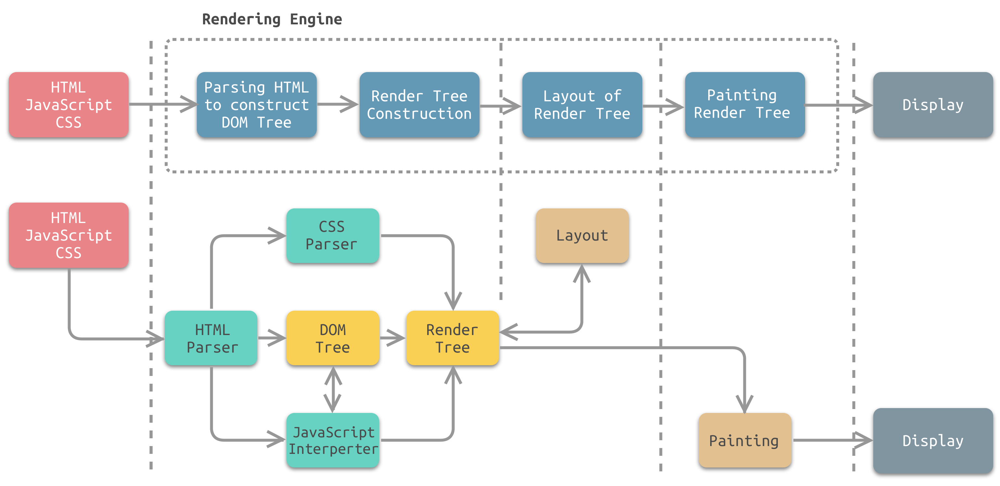
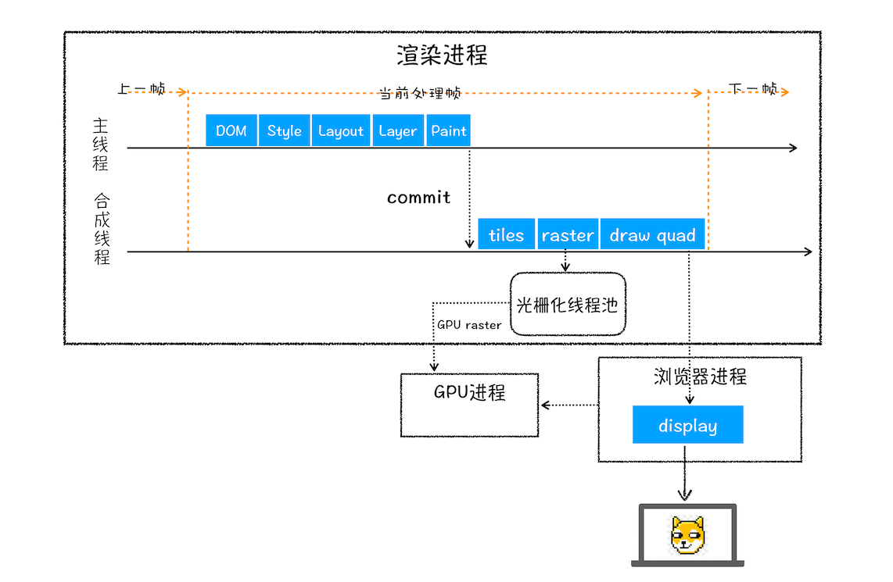
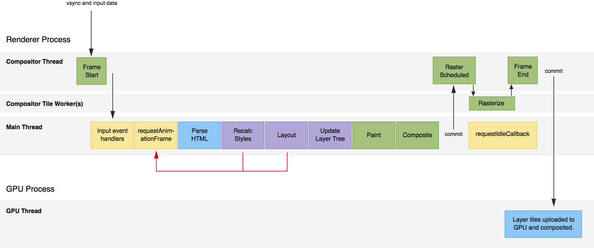

# 浏览器 渲染

## 零、参考
* [浏览器渲染详细过程：重绘、重排和 composite 只是冰山一角](https://juejin.cn/post/6844903476506394638)
* [浏览器渲染原理](https://juejin.cn/post/6844904024894865416)
* [画了20张图，详解浏览器渲染引擎工作原理](https://juejin.cn/post/7018358245785862151)

## 一、进程与线程
* 这玩意是软件工程的部分，只需要知道点基础：
  1. 一个软件由一个或多个进程组成，进程间无法共享数据，也无法直接通信，需要通过管道、文件、套接字等方法
  2. 一个进程由一个或多个线程组成，同一进程内的多个线程会共享部分状态，多个线程可以读写同一块内存。同时，每个线程还拥有自己的寄存器和栈，其他线程可以读写这些栈内存

* 现代浏览器一般有四个进程：
  1. Browser 主进程：负责协调、主控，只有一个，主要负责：
     * 浏览器界面显示，与用户交互，如前进，后退等；
     * 各个页面的管理，创建和销毁其他进程；
     * Renderer进程得到的内存中的Bitmap，绘制到用户界面上；
     * 网络资源的管理，下载等；
  2. CPU进程：用于3D绘制等，可禁用掉，只有一个
  3. 第三方插件进程：每种类型的插件对应一个进程，仅当使用该插件时才创建
  4. 浏览器渲染进程(浏览器内核 - render进程)：主要负责页面渲染、脚本执行、事件处理等。每一个标签页的打开都会创建一个 Render 进程，并且互不影响。这也是与前端开发(JS/CSS/HTML)最相关的进程
  
## 二、浏览器渲染进程(浏览器内核 - render进程)
这个进程中一般会包含 5 个线程：
1. GUI 渲染线程，有且只有一个，主要负责：
   * 渲染浏览器界面，解析 HTML，CSS，构建 DOM 树和 RenderObject 树，布局和绘制等
   * 重绘(repaint)时或者回流(reflow)
2. JS 引擎线程，有且只有一个，主要负责： 
   * 解析 Javascript 脚本，运行代码
   * 任务队列中的任务，然后加以处理
3. 事件触发线程(event lop)
   * 这个线程由浏览器控制
   * 当 JS 引擎执行代码块如 setTimeOut 时(也可来自浏览器内核的其他线程，如鼠标点击、AJAX异步请求等)，会将对应任务添加到事件线程中
   * 当对应的事件符合触发条件被触发时，该线程会把事件添加到待处理队列的队尾，等待 JS 引擎的处理
4. 定时触发器线程 
   * 传说中的 setInterval 与 setTimeout 所在线程，计算这两函数的时间，即这两函数的第二个参数
   * 计时完毕后，将 callback 加入事件队列中，等待 JS引擎执行
5. 异步http请求线程 - 这个线程和网络进程的关系有待研究 
   * XMLHttpRequest 在连接后是通过浏览器新开一个线程请求
   * 将检测到状态变更时，如果设置有回调函数，异步线程就产生状态变更事件，将这个回调再放入事件队列中。再由 JavaScript 引擎执行

关系：
1. GUI 线程和 JS 引擎线程是互斥的 - 这点非常重要
2. 基于第 1 点，如果 JS 引擎执行时间很久，就会引发页面阻塞，而一般浏览器每 16ms 左右会重新渲染一次，以达到 60Hz 的基本刷新率
3. HTML5中支持了 Web Worker，以解决页面阻塞，但是 Web Worker 是 JS 引擎子线程，受 JS 引擎控制，JS 单线程依旧不会改变

## 三、浏览器的整个渲染流程
#### 资源请求
1. 浏览器输入 URL，浏览器主线程接管，开一个下载线程，已进行 http 请求
2. 拿到响应内容，将内容通过 RendererHost 接口转交给 Renderer 渲染进程
3. 浏览器开始渲染

#### 资源请求


1. 解析 HTML 并建立 Dom 树；
2. 下载 css 资源，并建立 CSSOM 树；
3. 以上两个步骤完成后，才进入渲染树的构建阶段，这个阶段主要完成 DOM 树和 CSSOM 的合并，浏览器的工作大致是：遍历 DOM 树中所有节点，并把这些节点加到布局中，而不可见的节点会被布局树忽略掉，如 head 标签下面的全部内容，以及 display: none 的节点。这个步骤结束以后会生成一个渲染树(render tree)；
4. 布局树(layout tree)，这个步骤其实也可以笼统地算在第 3 步中，这一步主要是计算渲染树中每个真实节点的宽高、位置等信息；
5. 至此，所有的树形结构基本已经生成，然后浏览器会根据自身的策略进行分层，滚动条、堆叠上下文、transform、opacity 等样式都会或多或少的影响分层结果，也可以通过 will-change 属性更大程度的影响分层结果，分层步骤也有许多细节，但是和前端关联度有限，就不单列出来；
6. 经过分层之后，进入到绘制(paint)步骤，这个步骤，是为每一层生成绘制的指令(而不是真的去画出来)。这个步骤结束后，渲染主线程的工作结束，剩余步骤交给其他线程来完成(如合成线程)；
7. 合成(composite)线程又分很多小步骤，如分块，光栅化，成像(画)等，这些与硬件关联度较大，与前端的关联度不大。只要知道 css3 的 transform 作用在这一层，与渲染主线程没多大关系，所以效率高

注意：
1. 在解析 HTML 的过程中，会遇到 script 下载 & 解析，这里是会阻塞 HTML 的解析过程，详细见 async / defer 属性在 script 标签上的应用优化
2. 因为 js 的某些运算需要用到具体的 css，而 css 资源如果仍然是在下载中的(或者说 CSSOM 没有形成)，就会阻塞 js 的运行
3. 如果没有 js 的阻塞，那么 html 的解析过程和 CSSOM 的建立过程是没有关系的(这样的情况在现在看来十分少见)

## 四、渲染帧
由于现在广泛使用的屏幕都有固定的刷新率(比如最新的一般在 60Hz)，在两次硬件刷新之间浏览器进行两次重绘是没有意义的只会消耗性能。 浏览器会利用这个间隔 16ms(1000ms/60) 适当地对绘制进行节流，因此 16ms 就成为页面渲染优化的一个关键时间。尤其在异步渲染中，要利用流式渲染就必须考虑到这个渲染帧间隔

一些注意点：
* 一个渲染帧内 commit 的多次 DOM 改动会被合并渲染
* 耗时 JS 会造成丢帧

### 渲染帧的流程
* 简单一点的：
  
* 详细一点的(具体移步: [浏览器渲染详细过程：重绘、重排和 composite 只是冰山一角](https://juejin.cn/post/6844903476506394638))：
  

### 流程注意点
* Input event handlers: 处理上一帧触发的用户交互，并触发回调。这意味着上一帧可能会产生多次交互，但是只会在下一帧才触发回调，且同一种交互只会在一帧中最多执行一次回调(即自带了间隔为 16ms 左右的节流)
* requestAnimationFrame: raf，图片中的红线说的是，在 raf 回调中可能会通过 js 操作 css(获取宽高)，因此会触发强制重排(回流，Force Layout)，导致 Re-calc Styles 和 Layout 前移到代码执行过程当中(虽然说是前移，但不意味着后续的 Re-calc Styles 和 Layout 会省略，其实用 Force Layout 来解释这个过程会更清晰一点)
* 上面两个因为涉及到了 js 的执行，而如果 js 执行时间太长的话，就可能造成丢帧
* parse HTML: 如果有 DOM 变动，那么会有解析 DOM 的这一过程
* Re-calc Styles: 如果在 JS 执行过程中修改了样式或者改动了 DOM ，那么便会执行这一步，重新计算指定元素及其子元素的样式
* Layout：常说的重排(reflow)。如果有涉及元素位置信息的 DOM 改动或者样式改动，那么浏览器会重新计算所有元素的位置、尺寸信息。而单纯修改 color、background 等等则不会触发重排
* update layer tree: 这一步实际是更新 Render Layer 的层叠排序关系，也就是我们之前说的为了搞定层叠上下文搞出的那个东西，因为之前更新了相关样式信息和重排，所以层叠情况也可能变动
* commit to GPU，帧与帧之间只会有一次，算是浏览器的优化手段吧
* 注意 requestIdleCallback 在每帧内的执行时机

## 五、其他
会触发重排的属性和方法：

### Element/Window
```
innerText,outerText,
clientHeight,clientLeft,clientTop,clientWidth,
offsetHeight,offsetLeft,offsetParent,offsetTop,offsetWidth,
scrollLeft,scrollTop,scrollWidth,scrollHeight,scrollX,scrollY,scrollIntoView(),scrollBy(),scrollTo(),
focus(),getComputedStyle(),
```
### Frame,Image
```
height, width
```
### SVG
```
getBBox()
```
