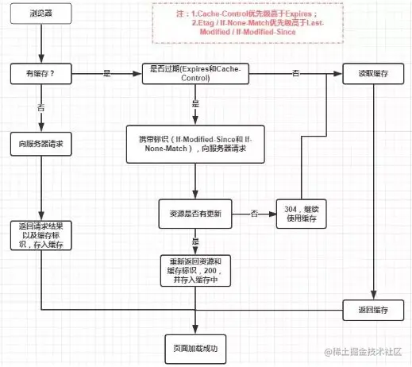

# 浏览器 缓存策略

## 零、参考
* [你了解浏览器原理吗？浏览器的缓存机制及缓存策略是什么？](https://juejin.cn/post/7155061544538243108)

## 一、基础原理
浏览器与服务器之间的通信大都是基于 HTTP 协议进行的，所以浏览器的缓存机制/策略也是基于 HTTP 报文(Header)进行的。  
通常，浏览器的缓存策略分为两种：
* **强缓存**：Client 向 Server 第二次请求相同资源时，Client 根据一些标识从内存/磁盘中读取之前的数据，并不向服务器发送请求
* **协商缓存**：Client 向 Server 第二次请求相同资源时，Client 发送请求，但是询问的是缓存文件和 Server 端的文件是否有更改，如果有，则使用 Server 返回的新的数据，如果没有更改，则使用内存/磁盘中的缓存文件

在这两种策略的选择上，强缓存策略优先于强缓存策略

## 二、强缓存策略
两个标识符：```Cache-Control``` 和 ```Expires```。均由 Server 设置于 HTTP Header 中，且 ```Cache-Control``` 优先于 ```Expires```。

### Cache-Control
在 HTTP/1.1 版本中，这是强缓存的主要控制字符，有很多值，可组合使用，具体可移步 [MDN](https://developer.mozilla.org/zh-CN/docs/Web/HTTP/Reference/Headers/Cache-Control)，这里仅记录一下常用的和易误解的几个：
* private: 默认值，表明请求内容只能被 Client 缓存，不能作为共享缓存（即中间的所有代理服务器 proxy 不能缓存）
* public: 请求内容可以被所有经过的服务器缓存(包括代理服务器 proxy)
* no-store: 请求内容不被任何节点缓存，无论是代理服务器 proxy 还是客户端 Client
* no-cache: 这个是最具有迷惑性的，表示是否使用缓存要经过**协商缓存**来验证决定

### Expires
缓存过期时间，用来指定资源到期的时间，是一个时间点，没有到这个时间点，则命中强缓存，超过了，则表示缓存失效
> HTTP 1.0 的产物，有个明显的缺点是浏览器会使用本地系统的时间点来进行比对，而系统的时间则是可以自由设置的，这就容易出现很多问题

## 三、协商缓存策略
### If-Modified-Since / Last-Modified
* Last-Modified：浏览器在第一次访问资源的情况下，服务器会在返回资源的同时，在 response header 中添加 Last-Modified 字段，其值就是该资源在服务器中最后的修改时间
* If-Modified-Since：浏览器在重复请求一个资源时，如果检测到 Last-Modified 这个 Header，则添加该字段，其值为 Last-Modified 中的值；而服务器则会将该值与真实资源的最后修改时间对比，如果没有变化则返回 304 和空的响应体，浏览器读取缓存，否则表示资源有更新，返回 200 和新的资源

但是 Last-Modified 有一些弊端：
* 如果在服务器上打开资源，即使没有进行修改，该资源的 Last-Modified 是会被变更的
* Last-Modified 以秒为单位进行计时，于是如果在不可感知的时间内完成资源修改，会认为该资源未被更新，从而不能返回正确的资源

### ETag / If-None-Match
在 Http/1.1 中，使用 ETag / If-None-Match 来解决 If-Modified-Since / Last-Modified 的问题，基本就是 If-Modified-Since / Last-Modified 的升级版，优先级高于 If-Modified-Since / Last-Modified

* ETag：是服务器根据文件内容生成的指纹，如果内容改变了，就会生成新的指纹
* If-None-Match：浏览器在请求同一个资源的时候，会把上一次返回的 ETag 的值放进去，发给服务器进行校验，服务器根据最终校验结果返回 304 / 200

## 四、整体缓存策略
  
