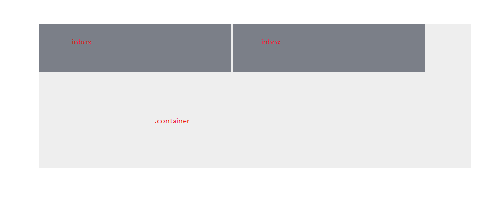

# CSS inline-block 盒子下的内容文字错位问题

## 零、序言
* [“display:block-inline形式的Span或Div中添加文字后，导致Span或Div排版掉落、错位”的原因及解决方法](https://blog.csdn.net/Esther_Heesch/article/details/51340730)

## 一、问题及解决方案
场景：两个 div 排在一行上，各有固定宽高，其中有一个 div 内部有文字和排版等其他填充；两个 div 杂七杂八的宽度加起来远小于 father 宽度。

拿到设计图之后，略想了一下，这不 so easy 么，既然有足够的宽度空间，那不就是随意发挥么：两 son 变 inline-block，那个有内容的 div 内或 padding ，或 flex，大致弄个上下等距不就 ok  了么，正好前面的人用 table-cell 来垂直居中，可以试试。然而事实证明太 naive 了，inline-block 中就藏了一个坑

首先是思路中的效果：
```html
<style>
.container {
  width: 900px;
  height: 300px;
  background-color: #eee;
  margin: 100px auto;
}
 
.inbox {
  display: inline-block;
  width: 400px;
  height: 100px;
  background-color: #7b7f88;
}
</style>
 
<div class="container">
  <div class="inbox"></div>
  <div class="inbox"></div>
</div>
```



很快啊，上面没什么问题（因为父元素的宽度足够，两个子元素之间的间隙可以忽略，当然这里也会出现隐藏坑，后叙）。于是很开心地去填充内容了，dom 结构变成：
```html
<div class="container">
  <div class="inbox"></div>
  <div class="inbox">
    <div>
      <h2>55</h2>
    </div>
  </div>
</div>
```

愉快地 ctrl + s 之后 F5，然后就懵逼了，这不对啊，怎么成这样了，刚才不还好好的么，就加了句话？？?


于是经过翻山越岭地 Google baidu 之后，找到了参考中的资料：css 有个属性 vertical-align，它只在 display为 inline 或者 inline-block 的情况下起作用，默认值是 baseline。这意味着把元素设置成 inline(-block) 的时候，内部的文字会按照基线对齐，这也是为什么用尺子量，“55” 正好切了前一个 inbox 的 bottom。

那解决办法就简单了，每个 inbox 设置 vertical-align: top（如果父元素的高度是撑开的话，设置成middle、bottom、text-bottom、text-top 都可以），就可以回归思路，如下图：


## 二、其他：
在第一张图我们也看到， inline-block 的盒子之间是存在一点间隙的，这个问题和 HTML 的结构有关。正如上面我们贴的代码，两个 inbox 之间有一个换行，而浏览器在解释的时候遇到 inline(-block) 会把这个换行符解释成一个空白文本节点，这在视觉上就出现了间隙。解决办法有很多，贴两个常见的：
  1. 代码写一行上，不过不利于维护；
  2. 父元素设置 font-size: 0，子元素重新设置字体大小；

各有优缺点，按需取用
