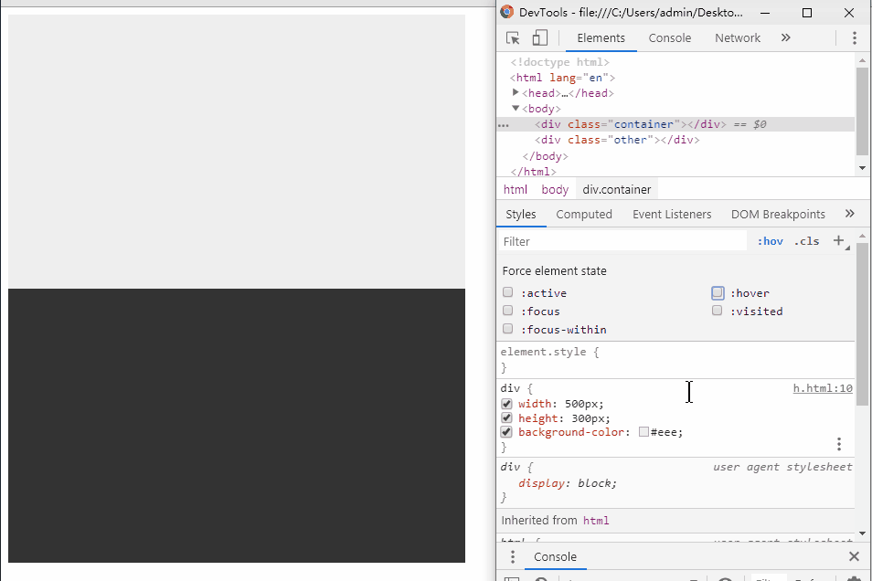
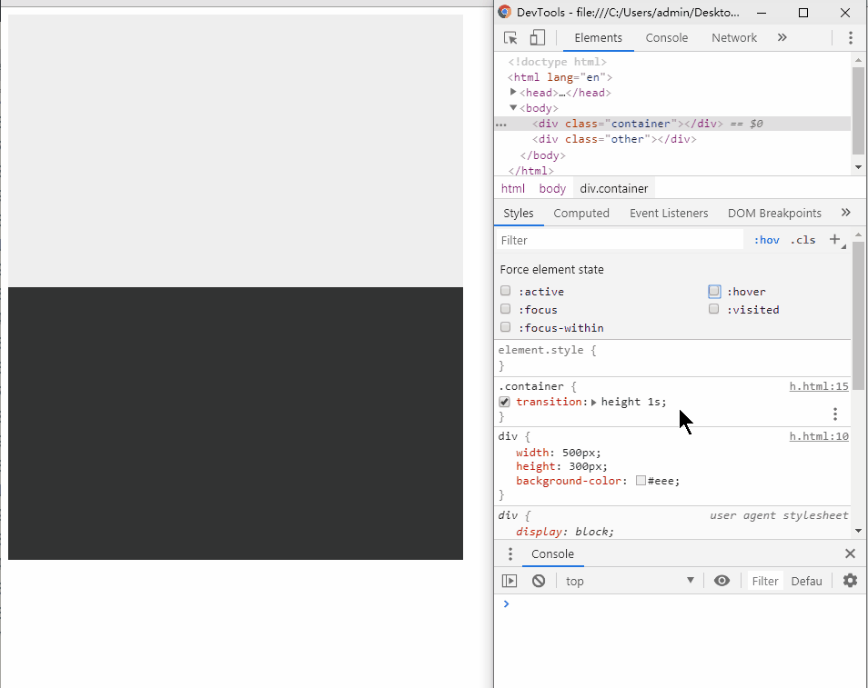
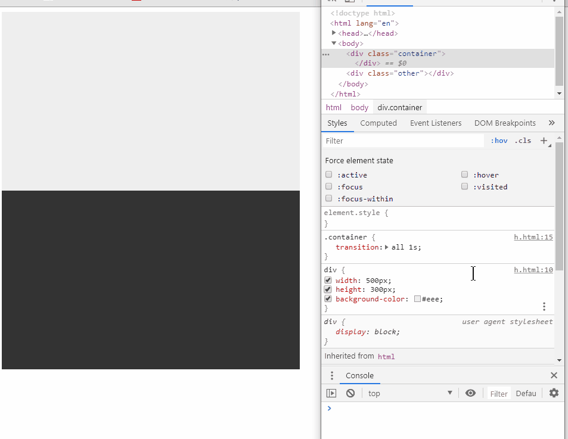
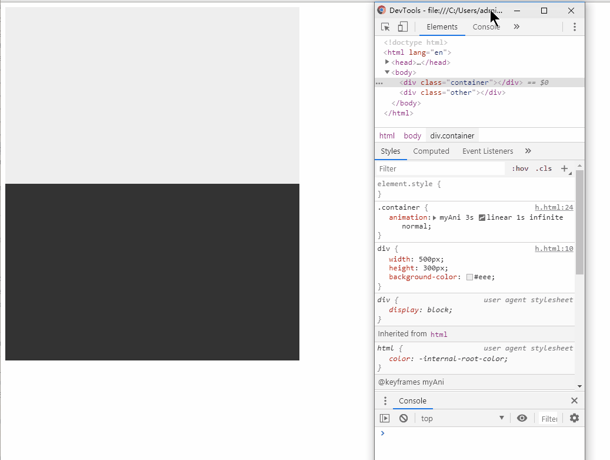

# CSS transform, transition

## 零、序言
CSS3 的新特性，很很多都停留在听说而非实际使用。transform， transition， translate 这三长得实在太像，刚开始的时候总是迷迷糊糊，分不清它们的功能。而最近新接入的项目以视觉效果为主，故也算是被动弄清基础含义  

先说结论，transform 与 transitions 是属性，如同 border、width 一样，我们可以手动设置其值以达到效果；translate 是 transform 的其中一个值，如同 auto 是 width 是其中的一个值一样

## 一、transform 转变
这是一个静态的属性，如同 border 一样，设置之后立即改变，改变不需要时间参与。它的作用是专注于改变元素基于默认位置的某些状态（如平移、缩放、旋转等），如下案例：
```html
<style>
div {
  width: 100%;
  height: 300px;
}
.container:hover {
  /* transform: scale(2,2) */
  transform: translateY(50%)
}

.other {
  background-color: #333;
}
</style>
 
<div class="container"></div>
<div class="other"></div>
```

  

从上例中，我们可以看出，```transform``` 是突变的，并且它转变之后并不挤压其他元素在文档流中的位置。

至于 ```transform``` 有哪些值，我们可以参看 [MDN](https://developer.mozilla.org/zh-CN/docs/Web/CSS/transform)。

## 二、transition 过渡
相对于 ```transform```，```transition``` 则引入了时间概念，因此这不再是突变，而是当它所绑定的属性（比如width）发生改变的时候，会根据速度曲线慢慢变化。如下例：
```html
<style>
div {
  width: 100%;
  height: 300px;
}
.container {
  transition: height 1s;
}
.container:hover {
  height: 700px;
}
.other {
  background-color: #333;
}
</style>
 
<div class="container"></div>
<div class="other"></div>
```

  

从上面我们可以看出，```transition``` 绑定的是元素某一个已经存在的属性值，这个属性值再某种状态下发生了变化，而 ```transition``` 专注于将这种改变添加个速度曲线，使得元素平滑转变，不显得很突兀。

从上图中我们也可以看出，因为 ```transition``` 过渡中某些属性被修改了，必然引起布局上的变化，这个有好处也有坏处，至于是看重效果还是看重性能，则需根据实际情况来定。

（这里有个建议，上例中，```transition``` 是写在 ```.container{}``` 中的，因此，在鼠标移出之后也会有个平滑地回退过程，而将 ```transition``` 写在 .```container:hover {}``` 中，鼠标移出后不会有平滑回退）

当然，如同其他属性一样，```transition``` 支持嵌套：
```html
<style>
div {
  width: 100%;
  height: 300px;
}
.container {
  transition: height 1s;
}
.child {
  width: 100px;
  height: 100px;
  background-color: red;
  transition: all 1s;
}
.container:hover .child {
  width: 300px;
}
.container:hover {
  height: 400px;
}
</style>
 
 
<div class="container">
  <div class="child"></div> 
</div>
<div class="other"></div>
```

另外，不是所有的 css 属性都能 ```transition```，比如 ```transition: display``` 就不会生效。只有“[可被用于动画的属性](https://developer.mozilla.org/en-US/docs/Web/CSS/CSS_animated_properties)” 才能够生效

## 三、混合使用
很多成熟的网站上，这两者经常混合使用，从而形成了一种动画效果。当然，这并不是真正的动画，此外，正是因为混合使用，所以在初学的时候贼容易搞混，加上单词又长得很像，就容易迷糊。当然了，混合使用的时候也容易出现各种各样的坑，故一定要耐心调试...
  
下面是一个简单的 demo:
```html
<style>
div {
  width: 100%;
  height: 300px;
}
.container {
  transition: all 1s;
}
.container:hover {
  transform: translateY(50%);
  height: 400px;
}
</style>
 
<div class="container"></div>
<div class="other"></div>
```



这个例子中，设置 ```.container``` 沿 y 轴正向平移 50%，那么，猜一猜平移了多少 px ？ o(￣▽￣)ｄ

## 四、transition 与 animation
```animation``` 与 ```transition``` 一起于 CSS3 中引入，在用法上也与 ```transition``` 上很相似，甚至很多的属性值如动画曲线，执行时间等都一样。那么这两个有什么区别呢？

先从整体上，```transition``` 其实只有两个状态（关键帧），变化前的(start)和变化后的(end)，而 ```animation``` 则可以人为设置多个状态（关键帧），这一点上，我们可以做出更丰富的视觉效果；```transition``` 需要显式设定触发条件，如使用 hover，动态增加/删除 CSS 类来修改某些属性， ```animation``` 则不需要显式控制，一旦定义之后，它将自动开始执行。

从细节上来看，```transition``` 的触发方式决定了其不具有循环的特点，当然，使用 js 定时器来模拟循环也是一种思路，```animation``` 则自带循环设置，```animation-iteration-count``` 这个就可以指定循环重复次数；另外，```transition``` 是直接在定义语句中绑定属性值，如 ```transition：width 1s``` ，而 ```animation``` 定义语句中绑定的是动画名字，如 ```animation: yourAniName 1s ...```  ，再在 ```@keyframes``` 中的每个关键帧中描述需要改变的属性的值  

下面是一个简单的 demo:
```css
/* transition */
.container {
  height: 300px;
  transition: all 1s;
}
.container:hover {
  transform: translateY(50%);
  height: 400px;
}
 
 
/* animation */
.container {
  animation: myAni 3s linear 1s infinite normal;
}
@keyframes myAni {
  0%, 100% {
    height: 300px;
  }
 
  20%, 80% {
    height: 400px;
    width: 550px;
  }
 
  50% {
    height: 500px;
    width: 600px;
  }
}
```
  

## 五、最后
CSS3 的新特性，对于 IE 来说都做不到完美兼容，如果需要照顾老项目，优先不考虑 CSS3 的这些新特性。但是，对于新项目，使用这些新的特性绝对能够带来非凡的体验
