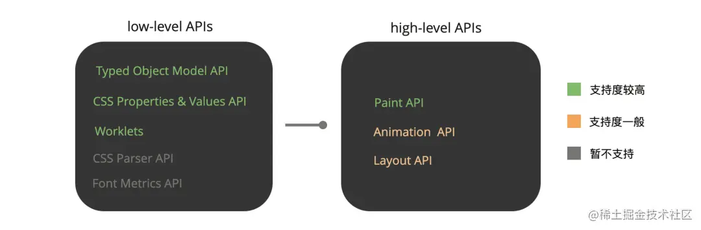
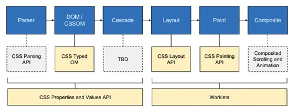

# CSS Houdini

## 零、参考
* [CSS Houdini：用浏览器引擎实现高级CSS效果](https://juejin.cn/post/7118920053348630542)
* [探索前端新领域：CSS Houdini API 的魅力](https://juejin.cn/post/7398408922362675200)
* [功能强大、值得关注的CSS Houdini API](https://mdnice.com/writing/37a7421e1c3d41acb07a6fa0ee948e82)
* [Houdini API](https://developer.mozilla.org/zh-CN/docs/Web/API/Houdini_APIs)
* [Houdini Samples](https://googlechromelabs.github.io/houdini-samples/)

## 一、Houdini 是什么
随着 CSS 规范在不断地更新迭代，越来越多有益的特性被纳入进来，但是一个新的CSS特性从被提出到成为一个稳定的 CSS 特性，需要经过漫长地等待，直到被大部分浏览器支持时，才能被开发者广泛地使用。  
而 Houdini 的出现正是洞察和解决了这一痛点，它将一系列 CSS 引擎 API 开放出来，让开发者可以通过 JavasScript 创造或者扩展现有的 CSS 特性，甚至创造自己的 CSS 渲染规则，给开发者更高的 CSS 开发自由度，实现更多复杂的效果。

## 二、总览
根据Houdini提供的规范说明文件，API共分为两种类型：high-level APIs 和 low-level APIs 。  


> 目前(2025.05.27) 这些 API 仍然处于实验阶段，浏览器兼容性以及更多 API 待开放和完善

* High-Level APIs: 直接参与浏览器的渲染流程
  1. Paint API: 提供了一组与绘制（Paint）过程相关的 API，我们可以通过它自定义的渲染规则，例如调整颜色（color）、边框（border）、背景（background）、形状等绘制规则。
  2. Animation API: 提供了一组与合成（composite）渲染相关的 API，我们可以通过它调整绘制层级和自定义动画。
  3. Layout API: 提供了一组与布局（Layout）过程相关的API，我们可以通过它自定义的布局规则，类似于实现诸如flex、grid等布局，自定义元素或子元素的对齐（alignment）、位置（position）等布局规则
* Low-Level APIs: High-Level APIs的实现基础
  1. Typed Object Model API
  2. CSS Properties & Values API
  3. Worklets
  4. Font Metrics API
  5. CSS Parser API

## 三、APIs
先放一张各 API 作用于渲染阶段的总图：  


### Typed Object Model API
这个算是基础中的基础，但是我们在实际情况中用到的其实也不是很多。  
在 Houdini 之前，我们通过 JS 来操作 CSS 的话，无论是 setter 还是 getter，其给出的数据类型都是 string，比如：
```js
// before Houdini

// setter
target.style.fontSize = 30 + 'px';
target.style.background = 'url(https://www.exampe.com/sample.png)';
target.style.cssText = 'font-size: 30px; background: url(https://www.exampe.com/sample.png)';

// getter
console.log(target el.style.fontSize); // string
```
这在实际开发过程中，为了节省性能，往往会将一长串的字符串传递给 cssText，可读性非常差。

而在 Houdini 之后，我们在 JS 中则多了一个属性 ```attributeStyleMap``` 和一个方法 ```computedStyleMap()```，用来代替之前直接在style对象上的操作。比如：
```js
el.attributeStyleMap.set('margin-top', '10px'); // string写法也没问题，向下兼容
el.attributeStyleMap.get('margin-top').value  // 10
el.attributeStyleMap.get('margin-top').unit // 'px'

el.attributeStyleMap.set('display', new CSSKeywordValue('initial'));
el.attributeStyleMap.get('display').value // 'initial'
el.attributeStyleMap.get('display').unit // undefined
```

#### attributeStyleMap & computedStyleMap
> 这两个 API 尚未在 MDN 中找到，应该是未标准化的，先记录下其他资料中的标注

* ```computedStyleMap``` 是一个 ```function```，其返回值是一个只读对象
* ```attributeStyleMap``` 得到一个对象，可以通过一些列的方法(```get、clear、has、delete、append```)去操作元素的样式

另外，```computedStyleMap``` 返回的是经过浏览器计算好的值，而 ```attributeStyleMap``` 得到的是原始 CSS 中的值，例如：
```
// css 中的写法
font-size: 5em;

// 通过 attributeStyleMap 得到的
target.attributeStyleMap.get("font-size"); // { value: 5, unit: "em"}

// 通过 computedStyleMap() 得到的
target.computedStyleMap().get("font-size"); // { value: 30, unit: "px"}
```

### CSS Properties & Values API
这个应该是目前应用最广泛的。  
在日常应用中，我们可以使用 CSS 变量(```CSS variables```) 来实现一定程度复用和代码简化。然而，在一些需要的场合，如果需要使用动画的话，这些 CSS 变量就无法胜任了，比如：  

```html
<!-- 需求：在 hover 时候，会有个切换颜色的过渡，并且这个变化有一个过渡效果 -->

<div id="container">container</div>

<style>
:root {
  --my-color: red;
}
 
#container {
  transition: --my-color 1s; /* 无效语句 */
  background-color: var(--my-color)
}
 
#container:hover {
  --my-color: blue;
}
</style>
```
要到达上面的效果，我们就可以对这个变量进行拓展，一般语法如下：
```js
// js 中通过 window.CSS.registerProperty api 进行拓展
window.CSS.registerProperty({
  name: "--my-prop",
  syntax: "<color>",
  inherits: false,
  initialValue: "#c0ffee",
});
```

```css
/* CSS 中使用 @property 进行拓展 */
@property --my-prop {
  syntax: "<color>";
  inherits: false;
  initial-value: #c0ffee;
}
```

于是，我们的改造：

```html
<div id="container">container</div>

<style>
/* 替换原来的 :root */
@property --my-color {
  syntax: "<color>";
  inherits: false;
  initial-value: #c0ffee;
}
 
#container {
  transition: --my-color 1s;
  background-color: var(--my-color);
}
 
#container:hover {
  --my-color: blue;
}
</style>
```

### Worklets
这个接口是一个轻量版本的 Web Workers，作用于浏览器的渲染流程中，由渲染引擎调用，并拓展了渲染引擎。其分类建议移步 MDN ，这里只列举一下具体的 workelet 作用的阶段：

* Paint Worklet - Paint API - paint
* Layout Worklet - Layout API - layout
* Animation Worklet - Animation API - composite

Worklets 提供了唯一的方法 Worklet.addModule()，这个方法用于向 Worklet 添加执行模块，具体的使用方法详见各具体的 API。

### Paint API
这个 API 和 Canvas 差不多，允许我们使用类似于 Canvas 2D 的 api 定义如何绘制 image，主要用在一些可以设置 image 的 CSS 属性上，比如 background-image、border-image、list-style-image 等。主要步骤分为3步：
* registerPaint() 定义如何绘制，即创建一个 PaintWorklet
* CSS.paintWorklet.addModule 注册模块
* 在CSS里调用 paint() 方法绘制指定模块

这是 Google Chrome Labs 给出的一个paint API 案例 checkboardWorklet 来直观看看它的具体使用方法，案例中利用Paint API为textarea绘制彩色的网格背景，它的代码组成很简单：

```js
// 定义
/* checkboardWorklet.js */

class CheckerboardPainter {
  paint(ctx, geom, properties) {
    const colors = ['red', 'green', 'blue'];
    const size = 32;

    for(let y = 0; y < geom.height/size; y++) {
      for(let x = 0; x < geom.width/size; x++) {
        const color = colors[(x + y) % colors.length];
        ctx.beginPath();
        ctx.fillStyle = color;
        ctx.rect(x * size, y * size, size, size);
        ctx.fill();
      }
    }
  }
}

// 注册 checkerboard
registerPaint('checkerboard', CheckerboardPainter);
```

```html
<!-- 添加 checkboardWorklet 到 paintWorklet -->
<script>
  CSS.paintWorklet.addModule('./../../checkboardWorklet.js');
</script>

<!-- 使用 -->
<textarea></textarea>
<style>
  /* 使用 paint() 方法调用 checkboard 绘制背景 */
  textarea {
    background-image: paint(checkerboard);
  }
</style>
```

### Layout API
这个 API，允许用户自定义新的布局规则，创造类似 flex、grid 之外的布局，当然，官方的布局考虑了很多边界情况，因此，自定义使用的话需要细细打磨。使用方法和其他 worklet 的方法大差不差，注册 -> 挂载 -> 使用：

* 通过 registerLayout() 创建一个 LayoutWorklet
* 将它添加到 Worklet 模块中，CSS.layoutWorklet.addModule()
* 通过 display: layout(exampleLayout) 使用

当然，也可以直接使用优秀开源的 Worklet 

### Animation API
扩展浏览器动画的能力，能够监听 scroll、hover、click 等事件，提供流畅的动画效果。使用方法和其他 worklet 的方法大差不差，注册 -> 挂载 -> 使用。基本语法：
```js
// 定义动画
registerAnimator("animation-api-example", class {
  constructor(options) {
    /* 构造函数，动画示例被创建时调用，可用于做一些初始化 */
  }

  /**
   * currentTime：时间线
   * effects：动画关键帧
   */
  animate(currentTime, effects) {
    /* 干预动画的执行 */
  }
});
```

示例 demo：
```js
// 注册，异步函数
await CSS.animationWorklet.addModule("path/to/worklet/file.js");;

// 动画要作用的元素
const elementExample = document.getElementById("elementExample");

// 定义关键帧动画
const effectExample = new KeyframeEffect(
  elementExample,
  [ /* ... */ ],   /* 关键帧 */
  { /* ... */ },   /* duration, delay, iterations等选项 */
);

/* 创建WorkletAnimation实例并运行 */
new WorkletAnimation(
  "animation-api-example"     // 前面注册的动画名
  effectExample,              // 动画
  document.timeline,          // 输入时间线
  {},                         // constructor的参数
).play(); 
```

动画的知识点非常多，这里只是做一个初步探讨和研究

### Other API
* Font Metrics API：文字渲染相关 API
* CSS Parser API：CSS 解析器相关 API

以上两个 API 都是处于早期草案阶段的 API，期待未来更多的消息
