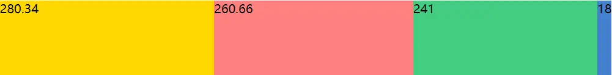
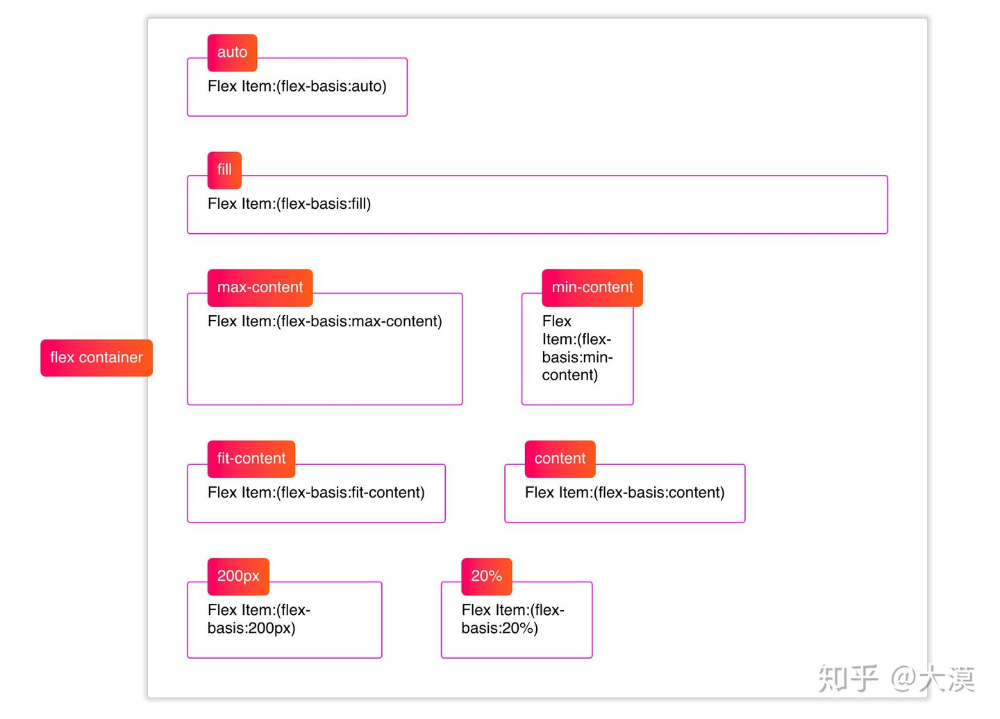

# CSS flex 子项目中的 flex 属性家族

## 零、参考文章
* [一文搞懂 flex 属性](https://juejin.cn/post/6844904079529869326)
* [聊聊Flexbox布局中的flex的演算法](https://zhuanlan.zhihu.com/p/50449041)

## 一、基础概念
### 语法
```flex``` 是简写语法，其作用是设置弹性项目如何**增大**或**缩小**以适应其弹性容器中**可用**的空间，其具体代表是：
* ```flex-grow```：**扩展**子元素长度
* ```flex-shrink```：**收缩**子元素长度
* ```flex-basic```：设置子元素长度

```flex-grow``` 和 ```flex-shrink``` 是基于父元素的长度进行计算的  
```flex-basic``` 实际上就是给子元素设定默认值，可以理解为直接他宽高设定默认值
> 当一个元素同时被设置了 flex-basis (除值为 auto 外) 和 width (或者在 flex-direction: column 情况下设置了height) , flex-basis 具有更高的优先级

### 剩余空间和不足空间
在 ```flex-box``` 布局中，```flex``` 容器中包含一个或多个 ```flex``` 项目（该容器的子元素或子节点）。```flex``` 容器和 ```flex``` 项目都有其自身的尺寸大小，那么就会有：```flex``` 项目尺寸大小之和大于或小于 ```flex``` 容器情景：

* 当所有 ```flex``` 项目尺寸大小之和小于 ```flex``` 容器时，```flex``` 容器就会有多余的空间没有被填充，那么这个空间就被称为 ```flex``` 容器的剩余空间（Positive Free Space）
* 当所有 ```flex``` 项目尺寸大小之和大于 ```flex``` 容器时，```flex``` 容器就没有足够的空间容纳所有 ```flex``` 项目，那么多出来的这个空间就被称为负空间（Negative Free Space）

## 二、flex-grow 扩展比
公式：```各项目扩展长度 = ( 父元素长度 - 所有子元素长度 ) / (flex-grow 比值总数) * flex-grow```

容器宽度为 ```800px```，子元素 ```width``` 为 ```150px```，一个有 4 个，所以剩余空间为 ```200px```

### 例子1:
* ```flex-grow``` 比值为 1:1:1:1
* 每项扩展长度 = (800 - 600) / 4 * 1 = 50
* 于是，每个子项目最终宽度为 ```150 + 50 =200px```


### 例子2:
* 当 ```flex-grow``` 比为 1:2:3:4 时，```flex-grow``` 比值总数 = 1+2+3+4 = 10
* 于是
  * 子项目 1 的扩展长度 = ( 800 - 600 ) / 10 * 1 = 20
  * 子项目 2 的扩展长度 = ( 800 - 600 ) / 10 * 2 = 40
  * 子项目 3 的扩展长度 = ( 800 - 600 ) / 10 * 3 = 60
  * 子项目 4 的扩展长度 = ( 800 - 600 ) / 10 * 4 = 80
* 所以实际 flex 子元素 宽度为
  * 150 + 20 = 170
  * 150 + 40 = 190
  * 150 + 60 = 210
  * 150 + 80 = 230


## 二、flex-shrink 收缩比
公式：```各项目收缩长度 = abs( 父元素长度 - 所有子元素长度 ) / (flex-shrink 比值总数) * flex-shrink```

容器宽度为 ```800px```，子元素 ```width``` 为 ```300px```，一个有 4 个，所以负(不足)空间为 ```400px```

### 例子1:
* ```flex-shrink``` 比值为 1:1:1:1
* 每项扩展长度 = abs(800 - 1200) / 4 * 1 = 100
* 于是，每个子项目最终宽度为 ```300 - 100 = 200px```


### 例子2:
* 当 ```flex-shrink``` 比为 1:2:3:4 时，```flex-shrink``` 比值总数 = 1+2+3+4 = 10
* 于是
  * 子项目 1 的扩展长度 = abs( 800 - 1200 ) / 10 * 1 = 40
  * 子项目 2 的扩展长度 = abs( 800 - 1200 ) / 10 * 2 = 80
  * 子项目 3 的扩展长度 = abs( 800 - 1200 ) / 10 * 3 = 120
  * 子项目 4 的扩展长度 = abs( 800 - 1200 ) / 10 * 4 = 160
* 所以实际 flex 子元素 宽度为
  * 300 - 40 = 260
  * 300 - 80 = 220
  * 300 - 120 = 180
  * 300 - 160 = 140


### 例子3：（注：该 demo 中需要在子项中填写一些内容才能观察出来）
* 当 ```flex-shrink``` 比值过于大时，如 1:2:3:18
* 按照上面的计算，最后一个子元素计算得出宽度将趋近于 0，flex 布局就会按照该元素内容的宽度大小(min-content)来设置其宽度，同时这个宽度也会影响到其他的 flex子元素
* 假设这个 ```flex-shrink``` 为 18 的 flex 子元素内容宽度(min-content)为 18px：
* 于是
  * 子项目 1 的最终长度 = 300 - abs( 800 - 1200 ) / 24 * 1 - 18 / ( 1 + 2 + 3 ) * 1 = 280.34
  * 子项目 2 的最终长度 = 300 - abs( 800 - 1200 ) / 24 * 2 - 18 / ( 1 + 2 + 3 ) * 2 = 260.66
  * 子项目 3 的最终长度 = 300 - abs( 800 - 1200 ) / 24 * 3 - 18 / ( 1 + 2 + 3 ) * 3 = 241
  * 子项目 4 的最终长度 = 18(min-content)


## 三、flex-basic 默认长度

### （一）auto
* ```flex-basis``` 属性在任何空间分配发生之前初始化 ```flex``` 子项目的尺寸。其默认值为 ```auto```。如果 ```flex-basis``` 的值设置为 ```auto```，浏览器将先检查 ```flex``` 子项目的主尺寸是否设置了绝对值再计算出 ```flex``` 子项目的初始值。比如说，你给 flex 子项目设置的 ```width``` 为 ```200px```，那么 ```200px``` 就是 ```flex``` 子项目的 ```flex-basis``` 值

* 如果你的 ```flex``` 子项目可以自动调整大小，则 ```auto``` 会解析为其内容的大小，这个时候，```min-content``` 和```max-content``` 便会起作用。此时将会把 ```flex``` 子项目的 ```max-content``` 作为 ```flex-basic``` 的值

### （二）百分比
* ```flex-basis``` 的值可以是一个百分比，此时，是以 ```flex``` 容器而非子项目的主轴为基础的，即：```子项目的长度 = 容器的长度 * 百分比```

### （三）0
在 ```flex box```布局中，如果想完全忽略 ```flex``` 子项目的尺寸，则可以将 ```flex-basis``` 设置为 0。这样的设置，基本上是告诉了浏览器，```flex``` 容器所有空间都可以按照相关的比例进行分配 

### （四）未显示设置 ```width``` 时到其他值演示


### （五）与 ```min-width``` 和 ```max-width``` 的反应
当 ```flex``` 子项目显式的设置了 ```min-width``` 或 ```max-width``` 的值时，就算 ```flex``` 子项目显式的设置了 ```flex-basis``` 的值，也会按 ```min-width``` 和 ```max-width``` 设置 ```flex``` 子项目宽度。当计算的值大于 ```max-width``` 时，则按 ```max-width``` 设置 flex 子项目宽度；当计算的值小于 ```min-width``` 时，则按 ```min-width``` 设置 flex 子项目宽度

即，在最终的结果上，```min-width``` 和 ```max-width``` 有更高的优先级

### （六）小结
* ```flex-basis```默认值为 ```auto```
* 如果 ```flex``` 子项目显式的设置了 ```width```值，同时 ```flex-basis``` 为 ```auto``` 时，则 ```flex``` 子项目的宽度为按 ```width``` 来计算，如果未显式设置 ```width```，则按 ```flex``` 子项目的内容宽度来计算
* 如果 ```flex``` 子项目显式的设置了 ```width``` 值，同时显式设置了 ```flex-basis``` 的具体值，则 ```flex``` 子项目会忽略 ```width``` 值，会按 ```flex-basis``` 来计算 ```flex``` 子项目
* 当 ```flex``` 容器剩余空间不足时，```flex``` 子项目的实际宽度并不会按 ```flex-basis``` 来计算，会根据 ```flex-grow``` 和 ```flex-shrink``` 设置的值给 ```flex``` 子项目分配相应的空间
* 对于 ```flex-box``` 布局中，不建议显式的设置 ```flex``` 子项目的 ```width``` 值，而是通过 ```flex-basis``` 来控制 ```flex``` 子项目的宽度，这样更具弹性
* 如果 ```flex``` 子项目显式的设置了 ```min-width``` 或 ```max-width``` 值时，当 ```flex-basis``` 计算出来的值小于 ```min-width``` 则按 ```min-width``` 值设置 ```flex``` 子项目宽度，反之，计算出来的值大于 ```max-width``` 值时，则按 ```max-width``` 的值设置 ```flex``` 子项目宽度
