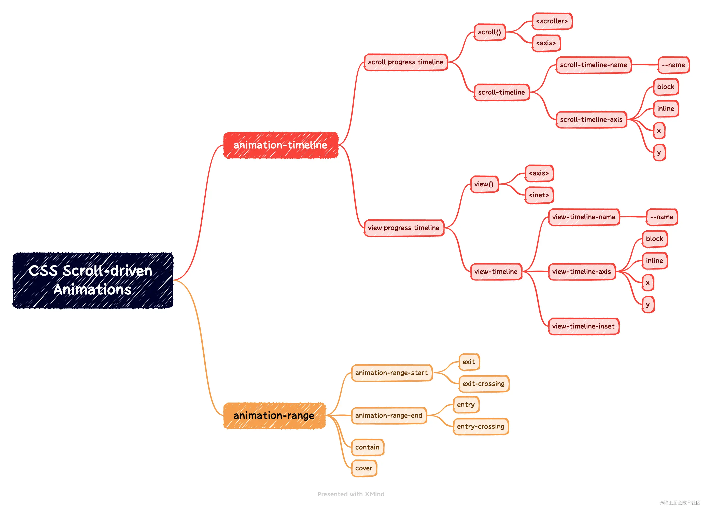

# CSS 滚动驱动的动画效果

## 零、参考文章
* [CSS scroll-driven animations](https://developer.mozilla.org/en-US/docs/Web/CSS/CSS_scroll-driven_animations)
* [CSS 滚动驱动动画终于正式支持了~](https://juejin.cn/post/7259026189904805944)
* [官方示例](https://scroll-driven-animations.style/)

## 一、起因
之前在写视差滚动的时候，其中有一个方案就是使用 ```animation-timeline``` 来实现。这是一个新兴的 CSS 特性，目前还处于实验阶段，于是先试试手，熟悉一下。  
根据 MDN 的介绍，可以分为 CSS 的部分和 JavaScript(Web api) 的部分，这里只介绍 CSS 的部分。

## 二、滚动进度时间线
表示将页面或者容器的滚动进度映射到动画进度上。起始滚动位置代表 0% 进度，结束滚动位置代表 100% 进度。基本语法：
```css
animation-timeline: scroll(); /** 简写形式 */
animation-timeline: scroll(<scroller> <axis>);
```
其中：
1. ```<scroller>``` 表示提供滚动进度(timeline)的容器，支持 3 个关键值：
   * ```nearest```：使用最近的祖先滚动容器
   * ```root```：使用文档视口作为滚动容器
   * ```self```：使用元素本身作为滚动容器
2. ```<axis>``` 表示滚动方向，支持 4 个关键值：
   * ```x```：滚动容器的横轴方向，firefox 应该用 ```horizontal``` 关键字
   * ```y```：滚动容器的纵轴方向，firefox 应该用 ```vertical``` 关键字
   * ```block```：受书写方向(writing-mode)影响，如果是水平书写模式，则相当于 ```y```，否则相当于 ```x```
   * ```inline```：受书写方向(writing-mode)影响，如果是水平书写模式，则相当于 ```x```，否则相当于 ```y```

demo 示例：
```html
<div id="container">
  <div id="square"></div>
  <div id="stretcher"></div>
</div>

<style>
  #container {
    height: 300px;
    overflow-y: scroll;
    position: relative;
    background-color: #eee;
  }

  #stretcher {
    height: 600px;
  }

  @keyframes rotateAnimation {
    from {
      transform: rotate(0deg);
    }
    to {
      transform: rotate(360deg);
    }
  }

  #square {
    background-color: deeppink;
    width: 100px;
    height: 100px;
    position: absolute;
    bottom: 0; /** 注意这个值和最终的效果 */

    animation-name: rotateAnimation;
    animation-duration: 1ms; /* Firefox requires this to apply the animation */
    animation-direction: alternate;

    animation-timeline: scroll(block);
  }
</style>
```

### 拓展：指定滚动容器
在 ```<scroller>``` 中我们只能指定 3 个值，有很大的限制，那么我们能不能自定义滚动的容器，从而实现更复杂的关联动画呢？
* scroll-timeline (下面两个的简写)
* scroll-timeline-name
* scroll-timeline-axis

demo:
```html
<!-- 结构一致 -->
<style>
  #container {
    /* ... */
    /* 定义滚动时间线 */
    scroll-timeline: --squareTimeline block;
  }

  #square {
    /* ... */
    /* animation-timeline: scroll(block); */
    /* 关联上面的时间线变量 */
    animation-timeline: --squareTimeline;
  }
</style>
```

```scroll-timeline``` 是 ```scroll()``` 的同位语法，```scroll-timeline``` 给予了我们指定祖先滚动元素的能力，这在存在多个可滚动的祖先元素中会非常有用

## 三、视图进度时间线
这个名字有些难以理解，其实表示的是一个元素出现在页面视野范围内的进度，也就是关注的是元素自身位置。元素刚刚出现之前代表 0% 进度，元素完全离开之后代表 100% 进度。这和 JS 的 Intersection Observer API 概念一致。基本语法：
```css
animation-timeline: view(); /** 简写形式 */
animation-timeline: scroll(<axis> <inset>);

/* 示例 */
animation-timeline: view(block 50% 10%);
```
其中：
1. ```<axis>``` 表示滚动方向，和上面的 ```scroll()``` 中的一致
2. ```<inset>``` 表示元素的偏移量，支持 2 个值：
   * ```auto```：默认值，元素的偏移量为 0
   * ```<length-percentage>```：表示调整元素的视区范围，有点类似 ```scroll-padding```，支持两个值，表示开始(```start```，元素仍然在下面，还没有出现在滚动视口中)和结束(```end```，元素已经从上面脱离滚动视口)两个范围。如果是百分比，表示目标元素与滚动视口的重叠的比例(?)

### 特别注意
1. ```<inset>``` 中的 ```start & end``` 与 动画中的 ```from(0%) & to(100%)``` 关键帧之间的对应关系

### 拓展：指定跟随元素
和 ```scroll-timeline``` 一样，我们也有个 ```view-timeline```。语法一致，指定跟随哪个元素的滚动时间线，具体参看 MDN。

## 四、time-scope 的应用
我们在滚动进度时间线 & 视图进度时间线 中，都是指定了一个元素的动画时间线，但是我们在代码中可以发现，目标元素和指定元素之间一定是存在一个纵向嵌套关系的，要么是父子，要么是子孙。那么如果这两个元素之间是平级或者没有其他关系呢？
这个时候就需要用到 ```time-scope``` 了，示例如下：
```html
<body>
  <div class="content">
    <!-- 跟随元素 -->
    <div class="box animation"></div>
  </div>

  <!-- 指定元素(滚动元素，时间线提供者) -->
  <div class="scroller">
    <div class="long-element"></div>
  </div>
</body>

<style>
  body {
    margin: 0;
    height: 100vh;
    display: flex;

    /* increases the timeline scope from the .scroller <div> element to the whole <body> */
    /* 这个自定义的命名需要与 scroll-timeline-name 一致 */
    timeline-scope: --myScroller;
  }

  .content,
  .scroller {
    flex: 1;
  }

  .scroller {
    overflow: scroll;
    /* 命名滚动时间线 */
    scroll-timeline-name: --myScroller;
    background: deeppink;
  }

  .long-element {
    height: 2000px;
  }

  .box {
    width: 100px;
    height: 100px;
    border-radius: 10px;
    background-color: rebeccapurple;
    position: fixed;
    top: 20px;
    left: 0%;
  }

  .animation {
    animation: rotate-appear;
    /* 使用自定义时间线 */
    animation-timeline: --myScroller;
  }

  @keyframes rotate-appear {
    from {
      rotate: 0deg;
      left: 0%;
    }

    to {
      rotate: 720deg;
      left: 100%;
    }
  }
</style>
```

上面的代码就实现了平级元素的滚动驱动动画效果，注意点是：
1. ```timeline-scope``` 需要放在两个元素共同的祖先元素上，起到一个作用域(或者桥)的作用；
2. ```timeline-scope``` 的命名，需要和 ```scroll-timeline-name``` 或者 ```view-timeline-name```一致，这样才能建立起联系；

## 五、范围区间
* animation-range /** 简写形式 */
* animation-range-start
* animation-range-end
> 注意这个玩意在 滚动进度时间线 & 视图进度时间线 中的效果

### 与滚动进度时间线(scroll())的关系
```css
animation-range: normal; /* 等价于 normal normal */
animation-range: 20%; /* 等价于 20% normal */
animation-range: 100px; /* 等价于 100px normal */
```
这个比较简单，如果指定了 ```animation-range-start```，就表示当滚动到这个位置的时候开始执行动画，如果指定了 ```animation-range-end```，就表示当滚动到这个位置的时候结束动画。其实就是在 ```[animation-range-start, animation-range-end]``` 这个区间内执行动画。

> 因为 ```animation-range-start``` 和 ```animation-range-end``` 都支持诸如 ```<timeline-range-name>``` 关键字，但是这个关键字似乎在视图进度时间线中有较大的影响，在滚动进度时间线中没啥影响，所以标注下

### 与视图进度时间线(view())的关系
由于涉及到元素和可视区域的交叉，所以 ```<timeline-range-name>``` 关键字的取值会有较大的影响：
```css
animation-range: cover; /* 等价于 cover 0% cover 100% */
animation-range: contain; /* 等价于 contain 0% contain 100% */
animation-range: cover 20%; /* 等价于 cover 20% cover 100% */
animation-range: contain 100px; /* 等价于 contain 100px cover 100% */

animation-range: normal 25%;
animation-range: 25% normal;
animation-range: 25% 50%;
animation-range: entry exit; /* 等价于 entry 0% exit 100% */
animation-range: cover cover 200px; /* 等价于 cover 0% cover 200px */
animation-range: entry 10% exit; /* 等价于 entry 10% exit 100% */
animation-range: 10% exit 90%;
animation-range: entry 10% 90%;
```

```<timeline-range-name>``` 关键字的取值和含义如下：
* cover：元素首次开始进入滚动容器可见范围（0%）到完全离开的过程（100% ），也就是元素只需要和可视范围有交集（默认）
* contain：元素完全进入滚动容器可见范围（0%）到刚好要离开的过程（100% ），也就是元素必须完全在可见范围才会触发
* entry：元素进入滚动容器可见范围的过程，刚进入是 0%，完全进入是 100%
* exit：元素离开滚动容器可见范围的过程，刚离开是 0%，完全离开是 100%
* entry-crossing：和entry比较类似，暂时没有发现明显差异
* exit-crossing：和exit比较类似，暂时没有发现明显差异

.png)

## 六、总结

