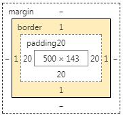

# CSS 盒子模型



1. 常见的块级元素均具有盒子模型的特征
2. 语法：
```css
  div { border: 2px solid red;}

  /* 等价于 */
  div {
    border-width: 2px; /* [thin | medium | thick | px] */
    border-style: solid; /* [dashed | dotted | solid] */
    border-color: red;
  }
```

#### 19.02.14 ---------------------------------
在 css 3 中，新增了一个 box-sizing 属性，这个属性定义了 width 和 border、padding 之间的计算规则，有 3 个值：
* content-box，默认值，表示 border 和 padding 不计算在 with 中；
* padding-box，将 padding 计算至 width 中；
* border-box，将 border 和 padding 都计算在 width 中；
