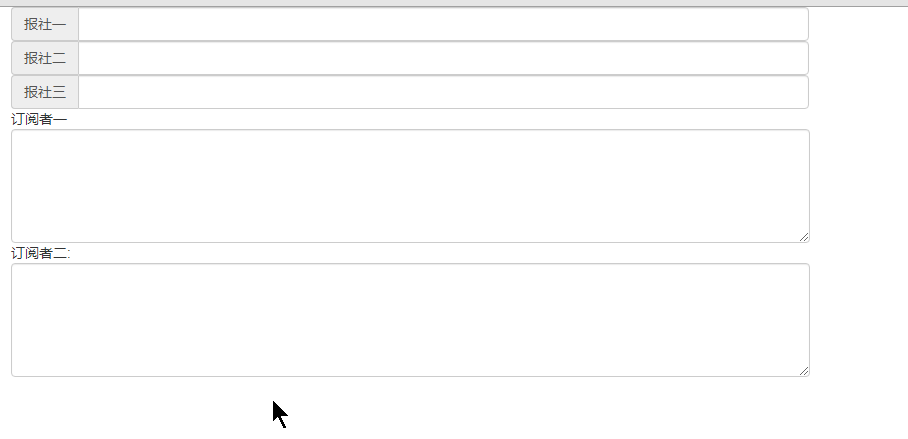

# JS Design pattern 观察者模式和订阅者模式

## 零、参考资料
* [JavaScript 设计模式系列 - 观察者模式](https://juejin.im/post/591a4f2a128fe1005cda28df)
* [JavaScript 设计模式（六）：观察者模式与发布订阅模式](https://juejin.cn/post/6844903886768046088)

## 一、观察者模式(Observer)
### 定义
观察者模式：定义了对象间一种一对多的依赖关系，当目标对象 ```Subject``` 的状态发生改变时，所有依赖它的对象 ```Observer``` 都会得到通知

这种模式的实质就是我们可以对某个对象的状态进行观察，并且在发生改变时得到通知（以进一步做出相应的行为）

这种模式在平常日用中很常见，比如我们监听 ```div``` 的 ```click``` 事件，其本质就是观察者模式。 ```div.addEventListener('click', function(e) {...})```，用文字描述：观察 ```div``` 对象，当它被点击了(发生变化)，执行匿名函数(接受通知，然后做出相应行为)

### 模式特征以及角色
1. 一个目标者对象 ```Subject```，拥有方法：添加 / 删除 / 通知 ```Observer```
2. 多个观察者对象 ```Observer```，拥有方法：接收 ```Subject``` 状态变更通知并处理
3. 目标对象 ```Subject``` 状态变更时，通知所有 ```Observer```

```Subject``` 可以添加一系列 ```Observer```，```Subject``` 负责维护与这些 ```Observer``` 之间的联系，"你对我有兴趣，我更新就会通知你"

* ```Subject``` - 被观察者，发布者
* ```Observer``` - 观察者，订阅者

### 示例
为加深理解，以具体实例来看看：现有三个报社，报社一、二、三；有两个订报人，订阅者1，订阅者2。此处，报社就是被观察者、订阅人就是观察者

#### 被观察者 - 主要功能是维护订阅自己的人以及分发消息
```js
var Publish = function(name) {
  this.name = name;
  this.subscribers = []; // 数组中存放所有的订阅者，本例中是所代表的观察者的行为
}
 
// 分发，发布消息
Publish.prototype.deliver = function (news) {
  var publish = this; // 各报社实例
  // 通知所有的订阅者
  this.subscribers.forEach(item => {
    item(news, publish); // 每个订阅者都收到了 news, 并且还知道是哪家报社发布的
  })
  return this; // 方便链式调用
}
```

#### 观察者 - 主要功能是(主动)订阅或取消订阅报社
```js
// 订阅
Function.prototype.subscribe = function(publish) {
  var sub = this; // 当前订阅者这个人
  // 1. publish.subscribers 中，名字可能重复
  // 2. publish.subscribers 数组里面已有的人，不能再次订阅
  var alreadyExists = publish.subscribers.some(function(item) {
    return item === sub;
  })
  // 如果出版社名单中没有这个人，则加入进去
  if (!alreadyExists) publish.subscribers.push(sub);
   
  return this; // 方便链式调用
}

// 取消订阅
Function.prototype.unsubscribe = function(publish) {
  var sub = this;

  publish.subscribers = publish.subscribers.filter(function(item){
    return item !== sub ;
  });

  return this; // 方便链式调用
}
```

#### 整体实现
```js
// 实例化发布者对象(报社)
var pub1 = new Publish('报社一');
var pub2 = new Publish('报社二');
var pub3 = new Publish('报社三');
 
// 定义观察者，当报社有了新的消息后，观察者会收到通知
// 本例中以观察者的行为代替观察者对象，模拟 addEventListener
var sub1 = function (news, pub) {
  console.log(arguments);
  document.getElementById('sub1').innerHTML += pub.name + news + '\n';
}
 
var sub2 = function (news, pub) {
  console.log(arguments);
  document.getElementById('sub2').innerHTML += pub.name + news + '\n';
}
 
// 执行订阅方法，这一步是观察者主动
sub1.subscribe(pub1).subscribe(pub2);
sub2.subscribe(pub1).subscribe(pub2).subscribe(pub3);
 
// --------------------- 分割线 ---------------------
var p1 = document.getElementById('pub1');  // dom
var p2 = document.getElementById('pub2');  // dom
var p3 = document.getElementById('pub3');  // dom
 
// 事件绑定, 触发 报社 的消息分发
p1.onclick = function() {
  pub1.deliver(document.getElementById('text1').value, pub1);
}
 
p2.onclick = function() {
  pub2.deliver(document.getElementById('text2').value, pub2);
}
 
p3.onclick = function() {
  pub3.deliver(document.getElementById('text3').value, pub3);
}
```

html 部分
```html
<head>
  <link rel="stylesheet" href="https://cdn.jsdelivr.net/npm/bootstrap@3.3.7/dist/css/bootstrap.min.css" integrity="sha384-BVYiiSIFeK1dGmJRAkycuHAHRg32OmUcww7on3RYdg4Va+PmSTsz/K68vbdEjh4u" crossorigin="anonymous">
  <script src="https://cdn.bootcss.com/jquery/3.4.1/jquery.js"></script>
  <script src="https://cdn.jsdelivr.net/npm/bootstrap@3.3.7/dist/js/bootstrap.min.js" integrity="sha384-Tc5IQib027qvyjSMfHjOMaLkfuWVxZxUPnCJA7l2mCWNIpG9mGCD8wGNIcPD7Txa" crossorigin="anonymous"></script>
</head>

<body>
  <div class="col-lg-8">
    <div class="input-group">
      <span id="pub1" class="input-group-addon">报社一</span>
      <input v-model="user.name" type="text" class="form-control"  id="text1">
    </div>
  </div>
  <div class="col-lg-8">
    <div class="input-group">
      <span id="pub2" class="input-group-addon">报社二</span>
      <input v-model="user.name" type="text" class="form-control"  id="text2">
    </div>
  </div>
  <div class="col-lg-8">
    <div class="input-group">
      <span id="pub3" class="input-group-addon">报社三</span>
      <input v-model="user.name" type="text" class="form-control"  id="text3">
    </div>
  </div>
   
  <div class="col-lg-8">
    订阅者一
    <textarea id="sub1" class="form-control" rows="5"></textarea>
    订阅者二:
    <textarea id="sub2"class="form-control" rows="5"></textarea>
  </div>
</body>
```

#### 姿势分解
1. 分割线之上是报社、订阅者的实例化，以及订阅者订阅报社，如同我们在平常代码中自定义 ```click``` 事件一样
2. 分割线之下则是普通的添加 ```click``` 事件，这里面需要注意的是我们利用自己实现的 ```deliver``` 函数完成消息分发(通知)功能
3. 点击"报社一"，两个订阅者都收到了通知，执行对应的行为，点击"报社三"，因为只有 订阅者2 订阅了这家报社，故只有 订阅者2 收到消息并完成行为  

  

#### 完整版(class)
```js
// 目标者
class Subject {
  constructor() {
    this. observers = []; // 观察者列表
  }
 
  // 添加订阅者
  add(observer) {
    this.observers.push(observer);
  }
 
  // 删除...
  remove(observer) {
    let idx = this.observers.findIndex(item => item === observer);
    idx > -1 && this.observers.splice(idx, 1);
  }
 
  // 通知
  notify() {
    for(let o of this.observers) {
      o.update();
    }
  }
}
 
// 观察者
class Observer {
  constructor(name) {
    this.name = name;
  }
 
  // 目标对象更新时触发的回调，即收到更新通知后的回调
  update() {
    console.log(`目标者通知我更新了，我是：${this.name}`);
  }
}
 
// 实例化目标者
let subject = new Subject();
 
// 实例化两个观察者
let obs1 = new Observer('前端');
let obs2 = new Observer('后端');
 
// 向目标者添加观察者
subject.add(obs1);
subject.add(obs2);
 
subject.notify();
```

### 优缺点：
* 优点明显：降低耦合，两者都专注于自身功能；
* 缺点也很明显：所有观察者都能收到通知，无法过滤筛选；

## 二、发布订阅模式（Publisher && Subscriber）
### 定义
发布订阅模式：基于一个事件（主题）通道，希望接收通知的对象 ```Subscriber``` 通过自定义事件订阅主题，被激活事件的对象 ```Publisher``` 通过发布主题事件的方式通知各个订阅该主题的 ```Subscriber``` 对象

发布订阅模式与观察者模式的不同，"第三者"（事件中心）出现。目标对象并不直接通知观察者，而是通过事件中心来派发通知

### 代码实现
```js
// 控制中心
let pubSub = {
  list: {},
 
  // 订阅
  subscribe: function(key, fn) {
    if (!this.list[key]) this.list[key] = [];
 
    this.list[key].push(fn);
  },
 
  //取消订阅
  unsubscribe: function(key, fn) {
    let fnList = this.list[key];
 
    if (!fnList) return false;
 
    if (!fn) { // 不传入指定的方法，清空所用 key 下的订阅
      fnList && (fnList.length = 0);
    } else {
      fnList.forEach((item, index) => {
        item === fn && fnList.splice(index, 1);
      });
    }
  },
 
  // 发布
  publish: function(key, ...args) {
    for (let fn of this.list[key]) fn.call(this, ...args);
  }
}
 
// 订阅
pubSub.subscribe('onwork', time => {
  console.log(`上班了：${time}`);
})
pubSub.subscribe('offwork', time => {
  console.log(`下班了：${time}`);
})
pubSub.subscribe('launch', time => {
  console.log(`吃饭了：${time}`);
})
 
pubSub.subscribe('onwork', work => {
  console.log(`上班了：${work}`);
})
 
// 发布
pubSub.publish('offwork', '18:00:00');
pubSub.publish('launch', '12:00:00');
 
// 取消订阅
pubSub.unsubscribe('onwork');
```

严格来讲， DOM 的事件监听是"发布订阅模式"：
```js
let loginBtn = document.getElementById('#loginBtn');
 
// 监听回调函数（指定事件）
function notifyClick() {
  console.log('我被点击了');
}
 
// 添加事件监听
loginBtn.addEventListener('click', notifyClick);
// 触发点击, 事件中心派发指定事件
loginBtn.click();            
 
// 取消事件监听
loginBtn.removeEventListener('click', notifyClick);
```

### 优缺点：
* 优点：解耦更好，细粒度更容易掌控
* 缺点：不易阅读，额外对象创建，消耗时间和内存（很多设计模式的通病）

## 三、两种模式的关联和区别
发布订阅模式更灵活，是进阶版的观察者模式，指定对应分发
1. 观察者模式维护单一事件对应多个依赖该事件的对象关系
2. 发布订阅维护多个事件（主题）及依赖各事件（主题）的对象之间的关系
3. 观察者模式是目标对象直接触发通知（全部通知），观察对象被迫接收通知。发布订阅模式多了个中间层（事件中心），由其去管理通知广播（只通知订阅对应事件的对象）
4. 观察者模式对象间依赖关系较强，发布订阅模式中对象之间实现真正的解耦
