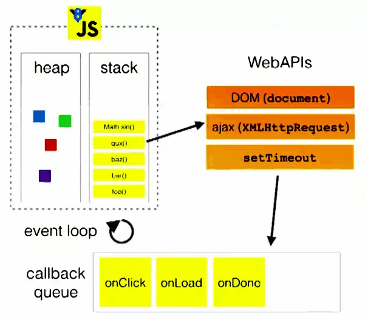

# JS Event loop
## 零、参考资料
* [最后一次搞懂 Event Loop](https://juejin.cn/post/6844903827611598862)

自打 ES 6 推出 Promise 改善了 js 的异步编程之后，event-loop 也越来越多地出现在视野当中。借用大佬们的话："Event Loop 是 JavaScript 异步编程的核心思想，也是前端进阶必须跨越的一关。同时，它又是面试的必考点。" 话不多说，上代码

## 一、镇楼题
```js
async function async1() {
  console.log('async1 start');
  await async2();
  console.log('async1 end');
}
 
async function async2() {
  console.log('async2');
}
 
console.log('script start');
 
setTimeout(function() {
  console.log('setTimeout');
}, 0);
 
async1();
 
new Promise(function(resolve) {
  console.log('promise1');
  resolve();
}).then(function() {
  console.log('promise2');
});
 
console.log('script end');
```

## 二、执行栈和任务队列
### 内存中的数据结构
* 栈 (stack): 栈是遵循 后进先出 (LIFO) 原则的有序集合，新添加或待删除的元素都保存在同一端，称为栈顶，另一端叫做栈底。在栈里，新元素都靠近栈顶，旧元素都接近栈底。栈在编程语言的编译器和内存中存储基本数据类型和对象的指针、方法调用等
* 队列 (queue): 队列是遵循 先进先出 (FIFO) 原则的有序集合，队列在尾部添加新元素，并在顶部移除元素，最新添加的元素必须排在队列的末尾。在计算机科学中，最常见的例子就是打印队列
* 堆 (heap): 堆是基于树抽象数据类型的一种特殊的数据结构



### 执行栈
在 js 中，当我们调用一个方法时，js 会生成执行上下文，这个执行上下文保存着该方法的私有作用域、上层作用域(作用域链)、方法参数、以及这个作用域中定义的变量和 this 的指向

当一系列的方法被调用的时候，由于 js 是单线程的，这些方法就会按照顺序被排列在一个单独的地方，这个地方就是执行栈

### 事件(任务)队列
事件队列是一个存储 **异步任务** 的队列，其中的任务严格按照时间先后顺序执行，排在队头的任务将会率先执行，而排在队尾的任务会最后执行。事件队列每次仅执行一个任务，在该任务执行完毕之后，再执行下一个任务。执行栈则是一个类似于函数调用栈的运行容器，当执行栈为空时，JS 引擎便检查事件队列，如果事件队列不为空的话，事件队列便将第一个任务压入执行栈中运行

## 三、事件循环 event loop
* 所有同步任务都在主线程上执行，形成一个执行栈 (Execution Context Stack)。
* 而异步任务会被放置到 Task Table，当异步任务有了运行结果，就将该函数移入任务队列。
* 一旦执行栈中的所有同步任务执行完毕，引擎就会读取任务队列，然后将任务队列中的第一个任务压入执行栈中运行。

主线程不断重复第三步，也就是 **只要主线程空了，就会去读取任务队列**，该过程不断重复，这就是所谓的 **事件循环**

## 三、宏任务 和 微任务
一个银行案例：

以去银行办业务为例，当 5 号窗口柜员处理完当前客户后，开始叫号来接待下一位客户，我们将每个客户比作 **宏任务**，接待下一个客户的过程也就是让下一个宏任务进入到执行栈

所以该窗口所有的客户都被放入了一个 **任务队列** 中。任务队列中的都是异步操作有了结果的，而不是注册一个异步任务就会被放在这个任务队列中（它会被放到 Task Table 中）。就像在银行中排号，如果叫到你的时候你不在，那么你当前的号牌就作废了，柜员会选择直接跳过进行下一个客户的业务处理，等你回来以后还需要重新取号排队

在执行宏任务时，是可以穿插一些微任务进去。比如你大爷在办完业务之后，顺便问了下柜员："最近 P2P 暴雷很严重啊，有没有其他稳妥的投资方式"。柜员就会给出相应的回答

我们分析一下这个过程，虽然大爷已经办完正常的业务，但又咨询了一下理财信息，这时候柜员肯定不能说："您再上后边取个号去，重新排队"。所以只要是柜员能够处理的，都会在响应下一个宏任务之前来做，我们可以把这些任务理解成是 **微任务**

大爷听罢，扬起 45 度微笑，说："我就问问。"

柜员 OS："艹..."

这个例子就说明了：你大爷永远是你大爷。**在当前微任务没有执行完成时，是不会执行下一个宏任务的！**

总结一下，异步任务分为 **宏任务(macrotask)** 与 **微任务(microtask)** 。宏任务会进入一个队列，而微任务会进入到另一个不同的队列，且(上一个宏任务的)微任务要优于(下一个)宏任务执行

### 常见的 宏任务 和 微任务
* 宏任务：script(整体代码)、setTimeout、setInterval、I/O、事件、postMessage、MessageChannel、setImmediate (Node.js)

* 微任务：Promise.then、 MutaionObserver、process.nextTick (Node.js)

## 四、案例和分析
### 案例 1：
```js
setTimeout(() => {
  console.log('A');
}, 0);
 
var obj = {
  func: function() {
    setTimeout(function() {
      console.log('B');
    }, 0);
    return new Promise(function(resolve) {
      console.log('C');
      resolve();
    });
  },
};
 
obj.func().then(function() {
  console.log('D');
});
 
console.log('E');
```
* 第一个 ```setTimeout``` 放到宏任务队列，此时宏任务队列为 ```['A']```
* 接着执行 ```obj``` 的 ```func``` 方法，将 ```setTimeout``` 放到宏任务队列，此时宏任务队列为 ```['A', 'B']```
* 函数返回一个 ```Promise```，因为这是一个同步操作，所以先打印出 ```'C'```
* 接着将 ```then``` 放到微任务队列，此时微任务队列为 ```['D']```
* 接着执行同步任务 ```console.log('E');```，打印出 ```'E'```
* 因为微任务优先执行，所以先输出 ```'D'```
* 最后依次输出 ```'A'``` 和 ```'B'```
* 故最终结果是： ```C-E-D-A-B```

要注意的是 ```obj.func().then()``` 这里，```obj.func()``` 是普通函数/同步代码，后面的 ```then``` 才是微任务

### 案例 2：
```js
function go() {
  console.log(5)
}
 
let p = new Promise(resolve => {
  resolve(1);

  Promise.resolve(go()).then(() => console.log(2));

  console.log(4);
}).then(t => console.log(t));
 
console.log(3);
```
* 首先执行同步代码 ```Promise.resolve(go())``` 中 ```go()```，打印 ```5```
* 首先将 ```Promise.resolve()``` 的 ```then()``` 方法放到微任务队列，此时微任务队列为 ```['2']```
* 然后打印出同步任务 ```4```
* 接着将 p 的 then() 方法放到微任务队列，此时微任务队列为 ```['2', '1']```
* 打印出同步任务 ```3```
* 最后依次打印微任务 ```2``` 和 ```1```
* 故最终结果是： ```5-4-3-2-1```

要注意的是 ```Promise.resolve(go())``` 这里也是普通函数/同步代码，当执行到这一行的时候，会立即执行 ```go()```，后面的 ```then``` 才是微任务

## 五、当 Event Loop 遇到 async/await
在 es 7 中引入了 async/await 的语法，当他们会与 event-loop 发生什么样的反应呢？

根据定义，我们知道，async/await 仅仅是生成器的语法糖，所以不要怕，只要把它转换成 Promise 的形式即可。下面这段代码是 async/await 函数的经典形式
```js
async function foo() {
  // await 前面的代码
  await bar();
  // await 后面的代码
}
 
async function bar() {
  // do something...
}

foo();
```

其中 ```await``` 前面的代码是 **同步** 的，调用此函数时会直接执行；而 ```await bar();``` 这句可以被转换成 ```Promise.resolve(bar())```， ```await``` 后面的代码则会被放到 ```Promise``` 的 ```then()``` 方法里

改写如下：
```js
function foo() {
  // await 前面的代码
  Promise.resolve(bar()).then(() => {
    // await 后面的代码
  });
}
 
function bar() {
  // do something...
}
 
foo();
```

所以，开篇的那条镇楼题可以改写成这样：

```js
function async1() {
  console.log('async1 start'); // 2
 
  Promise.resolve(async2()).then(() => {
    console.log('async1 end'); // 6
  });
}
 
function async2() {
  console.log('async2'); // 3
}
 
console.log('script start'); // 1
 
setTimeout(function() {
  console.log('settimeout'); // 8
}, 0);
 
async1();
 
new Promise(function(resolve) {
  console.log('promise1'); // 4
  resolve();
}).then(function() {
  console.log('promise2'); // 7
});
console.log('script end'); // 5
```
* 首先打印出 ```script start```
* 接着将 ```settimeout``` 添加到宏任务队列，此时宏任务队列为 ```['settimeout']```
* 然后执行函数 ```async1```，先打印出 ```async1 start```，又因为 ```Promise.resolve(async2())``` 是同步任务，所以打印出 ```async2```，接着将 ```async1 end``` 添加到微任务队列，，此时微任务队列为 ```['async1 end']```
* 接着打印出 ```promise1```，将 ```promise2``` 添加到微任务队列，，此时微任务队列为 ```['async1 end', promise2]```
* 打印出 ```script end```
* 因为微任务优先级高于宏任务，所以先依次打印出 ```async1 end``` 和 ```promise2```
* 最后打印出宏任务 ```settimeout``` 

> 关于这道题的争议：大多都是 async1 end 和 promise2 的顺序问题。在 Chrome 73.0.3683.103 for MAC 和 Node.js v8.15.1 测试是 async1 end 先于 promise2，在 FireFox 66.0.3 for MAC 测试是 async1 end 后于 promise2  
> 
> 另外：关于最后的结果顺序，国外的一篇文章，写的很详细，并且有详细的测试。结果就是：在不同的浏览器下，甚至是同一种浏览器的不同版本中，异步任务的执行顺序都会有差异，也就是说他们的优先级并不是完全固定的。注意，只是异步任务的优先级会有所不同，这主要还是各个浏览器的问题
