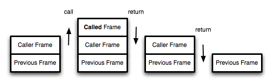

# JS 尾调用及递归优化

## 零、参考资料
* [尾调用优化](https://ruanyifeng.com/blog/2015/04/tail-call.html)

## 一、基础概念
### （一）、尾调用
一个函数的最后一步是调用另一个函数，并返回。注意点是，返回的是一个函数的调用(执行)

```js
// 最简形式
function f(x){ return g(x); }

// 变种
function f(x) {
  if (x > 0) return m(x);

  return n(x);
}

// 不属于的情况
// 情况一
function f(x){
  let y = g(x);

  return y;
}

// 情况二
function f(x){ return g(x) + 1; }
```
### （二）、尾调用优化
尾调用优化是将原本的函数进行一定的改造，改造成尾调用的形式，这样能节省一定的内存空间，是空间复杂度优化的常用手段之一

我们知道，函数调用会在内存形成一个"调用记录"，又称"调用帧"（call frame），保存调用位置和内部变量等信息。如果在函数A的内部调用函数B，那么在A的调用记录上方，还会形成一个B的调用记录。等到B运行结束，将结果返回到A，B的调用记录才会消失。如果函数B内部还调用函数C，那就还有一个C的调用记录栈，以此类推。所有的调用记录，就形成一个"[调用栈](https://zh.wikipedia.org/wiki/%E8%B0%83%E7%94%A8%E6%A0%88)"（call stack）



demo:   
```js
// 原始函数：
function f() {
  let m = 1;
  let n = 2;
  let result = g(m + n);

  return result;
}

// 优化
function f() {
  let m = 1;
  let n = 2;

  return g(m + n);
}

// 执行
f();
```
在原始函数中，当执行到 ```let result = g(m + n);```时候， 会进入到 ```g``` 函数的作用域去执行相关的逻辑，但是此时 ```f``` 函数尚未执行完成，那么就会把 ```f``` 函数压入调用栈，于是就需要内存空间保存相关数据，直至 ```g``` 函数执行完毕，才接着执行 ```f``` 函数，最终一一释放内存空间，顺序为 ```f 函数执行 -> g 函数执行 -> ... -> g 函数结束 -> f 函数结束``` 

这就叫做"尾调用优化"（Tail call optimization），即只保留内层函数的调用记录。如果所有函数都是尾调用，那么完全可以做到每次执行时，调用记录只有一项，这将大大节省内存。这就是"尾调用优化"的意义

## 二、将尾调用用于递归优化
函数调用自身，称为递归。如果尾调用自身，就称为尾递归

递归非常耗费内存，因为需要同时保存成千上百个调用记录，很容易发生"栈溢出"错误（stack overflow）。但对于尾递归来说，由于只存在一个调用记录，所以永远不会发生"栈溢出"错误。如

```js
// 阶乘计算
function factorial(n) {
  if (n === 1) return 1;

  return n * factorial(n - 1);
}

factorial(5) // 120
```

在最后一步要计算 ```n * factorial(n - 1)``` , ```n``` 在当前作用域可以获得，但是 ```factorial(n - 1)``` 则需要进入下层作用域计算，所以只能将本层压入调用栈，继续申请内存进行下层运算，因此这种递归方式很占用内存。

进行尾调用优化：
```js
function factorial(n, total) {
  if (n === 1) return total;

  return factorial(n - 1, n * total);
}

factorial(5, 1) // 120
```
在最后一步，无论 ```n - 1``` 还是 ```n * total``` 都可以在本级运算出结果，所以对于本层而言，没有需要记录的数据，因此在将这两个结果运算出来后作为参数传递给下级函数，并返回，对于本级而言，没有需要记录或者保存的，可以将本层的内存空间释放出来，相较于普通的形式，永远只需要一块函数的运行空间，这就是优化的意义所在(对于代码阅读也十分友好)。

再看一个对斐波拉契数列的递归优化：
```js
// 普通递归
function factorial(num) {
  if (num === 0 || num === 1) {
    return num;
  }
  // console.trace();
  // console.log(factorial(num - 1) + factorial(num - 2));
  return factorial(num - 1) + factorial(num - 2);
}

// 尾递归优化
function factorial(num, num1 = 0, num2 = 1) {
  if (num === 0) {
    return num1;
  }
  // console.trace();
  return factorial(num - 1, num2, num1 + num2);
}
```
## 三、总结
尾递归的实现，往往需要改写递归函数，确保最后一步只调用自身。做到这一点的方法，就是把所有用到的内部变量改写成函数的参数

递归本质上是一种循环操作。纯粹的函数式编程语言没有循环操作命令，所有的循环都用递归实现，这就是为什么尾递归对这些语言极其重要。对于其他支持"尾调用优化"的语言（比如Lua，ES6），只需要知道循环可以用递归代替，而使用递归，就最好使用尾递归
