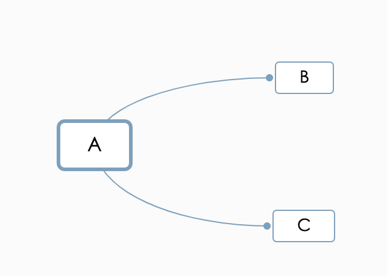
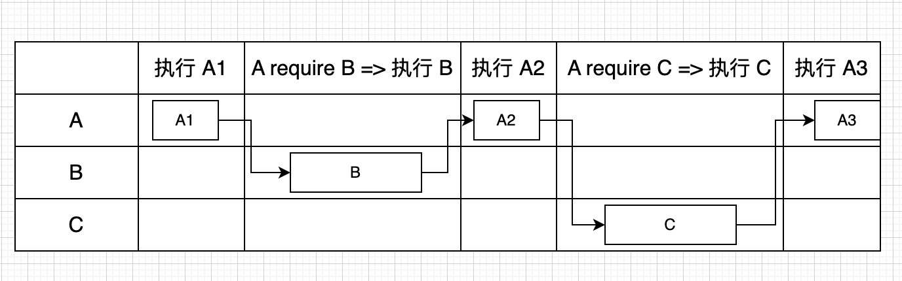
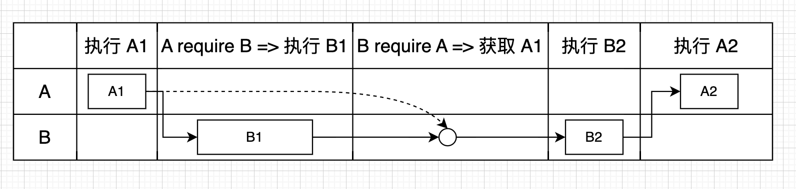
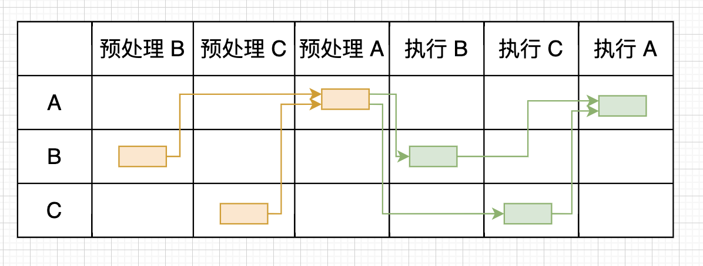
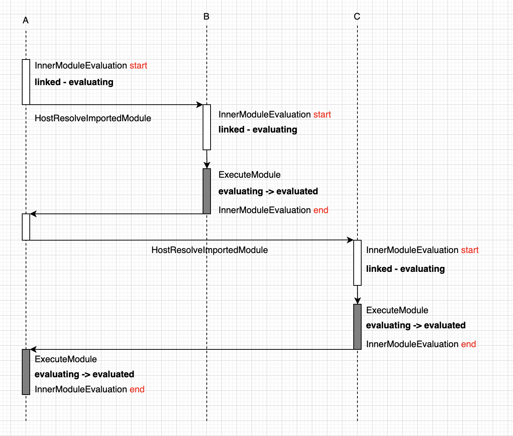
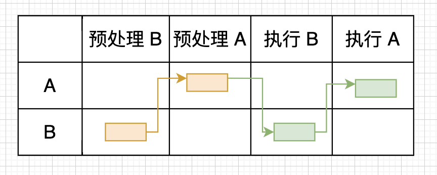

# JS 中的模块化 Module
## 零、参考资料
* [深入分析JavaScript模块循环引用](https://juejin.cn/post/7020247627618861093)
* [Module 的加载实现](https://es6.ruanyifeng.com/#docs/module)
* [从模块的循环加载看ESM与CJS](https://juejin.cn/post/7027778119050362917)
* [理解amd,cmd,commonjs,esm,umd 模块化](https://juejin.cn/post/7341652882114084927)

## 一、早期的实践 - CommonJS 族
Node.js 提供了服务器端的 js 运行环境，因此也带来了一波服务端 js 库的开发高潮。随着功能的完善，相关代码也越来越多，怎么按照功能管理这些代码，就有了模块这个概念。所以说，Node.js 是 js 模块化的积极实践者，而其采用的就是 CommonJS 模块规范

### 基本语法：
* 导出：```module.exports = {xxx}``` 或者 ```module.exports = function() {xxxx}``` 或者 ```exports.xxx = xxxx```
* 导入：```var module = require(xxx)```，其中 ```xxx``` 表示第三方模块名或者自定义的模块的路径，```module``` 对应的是导出语句的 ```exports```（对象或函数）

> 这里可以看到，module 本质上也是一个对象，代表当前的模块(文件)，exports 则是 module 对象上的一个属性

### DEMO：
#### 常规 DEMO：
```js
// lib.js
var counter = 3;

function incCounter() {
  counter ++;
  console.log('lib function ' + counter);
}

console.log('lib global ' + counter);

module.exports = {
  counter,
  incCounter,
};

// main.js
var counter = require('./lib').counter;
var incCounter = require('./lib').incCounter;

console.log('main before function ' + counter);
incCounter();
console.log('main after function ' + counter);

// 输出顺序和结果
// lib global 3
// main before function 3
// lib function 4
// main after function
```

#### 非常规代码 - 1: 将 lib.js 中的对 counter 的导出放在函数中，维持 main.js 中语句不变
```js
// lib.js
var counter = 3;

function incCounter() {
  counter ++;
  console.log('lib function ' + counter);

  module.exports.counter = counter;
}

console.log('lib global ' + counter);

module.exports = {
  incCounter,
};

// 输出顺序和结果
// lib global 3
// main before function undefined
// lib function 4
// main after function undefined
```

#### 非常规代码 - 2: 在第一种的基础上，在 main.js 中将 counter 的引入放在函数执行之后(注释了一行输出)
```js
// main.js
var incCounter = require('./lib').incCounter;

// console.log('main before function ' + counter);

incCounter();

var counter = require('./lib').counter;

console.log('main after function ' + counter); 

// 输出顺序和结果
// lib global 3
// lib function 4
// main after function 4
```

#### 非常规代码 - 3: 还原成最初的 lib.js ，保持第二种 main.js 中的对 counter 引入位置不变
```js
// 输出顺序和结果
// lib global 3
// lib function 4
// main after function 3
```
#### 小结
综合以上的四种情况，我们发现，在 CommonJS 的规范中，<strong><font color=red>导入/导出的位置对最终值是用影响的</font></strong>

### 模块的执行顺序
CommonJS 模块是顺序执行的，遇到 require 时，加载并执行对应模块的代码，然后再回来执行当前模块的代码(即同步)
如下图，A 模块引用了 B/C 模块，意味着在 A 中会有两个 require 语句，将 A 中代码分割为三块(尽管一般的书写规范通常将 require 放在文件头部)，我们分别标记为 A1/A2/A3 代码块，其串行执行顺序是：  

  

  

### 模块的循环引用  
如果模块 A 依赖模块 B，模块 B 又依赖模块 A，那么 CommonJS 是如何处理的呢？同样根据 require 语句的位置，我们将 A/B 标记成 A1/A2/B1/B2，其执行顺序是(以 A 为入口)：  

  

值得注意的是，在模块 B 中 require A 的时候，我们拿到的只是 A1 代码段运算结果，之后 A2 的运算结果是拿不到的，所以，如果此时需要在 A2 代码块中 export 的变量，其值只会是 undefined，恰如上面 demo 中所示的那样

### 总结
* CJS加载模块加载过程是在代码执行过程中，且是同步的，必须等到加载的模块以及加载的模块所有依赖模块加载执行完毕才会继续执行当前模块的代码
* CJS中，模块导出值是对原始值的一个浅拷贝，且这个值会被缓存，即再次使用的话读取的是缓存值
* CJS中，如果模块发生循环加载，由于CJS中对已经加载的代码块进行了缓存，所以不会发生死循环，而是直接访问已经存在的缓存，且缓存只能访问部分导出结果（基于导入导出执行位置）
* 为何说 CommonJS 族，因为 CJS 主要应用在服务端的，不支持异步，所以社区又有了基于此的 AMD/CMD 规范，这个之后再研究

## 二、ESM - ES6 的标准化
ES6 不愧是 6 年磨一剑，在模块方面有着相当多的设计，这些设计逻辑清晰且自洽，但仍有一些模棱两可的地方，没有达到一种绝对完善和无懈可击的状态

> 以下基本搬运自大佬的文章

* 5 种状态：分别为 unlinked、linking、linked、evaluating 和 evaluated，用循环模块记录（Module Environment Records）的 Status 字段表示
* 2 个处理过程：连接（link）和评估（evaluate），连接成功之后才能进行评估

### 连接阶段
连接主要由函数 InnerModuleLinking 实现。函数 InnerModuleLinking 会调用函数 InitializeEnvironment，该函数会初始化模块的环境记录（Environment Records），主要包括：

* 创建模块的执行上下文（Execution Contexts）
* 给导入模块变量创建绑定并初始化为子模块的对应变量，给 var 变量创建绑定并初始化为 undefined
* 给函数声明变量创建绑定并初始化为函数体的实例化值
* 给其他变量创建绑定但不进行初始化

> 注意，这里有些变量只有创建过程，没有初始化过程

完成核心操作的函数 InitializeEnvironment 是后置执行的，所以从效果上看，子模块先于父模块被初始化

### 评估阶段
评估主要由函数 InnerModuleEvaluation 实现。函数 InnerModuleEvaluation 会调用函数 ExecuteModule。具体评估模块的什么内容，ES6 也有点语焉不详

### 两个阶段的综合示意图
  

  

由于连接阶段会给导入模块变量创建绑定并初始化为子模块的对应变量，子模块的对应变量在评估阶段会先被赋值，所以导入模块变量获得了和函数声明变量一样的提升效果。例如，下面的代码是能正常运行的。**因此，ES6 模块的导入导出语句的位置不影响模块代码语句的执行结果**
```js
console.log(a) // 正常打印 a 的值

import { a } from './child.js'
```

### 模块循环引用
对于循环引用的场景，会先对子模块进行预处理和执行。连接阶段除了分析模块依赖关系，还会创建执行上下文和初始化变量，所以连接阶段主要包括分析模块依赖关系和对模块进行预处理。如下图所示，对于模块循环引用，处理顺序为：预处理 B -> 预处理 A -> 执行 B -> 执行 A(A 为入口文件)

  

### 循环引用中，使用不当的问题
```js
// 文件 parent.js (入口文件)
import {} from './child.js';
export const parent = 'parent';

// 文件 child.js
import { parent } from './parent.js';
console.log(parent); // 报错
```
如上面代码所示，child.js 中的导入变量 parent 被绑定为 parent.js 的导出变量 parent，当执行 child.js 的最后一行代码时，parent.js 还没有被执行，parent.js 的导出变量 parent 未被初始化，所以 child.js 中的导入变量 parent 也就没有被初始化，会导致 JS 错误

但是，有个特例：如果子模块中，对父模块中导出变量的使用（消费）在异步块中，那么就不会报错，因为异步执行的时候父模块已经被执行了，如下面代码所示：
```js
// child.js
import { parent } from './parent.js';
setTimeout(() => {
  console.log(parent) // 输出 'parent'
}, 0);
```

### ESM 的总结
* ESM 的导出值不是一个浅拷贝，而直接是内存中的那个地址(或值)，因此，对这个值的修改(通过同模块中的方法)，所有的导入文件都会受到影响
* 在导入文件中，导入的变量是只读的，对它进行重新赋值会报错，类似于 const 定义的变量
* ESM 相对于 CommonJS 有个预处理的过程，相当于"编译时"处理过程
* ESM 和 CommonJS 一样，解决循环引用的方式是读取缓存，这个缓存是指对模块的引入，而不是对内部模块值的运算(否则就违背了总结 1 了)，下面是对这个总结的举例说明：
  * 入口文件是 parent.mjs，在其中引入了 child.mjs
  * 预处理 parent，并将 parent.mjs 放入 Module Map 中，形成模块记录
  * 在 parent 中发现依赖了 child，加载 child.mjs，预处理 child.mjs，并将其放入 Module Map 中，形成模块记录
  * 在 child 中发现依赖了 parent，此时不会去加载 parent，而是直接去 Module Map 中读取 parent，而此时会按照连接中的原则进行后续的代码解释，接着对 child 进行评估、执行，如同 模块循环引用 中示意图那样

## 总结 - 待完善
* Module 这玩意吧，说到底就四个字 - 空间隔离，技术实现嘛，要么块要么函数(因为除了全局作用域外，就剩这两个家伙)，在现在 js 的基石上，估计无论选择哪条路径，都离不开闭包这个家伙
