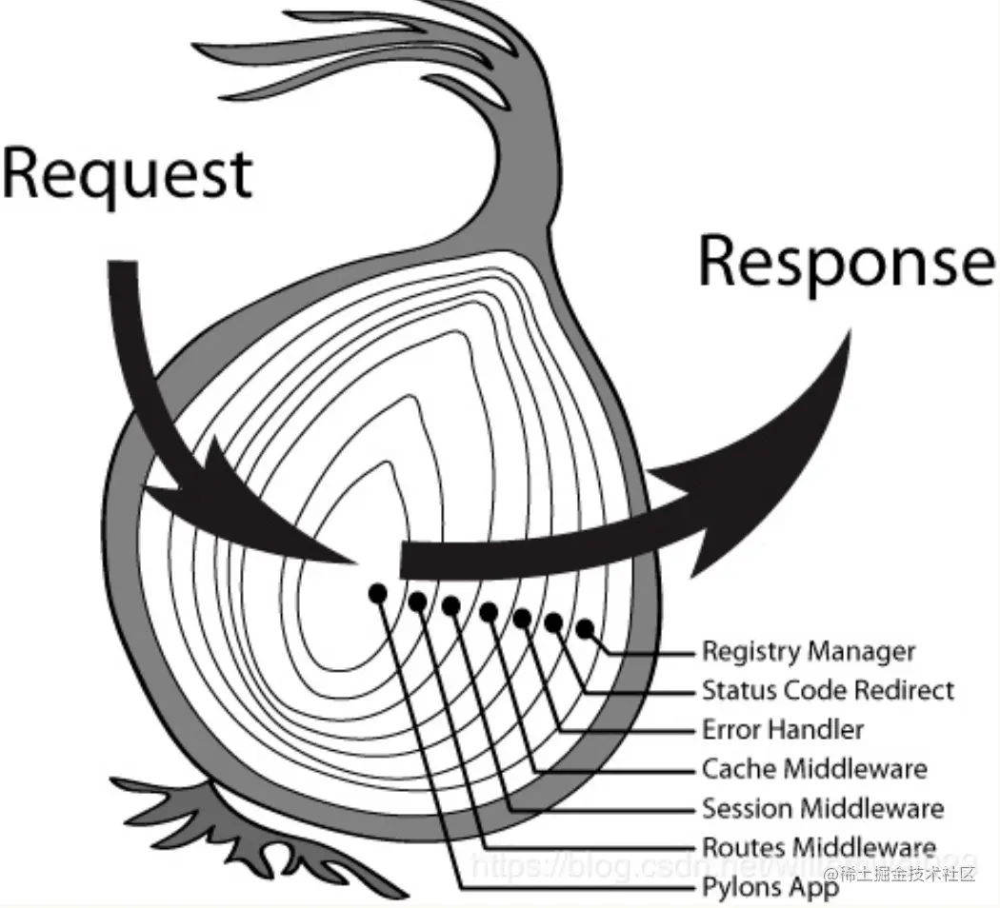

# JS Promise 的一些用法

## 零、参考资料
* [20几个你不得不知道的Promise高级用法](https://juejin.cn/post/7307838693146116130)
* [整会promise这8个高级用法，再被问倒来喷我](https://juejin.cn/post/7263089207128850489)

## 一、KOA2 中的洋葱模型
这也是本篇文章的起因

#### 洋葱模型


#### 使用演示
```js
const app = new Koa();

app.use(async (ctx, next) => {
  console.log('1-1');

  await next();

  console.log('1-2');
});

app.use(async (ctx, next) => {
  console.log('2-1');

  await next();

  console.log('2-2');
});

// ... 其他 use

app.listen(3000)
```

以上的输出为 ```1-1 -> 2-1 -> 2-2 -> 2-1```

#### 一个简单的洋葱模型
```js
class Koa {
  middlewares = []; // 缓存所有中间件

  use(mid) {
    this.middlewares.push(mid);
  }

  listen(port) {
    // 伪代码模拟接受请求
    http.on('request', ctx => {
      action(this, ctx);
    })
  }
}

// 启动函数，这个函数是 Koa 源码中 compose 的简单代替
function action(koaInstance, ctx) {
  let nextMiddlewareIndex = 1; // 中间件索引

  // 定义 next 函数
  function next() {
    const nextMiddleware = middlewares[nextMiddlewareIndex];

    if (nextMiddleware) {
      nextMiddlewareIndex++;

      // 让中间件函数的执行用promise从后到前串联执行
      return Promise.resolve(nextMiddleware(ctx, next));
    } else {
      // 当最后一个中间件的前置逻辑执行完后，返回 fulfilled 的promise开始执行next后的后置逻辑
      return Promise.resolve();
    }
  }

  middlewares[0](ctx, next);
}
```

#### 一个 mini Koa 实现
```js
import { http } from 'http';

class Application {
  constructor() {
    this.middlewares = [];
  }

  use(fn) {
    if(!fn || Object.prototype.toString.call(fn) !== '[object Function]') {
      return new Error('use函数值接受function参数且不能为空值');
    }

    this.middlewares.push(fn);

    return this;
  }

  listen(port) {
    const server = http.createServer(this.callback());

    console.log(`服务器正在端口:${port} 上启动`);

    return server.listen(port);
  }

  // 洋葱模型的 起点
  callback() {
    const fn = this.compose(this.middlewares);

    return (req, res) => {
      const ctx = this.createContext(req, res);

      this.handleRequest(ctx, fn);
    }
  }

  handleRequest(ctx, middleware) {
    middleware(ctx);
    this.handleResponse(ctx);
  }

  handleResponse(ctx) {
    const res = ctx.res;
    let body = ctx.body;

    // 如果 body 是一个 stream，则通过 pipe 方法进行响应
    if (body instanceof Stream) return body.pipe(res);

    body = JSON.stringify(body);

    return res.end(body);
  }

  // 洋葱模型核心方法
  // 当然，这里并没有异步的实现，可以参考上面简单洋葱模型的实现
  compose(middlewares) {
    const dispatch = (ctx, i) => {
      if (middlewares.length === i) return;

      return middlewares[i](ctx, () => dispatch(ctx, i + 1));
    }

    return (ctx) => {
      middlewares[0](ctx, () => dispatch(ctx, 1));
    }
  }

  createContext(req, res) {
    return {
      app: this,
      req,
      res,
    };
  }
}

const koa = new Application();

koa.use((ctx, next) => {
  console.log('1-1');
  next();
  console.log('1-2');
});

koa.use((ctx, next) => {
  console.log('2-1');
  next();
  console.log('2-2');
});

koa.listen(3000);
```

> 从模型上来看，洋葱模型很像是 JAVA 中的 AOP 思想  
> 从结果上来看，有点先进后出的意思

## 二、异步的串行执行
Promise 本身并没有串行执行的概念，但是我们可以借助一些方法，主要是两个：

#### for...of... 版
```js
const promises = [() => pro1, () => pro2, () => pro3];

for (const fn of promises) {
  await fn();
}
```

#### reduce 版
```js
const promises = [() => pro1, () => pro2, () => pro3];

const finallyPromise = promises.reduce(
  (currentPromise, nextPromiseFn) => currentPromise.then(() => nextPromiseFn()),
  Promise.resolve(), // 创建一个初始promise，用于链接数组内的promise
);
```

## 三、在 new Promise 作用域外更改状态
通常，我们习惯在构造 ```Promise``` 的时候就决定了什么时候改变状态，如下面的代码
```js
new Promise((resolve, reject) => {
  if (...) {
    resolve();
  } else {
    reject();
  }
})
```

那么，我们能不能把 ```resolve``` & ```reject``` 暴露出来，在其他交互的时候来改变这个 ```Promise``` 的状态呢？
```js
let resolveFn, rejectFn;

function wrapper() {
  // some other code

  return new Promise((resolve, reject) => {
    resolveFn = resolve;
    rejectFn = reject;
  });
}
```

这样，调用 ```wrapper``` 函数将生成一个 ```promise``` 对象，由于没有调用该对象的 ```resolve``` & ```reject``` 方法，所以会一直处于 ```pending``` 状态。而在其他的交互中，我们就可以通过调用 ```resolveFn``` 或者 ```rejectFn``` 来按需改变这个 ```promise``` 的状态

很多 UI 组件库中就是基于这种形式进行交互控制

## 四、并发控制
使用 ```Promise.all``` 可以并行执行多个 ```Promise```，但当需要控制并发的请求数量时，可以通过实现一个并发控制函数来控制同时执行的 ```Promise``` 数量

```js
function concurrentPromises (promises, limit) {
  return new Promise((resolve, reject) => {
    let i = 0;
    let result = [];

    const executor = () => {
      if (i >= promises.length) return resolve(result);

      const _promise = promises[i++];

      Promise.resolve(_promise).then(value => {
        result.push(value);

        if (i < promises.length) {
          executor();
        } else {
          resolve(result);
        }
      }).catch(reject);
    };

    for (let j = 0; j < limit && j < promises.length; j++) {
      executor();
    }
  })
}
```

## 五、超时控制
有时候，我们希望 ```Promise``` 在一定时间内如果没有得到解决就自动 ```reject```，于是可以这样
```js
const promiseWithTimeout = (promise, ms) =>
  Promise.race([
    promise, // 目标 promise
    new Promise((resolve, reject) =>
      setTimeout(() => reject(new Error('Timeout after ' + ms + 'ms')), ms)
    ) // 超时控制 promise
  ]);
```

## 六、取消控制
原生的 ```Promise``` 是无法取消的，但我们可以通过引入一个可控的中断逻辑来模拟取消 ```Promise```

```js
const cancellablePromise = promise => {
  let isCanceled = false;

  const wrappedPromise = new Promise((resolve, reject) => {
    promise.then(
      value => (isCanceled ? reject({ isCanceled, value }) : resolve(value)),
      error => (isCanceled ? reject({ isCanceled, error }) : reject(error))
    );
  });

  return {
    promise: wrappedPromise,
    cancel() {
      isCanceled = true;
    }
  };
};
```

## 七、重试
当Promise因为某些暂时性的错误被拒绝时，可能希望能够重试执行
> 这应该可以应用在 WS 中的重连逻辑中

```js
const retryPromise = (promiseFn, maxAttempts, interval) => {
  return new Promise((resolve, reject) => {
    const attempt = attemptNumber => {
      if (attemptNumber === maxAttempts) {
        reject(new Error('Max attempts reached'));

        return;
      }

      promiseFn().then(resolve).catch(() => {
        setTimeout(() => {
          attempt(attemptNumber + 1);
        }, interval);
      });
    };
    attempt(0);
  });
};
```

## 八、once 
既然有了重试，那么也有 once(其实就是最大重试次数为 0)
```js
const onceResolvedPromise = executor => {
  let isResolved = false;
  return new Promise((resolve, reject) => {
    executor(
      value => {
        if (!isResolved) {
          isResolved = true;
          resolve(value);
        }
      },
      reject
    );
  });
};
```

## 九、链式流程控制
有两种方案：
### ```then``` 方案
这种方案就是常规的在 ```then``` 的两个回调函数中操作，但是要注意每个回调中要 ```return``` 正确的值，方便后续的链式操作  
这种方案也自带来一部分的分支控制功能，可以部分替代 ```if/else``` 的书写

### ```Generators``` 方案
通过将 ```async/await``` 与 ```Generators``` 配合，可以创建一个可控制的异步流程管理器
```js
function* asyncGenerator() {
  const result1 = yield aPromise1;
  const result2 = yield aPromise2(result1);
  // ...
}
```

## 十、使用 ```Promise``` 实现简易的异步锁
```js
let lock = Promise.resolve();

const acquireLock = () => {
  let release;
  const waitLock = new Promise(resolve => {
    release = resolve;
  });
  const tryAcquireLock = lock.then(() => release);

  lock = waitLock;

  return tryAcquireLock;
};
```

## 十一、流式处理大型数据集
使用 ```Promise``` 处理大型数据集时，最好是流式地获取和处理这些数据，以避免内存过载。其实就是分片加载数据
```js
async function processLargeDataSet(dataSet) {
  for (const dataChunk of dataSet) {
    const processedChunk = await process(dataChunk); // Returns a Promise

    await save(processedChunk); // Another async operation
  }
}
```
