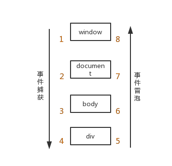

# JS 事件委托
## 零、写在前面
最近在看 vue 的轮播插件的时候想起以前也写过一个小 demo，翻当初的代码的时候脑中一直冒出“事件委托”这样的概念，于是顺手查了点资料，重构了下这个demo，权当复习

## 一、何为事件委托？
从字面意思上理解就是把事件委托给其他元素，由他们代为执行

那为什么需要其他元素代为执行事件回调呢？先看下面的例子：
```html
<div class="buttons">
  <span class="on" data-index="0">1</span>
  <span class data-index="1">2</span>
  <span class data-index="2">3</span>
  <span class data-index="3">4</span>
  <span class data-index="4">5</span>
</div>

<script>
for (var i = 0, len = spans.length; i < len; i++){
  (function(i){
    span[i].onclick = function () {
      ...
    }
  })(i);           
}
</script>
```

场景很简单，轮播图下方一般都会有显示进度的点，当点击这些点的时候可以跳转到对应的图片上，于是需要对这些点注册 ```onclick``` 事件，就像上面例子中的 for 循环。当然这个场合下使用循环来绑定注册事件并没多大的影响。

但是如果换成瀑布流布局呢？并且，瀑布流中的元素需要动态生成，每重新获取一次就动态绑定注册一次？这样我想用户体验也会差吧。

因此，就可以使用事件委托来处理，开局只需绑定一次父元素，后面子元素无论增删，都可以自动绑定，并且，不需要 for 循环了，性能提升效果显著。

于是，上面的例子可以改写成：
```js
buttons.onclick = function(ev) {
  let target = ev.target || ev.srcElement;

  ...     
}
```

## 二、事件委托的原理 - 事件捕获 和 事件冒泡
* 事件捕获：当鼠标点击或者触发 ```dom``` 事件时（被触发 ```dom``` 事件的这个元素被叫作事件源），浏览器会从根节点 =>事件源（由外到内）进行事件传播
* 事件冒泡：事件源 =>根节点（由内到外）进行事件传播

  

捕获和冒泡的流程中所有经过的节点，都会触发对应的事件

```dom``` 标准事件流的触发的先后顺序为：**先捕获再冒泡**。即当触发 ```dom``` 事件时，会先进行事件捕获，捕获到事件源之后通过事件传播进行事件冒泡

上例中，使用 ```onclick``` 的方式进行注册绑定的事件会发生在事件冒泡的过程中。即事件源上注册的事件先执行，依次向 ```window``` 对象扩散。

那么有没有办法在事件捕获的阶段执行回调函数呢？ addEventListener 这个API可以实现：  
```element.addEventListener(eventType, function(e) { ... }, useCapture);```

* 第一个参数是必须的，```String``` 类型，表示事件名，如 ```click```；
* 第三个参数 ```useCapture``` 可以决定在何阶段执行。默认 false，表示在冒泡阶段调用事件处理函数，如果设置为 true，表明会在捕获阶段调用


### 注意
* 使用 ```onclick``` 的方式进行事件注册绑定，如果存在多个事件的话，后注册的事件会覆盖先注册的事件，而使用 ```addEventListener``` 方式进行注册，会按照注册顺序执行，并不存在覆盖
