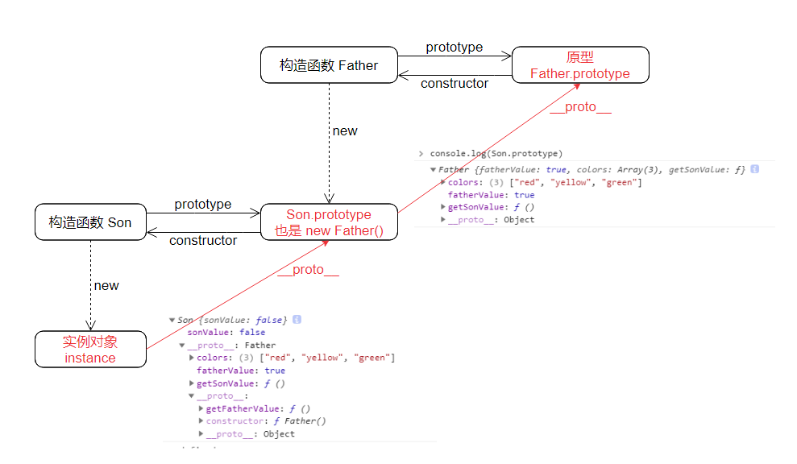
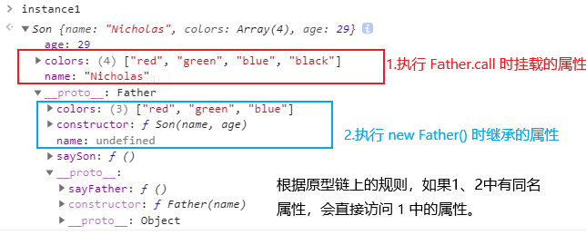
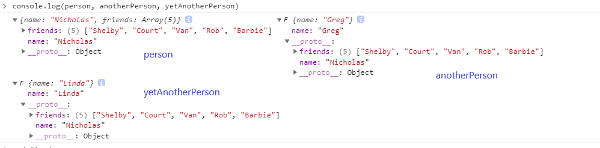
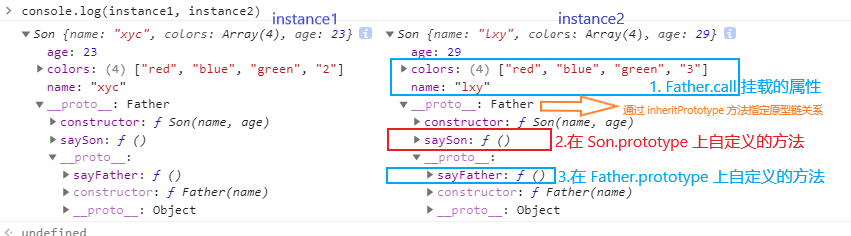

# JS 常用的继承 - extend
## 零、参考资料
* [JavaScript常用八种继承方案](https://juejin.cn/post/6844903696111763470)

注意：阅读之前建议温习一下 js 中的 prototype 和 constructor([JS.原型-V2](./JS.原型-V2.md))

## 一、原型链上的继承(new)
```js
function Father() {
  this.fatherValue = true;
  this.colors = ['red', 'yellow', 'green'];
}
 
Father.prototype.getFatherValue = function() {
  return this.fatherValue;
}
 
function Son() {
  this.sonValue = false;
}
 
// 以下两句需要按照顺序写，避免意外的覆盖
Son.prototype = new Father(); // 核心，这里建立继承关系
 
Son.prototype.getSonValue = function() { // 定义需要的属性/方法
  return this.sonValue;
}
 
var instance1 = new Son();

console.log(instance1)
```


这个方法的原理是利用原型链 ```instance1.__proto__ === Son.prototype```，然后手动修改 ```Son.prototype``` 的指向，使其指向一个 ```Father``` 的实例对象，从而实现继承

从上例中我们可以发现，```instance1``` 自身并没有 ```fatherValue```、```colors``` 这些属性，但是我们可以通过原型链访问得到这些属性，说明继承成功

但是这里就存在一个问题，我们接着看下面的代码：
```js
var instance1 = new Son();
console.log(instance1.colors);   // ["red", "yellow", "green"]

instance1.colors.push('black');
console.log(instance1.colors); // ["red", "yellow", "green", "black"]
 
 
var instance2 = new Son();
console.log(instance2.colors);  // ["red", "yellow", "green", "black"]
```

对象 ```instance1``` 对引用类型的 ```colors``` 修改，那么其他所有的实例中的 ```colors``` 都被修改了，这也是这种继承方法的缺点之一：**父类使用 ```this``` 声明的属性被所有实例共享**

另外，我们也**没有办法在实例子类的同时，根据需要向父类传参数**，不够灵活

## 二、借用构造函数(call)
```js
function Father() {
  this.color = ['red', 'green', 'blue'];
}
function Son() {
  Father.call(this) // 核心，利用 this 在初始化的时候指向实例对象实现继承
}
var instance1 = new Son();
instance1.color.push('black');
console.log(instance1.color); // 'red, green, blue, black'
 
var instance2 = new Son();
console.log(instance2.color); // 'red, green, blue'
```
可以看一下 ```instance1``` 内部结构图

我们可以看到这里与第一种方法的不同的地方在属性的挂载上，第一种方法 ```colors``` 是挂在原型链上的，而这种方法 ```colors``` 直接是在子类的实例对象上的，所以我们就能修正第一种方法的实例共享的问题

　　我们仔细分析一下这里面的核心关系：我们在 new Son() 的时候，一定会执行函数调用语句 ```Father.call(this)``` 这句，而这一句实质是改变 ```Father``` 内部的 ```this``` 的指向，使其指向子实例对象，并在子实例对象上挂载 ```color``` 属性(相当于 ```instance1.color = ['red', 'green', 'blue'];```)，这样，在 ```Father.call(this)``` 执行完之后，子实例对象上就会多一个属性，并且，因为该过程中执行的是函数调用，所以每次新实例化子对象的时候均会创建地址不同的 ```['red', 'green', 'blue']``` 并赋值，从而解决第一种方法中的共享问题

这种方法的优点除解决共享问题外，还可以**在实例化子类型对象时向父类型传递参数**。当然，也有缺点，因为这种方法与原型链没有任何关系，故，**子类只能继承父类中通过 ```this``` 声明(注册)的属性，不能访问，也不能继承父类 ````prototype``` 上的属性/方法**

## 三、组合式继承(call + new)
这种方式是将上面两种方法综合一下：
```js
function Father(name) {
  this.name = name;
  this.colors = ['red', 'green', 'blue'];
}
 
Father.prototype.sayFather = function() {
  console.log(this.name);
}
 
function Son(name, age) {
  // 继承属性
  // 第二次调用 Father();
  Father.call(this, name);
  this.age = age;
}
 
// 继承方法
// 第一次调用 Father();
Son.prototype = new Father();
 
// console.log(Son.prototype.constructor) // => Father() {}
 
// 重写(扶正) Son.prototype 的 constructor, 让其指向自身的构造函数 Son
// 因为上一句 (Son.prototype = new Father()) 的关系，如不修改，Son.prototype.constructor 会指向 Father
Son.prototype.constructor = Son;
 
Son.prototype.saySon = function() {
  console.log(this.age)
}
 
// console.log(Son.prototype.constructor) // () => Son() {}
 
var instance1 = new Son('Nicholas', 29);
instance1.colors.push('black');
console.log(instance1.colors);  // 'red,blue,green,black'

instance1.sayFather();  // 'Nicholas';
instance1.saySon();  // 29

var instance2 = new Son('Greg', 27);
console.log(instance2.colors);  // 'red,blue,green'
instance2.sayFather();  // 'Greg';
instance2.saySon();  // 27
```

这样的优点自然是解决上面两种方法的主要痛点

然后我们来观察下子实例的结构：  


原因是在源码中执行过两次 ```Father()```，这两次分别在子实例的原型(```Son.prototype```)和子实例(```new Father()```)上挂载了同样的属性，当然这里不存在同一个子实例原型和子实例上的引用类型数据共享的问题(```instance.colors !== instance.__proto__.colors```)

而因为每个子实例均会优先访问自身的属性，所以这就绕过了父类使用 ```this``` 声明的属性被所有实例共享的问题

当然，这也是这种方法的缺点：**在使用子类创建实例对象时，其原型中会存在一份同样的属性/方法**

另外，还有几点需要注意：
1. 凡是使用原型链(```new Father()```)的方式，都会存在 ```Son.prototype.constructor``` 需要扶正的问题，所以第一种方式中需要补全。(￣_,￣ )

## 四、原型式继承(Object.create())
```js
function cloneObject(obj) {
  function F() {}
  F.prototype = obj;
 
  return new F();
}
 
var person = {
  name: 'Nicholas',
  friends: ['Shelby', 'Court', 'Van']
};
 
var anotherPerson = cloneObject(person);
anotherPerson.name = 'Greg';
anotherPerson.friends.push('Rob');
 
var yetAnotherPerson = cloneObject(person);
yetAnotherPerson.name = 'Linda';
yetAnotherPerson.friends.push('Barbie');
 
console.log(person.friends);   // 'Shelby, Court, Van, Rob, Barbie'
console.log(anotherPerson.friends);  // 'Shelby, Court, Van, Rob, Barbie'
console.log(yetAnotherPerson.friends);  // 'Shelby, Court, Van, Rob, Barbie'
```

其中，```cloneObject``` 函数是 ```Object.create()``` 原生方法的模拟实现，这里只是演示下，实际情况中可以使用 ```Object.create()``` 来代替。当然，这里发生的复制都是浅复制

接着我们看一下子实例的内部结构：


和第一种方法打印出来的子实例结构类似，其实这两种方式本质上是相同的，所以他们的名字就差一个字，缺点也一样：**共享引用类型；不能灵活传参**

## 五、寄生式继承
这种继承方式仅在第四种方法的基础上做了些许增强(可以理解成定制化)，修改不大：
```js
function createAnother(original) {
  var clone = Object.create(original);

  clone.sayHi = function() { // 增强的部分
    console.log('hi');
  }
 
  return clone;
}
 
var person = {
  name: 'Nicholas',
  friends: ['Shelby', 'Court', 'Van']
};
var anotherPerson = createAnother(person);

anotherPerson.sayHi();  // 'hi'
```

## 六、寄生组合式继承(call + 寄生式)
结合借用构造函数和寄生模式实现继承，是目前最成熟的方式，也是现在很多库实现的方法
```js
function Father(name) {
  this.name = name;
  this.colors = ['red', 'blue', 'green'];
}
Father.prototype.sayFather = function() {
  console.log(this.name);
}
 
function Son(name, age) {
  Father.call(this, name);
  this.age = age;
}
 
// 核心关系函数
function inheritPrototype(son, father) {
  var prototype = Object.create(father.prototype); // 创建一个父类原型的副本对象

  prototype.constructor = son;   // 扶正 constructor, 否则会指向 father
  son.prototype = prototype;
}
inheritPrototype(Son, Father);
 
Son.prototype.saySon = function() {
  console.log(this.age);
}
 
var instance1 = new Son('xyc', 23);
var instance2 = new Son('lxy', 29);
 
instance1.colors.push('2'); // ['red', 'blue', 'green', '2']
instance2.colors.push('3'); // ['red', 'blue', 'green', '3']
```

这种方式与组合式的区别在于使用 ```inheritPrototype``` 函数来代替 ```Son.prototype = new Father();``` ，在整个过程中只调用一次 ```Father()``` ，从而避免在 ```Son.prototype``` 上挂载多余的属性。我们来看一下子实例的结构


我们可以看到，在所有子实例的原型对象(```instance.__proto__```)上并没有找到组合式存在的不必要的、重复属性。所以总结来说，借用组合式实现参数传递，借用寄生式完善原型链建立，因此，还能正常使用 ```instanceof``` 和  ```isPrototypeOf()```

## 七、ES 6 extends 继承
这个和 java 的用法一致，具体写法就不贴了，就贴一下核心代码实现，当然，是通过 babel 编译成 es5 的：
```js
function _inherits(subType, superType) {
  // 创建对象，创建父类原型的一个副本
  // 增强对象，弥补因重写原型而失去的默认的constructor 属性
  // 指定对象，将新创建的对象赋值给子类的原型
  subType.prototype = Object.create(superType && superType.prototype, {
    constructor: {
      value: subType,
      enumerable: false,
      writable: true,
      configurable: true
    }
  });
    
  if (superType) {
    Object.setPrototypeOf
      ? Object.setPrototypeOf(subType, superType)
      : subType.__proto__ = superType;
  }
}
```
其本质就是寄生组合的方式
