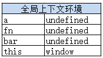
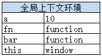
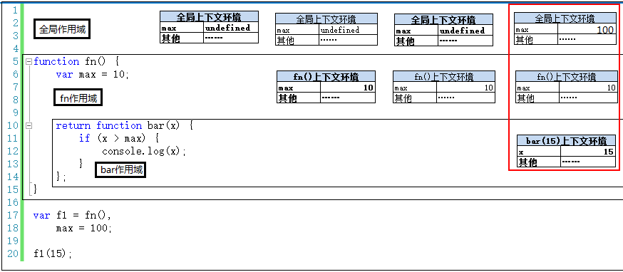

# JS 中的函数相关
## 零、参考资料
* [深入理解javascript原型和闭包（完结）](https://www.cnblogs.com/wangfupeng1988/p/3977924.html)
* JS 中的原型见:
  1. [JS 原型](./JS原型.md)
  2. [JS 原型-V2](./JS原型-V2.md)

## 执行上下文
### 基础概念
在一段js代码拿过来真正一句一句运行之前，浏览器已经做了一些"准备工作"，其中包括对变量的声明（而不是赋值。变量赋值是在赋值语句执行的时候进行的。）、this 的赋值、"函数表达式"或"函数声明"，如：
1. this 的绑定([JS 中的 this-V2](./JS中的this-V2.md))
2. 变量、函数表达式。如：
```js
console.log(a);  // undefined
var a = 10;

console.log(f1)  // undefined
var f1 = function() { };
```
3. 函数的声明及赋值；
```js
console.log(f1);  // function f1() { }
function f1() { };
```
  > "函数的声明"和"函数表达式"均发生在这一准备工作阶段，但是过程确实不一样的   

以上的三种的数据准备情况称之为"执行上下文"。通俗来讲，在执行代码前，把将要用到的所有变量都事先拿出来，有的直接赋值，有的先用 undefined 占个坑

### 全局与局部(函数体)上下文环境
* 全局(global)的上下文环境：  

| 种类 | 动作 |
| :---- | :----: |
| 普通变量(包括函数表达式)，如 var a = 10; | 声明(默认赋值为 undefined) |
| 函数声明，如 function fn() { } | 赋值 |
| this | 赋值 |

* 函数体上下文环境(在全局的基础上多了如下的内容)

| 种类 | 动作 |
| :---- | :----: |
| 参数 | 赋值 |
| arguments | 赋值 |
| 自由变量的取值作用阈 | 赋值 |

### 需要注意的是
1. 函数每被调用一次，都会产生一个新的执行上下文环境。因为不同的调用可能就会有不同的参数
2. 函数在定义的时候（不是调用的时候），就已经确定了函数体内部自由变量的作用域。比如
```js
var a = 10;
function fn() {
  console.log(a); // 10 
}
 
function bar(f) {
  var a = 20;
  f();               
  console.log(f); // function fn() { console.log(a); }
}
 
bar(fn);

// 控制台打印 10
// function fn() { console.log(a); }
```
3. 关于函数的执行。上例中应该可以看出来，函数执行真正的符号是 "()" , 前面的基本等同于是个标识

## 执行上下文栈
执行全局代码时，会产生一个执行上下文环境，每次调用函数都又会产生执行上下文环境。当函数调用完成时，这个上下文环境以及其中的数据都会被消除，再重新回到全局上下文环境。处于活动状态的执行上下文环境只有一个

这其实是一个压栈出栈的过程 -- 执行上下文栈  


一段具体的代码分析:
```js
var a = 10,                    // 1.进入全局上下文环境
  fn,
  bar = function(x) {
    var b = 5;
    fn(x + b);                // 3.进入 fn 函数上下文环境
  };
 
fn = function(y) {
  var c = 5;
  console.log(y + c);
}
 
bar(10);                      // 2.进入 bar 函数上下文环境
```

* 首先，在执行第 1 行代码前，创建一个全局上下文环境  

* 然后，执行代码。在执行 ```bar(10);``` 这一句之前，上下文中的变量均被赋值  

* 接着，执行 ```bar(10);```。跳转到 ```bar``` 函数的内部，执行函数体语句之前，会创建一个新的执行上下文环境  

* 并将这个上下文环境压栈，设置为活动状态  

* 因为在 ```bar``` 函数内部又调用了 ```fn``` 函数，进入 ```fn``` 函数，在执行函数体语句之前，会创建 ```fn``` 函数的执行上下文环境，并压栈，设置为活动状态  

* 在 ```fn(x + b);``` 执行完毕，即 ```fn``` 函数执行完毕后，此次调用 ```fn``` 所产生的上下文环境出栈，并且被销毁（释放内存）  

* 同样， ```bar``` 函数执行完毕后，调用 ```bar``` 函数所生成的上下文环境出栈，并且被销毁（释放内存）  

* 以上，是一段代码执行时全局、函数体的上下文执行环境的变化理论过程。实际情况往往跟复杂  

## 作用域
### 注意点
* "javascript 没有块级作用域"。块，即"{ ... }"。例如 if/for 语句
* javascript 除了全局作用域之外，只有函数可以创建的作用域

### 代码示例及解析
所以一个好的习惯就是在声明变量时，全局代码要在代码前端声明，函数中要在函数体一开始就声明好。除了这两个地方，其他地方都不要出现变量声明。而且建议用"单var"形式。比如：
```js
var i = 10;
if (i > 1) {
  // code
}
 
var i;
for (i = 0; i < 10; i++) {
  // code
}
```

作用域，通俗意义上相当于"地盘"，其作用就是隔离变量，防止冲突。<strong><font color=red>正如前面提到的，函数在定义时，其作用域就已经确定了，而不是在函数调用时确定</font></strong>

```js
var a = 10, b = 20;
 
function fn(x) {
  var a = 100, c = 300;

  function bar(x) {
    var a = 1000, d = 4000;
  }

  bar(100);
  bar(200);
}
 
fn(10);
```
  

接下来，逐步分析：
1. 第一步，在加载程序时，已经确定全局上下文环境，并随着程序的执行对变量进行赋值
2. 第二步，程序执行 ```fn(10);``` ，此时生成此次调用 ```fn``` 函数时的上下文环境，压栈，并此上下文环境设置为活跃状态
3. 第三步，调用 ```bar(100);```，生成此次调用的上下文环境，压栈，并设置为活动状态
4. 第四步，执行完 ```bar(100);```，```bar(100)``` 调用结束， ```bar(100)``` 上下文环境被销毁。接着执行 ```bar(200)``` ，则有生成 ```bar(200)``` 的上下文环境，压栈，设置为活动状态
5. 第五步，执行完 ```bar(200)```, ```bar(200)``` 调用结束，上下文环境被销毁。回到 ```fn(10)``` 上下文环境，变回活动状态
6. 第六步，执行完```fn(10)```，```fn(10)``` 调用结束，上下文环境被销毁。回到全局上下文环境，变回活动状态  

  

### 总结
* 作用域只是一个"地盘"，一个抽象的概念，其中没有变量
* 要通过作用域对应的执行上下文环境来获取变量的值
* 同一个作用域下，不同的调用会产生不同的执行上下文环境，继而产生不同的变量的值。
* 所以，作用域中变量的值是在执行过程中产生的确定的，而作用域却是在函数创建时就确定了。
* 即：作用域只会产生一次，上下文环境多次产生多次销毁

--------------- ES6 的补充 ---------------

ES 6 中引入了 ```let、const、class``` 这些 feature，使用这些关键字声明的标识符具有块级作用域，如：
```js
const c = 1;

{
  const c = 2;
}

console.log(c); // 1; 不会抛出 SyntaxError
```

## 自由变量以及作用域链
### 基础概念
* 自由变量：在 A 作用域内使用变量 x ， 但是 A 的作用域内却没有 x 变量的声明（即在其他作用域内声明的），对于 A 作用域来说，x 就是自由变量
* 作用域链：如果一个子函数在父函数（声明这个子函数所在的函数体）中没有找到所需要的自由变量，那么该子函数会去祖父函数中去找 ... 并以此类推

### 代码与分析
```js
var x = 10;
function fn() {
  console.log(x);
}
 
function show(f) {
  var x = 20;
    
  // 这是个匿名函数
  (function() {
    f();
  })()
}
 
show(fn);

// 控制台打印 10, 而不是20
```

代码中，对于函数 fn 来说， 其中的 x 就是自由变量。

然后，<strong><font color=red>对于函数中自由变量的取值，要到创建这个函数的那个作用域中取值——是"创建"，而不是"调用"</font></strong>  

所以，在上面的代码中，匿名函数在 show 函数中创建，所以其中的自由变量应该是到 show 函数的作用域中取值；但是，匿名函数中并没有自由变量，只是执行了 f （即 fn） 函数，而 fn 函数是在全局作用域的环境中创建，所以其中的自由变量是到全局作用域中取值。故，最终打印的 x 是 10

## 闭包
闭包这个概念不太好理解，但我们可以记住它的运用场合 —— 函数作为返回值，函数作为参数传递。
> 这里开始需要上面 执行上下文、作用域 的基础

### 关键点
1. 函数作用域在定义时即创建，而非在调用时 - 决定自由变量的取值
2. 函数执行前会对产生执行上下文环境，此时才会对函数体内的变量声明以及赋值
3. 一般情况下，函数调用执行完成，执行上下文环境即被销毁
4. 函数真正执行的语句是 “()”，而不是 “函数名()”

### 闭包
既然存在一般情况，那么也就存在特殊情况，这种特殊情况就是闭包，其核心是：使用闭包的场合下，<strong><font color=red>一些执行上下文环境不会被销毁</font></strong>

demo: 
```js
function fn() {
  var max = 10;

  function bar(x) {
    if (x > max) {
      console.log(x);
    }
  }

  return bar;
}
 
var f1 = fn(),
    max = 100;

f1(15);
```


步骤分析：
1. 代码执行前生成全局上下文环境，并在执行时对其中的变量进行赋值。此时全局上下文环境是活动状态
2. 执行 ```var f1 = fn()``` 时，调用 ```fn()```，产生 ```fn()``` 执行上下文环境，压栈，并设置为活动状态
3. 执行完 ```var f1 = fn()```。按理，应销毁 ```fn``` 的执行上下文环境，但是因为 ```fn``` 的返回值是 ```bar``` 函数，```bar``` 函数中 ```max``` 变量是自由变量，其需要引用 ```fn``` 执行上下文环境中的 max 变量，因此，```fn``` 的执行上下文环境不能被销毁，否则 ```bar``` 函数中 ```max``` 将找不到值。
4. 执行到 ```max = 100;``` 时，全局上下文环境将变为活动状态，但是 ```fn()``` 上下文环境依然会在执行上下文栈中。另外，执行完这一句后，全局上下文环境中的 ```max``` 被赋值为 100
5. 执行到 ```f1(15);```，即执行 ```bar(15)```，创建 ```bar(15)``` 上下文环境，并将其设置为活动状态
6. 执行完 ```f1(15);```，全部代码结束，接着就是上下文环境的销毁过程，依次是 ```bar - fn - 全局``` (当然真实情况下，关闭浏览器或者宿主环境的时候才会执行这个步骤)

## 最后的一段综合分析
试试最终的打印结果以及修改方案
```js
function createFunctions(){
  var result = new Array();
  for (var i=0; i < 10; i++){
    result[i] = function(){
      return i;
    };
  }
  return result;
}

var fns = createFunctions();

for (var i = 0; i < fns.length; i++){
  console.log(fns[i]());
}
```
