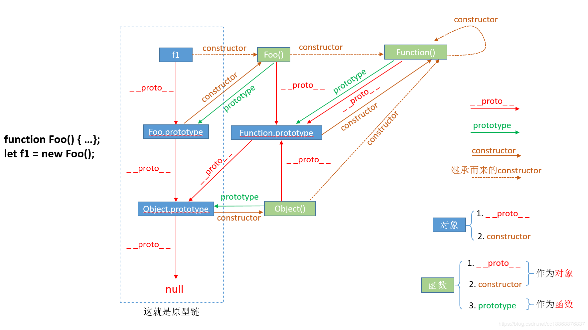
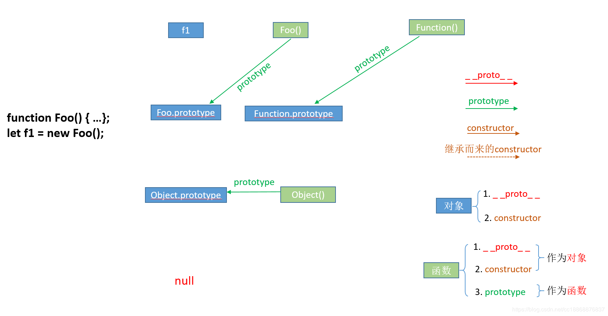

# JS 中 prototype、\_\_proto\_\_ 以及 constructor
## 零、参考
* [帮你彻底搞懂JS中的prototype、__proto__与constructor（图解）](https://blog.csdn.net/cc18868876837/article/details/81211729)
* [JS 原型](./JS原型.md)

## 一、总览
以下示例贯穿全文：
```js
function Foo(age) {
  this.age = age;  
}
 
let f1 = new Foo(16)；
```


注意： 图中的 '()' 仅代表这是一个函数对象，并非执行函数运算符。

## 二、\_\_proto\_\_
* ```__proto__``` 在 ECMA 标准中是 ```[[Prototype]]``` ，各家浏览器的实现不一样，在 chrome 中就是 ```__proto__``` ，稍微留意下即可

* ```__proto__``` 属性，当中存放(指向)着的是一个对象，粗略地讲就是以 ```{ key: value }``` 这种形式存在的对象（这里主要的为和 js 中的函数对象区分开来）

* ```__proto__``` 这个属性，理应是 ```{k: v}``` 对象所独有的，但是因为 js 中万物皆对象，所以 js 函数也是一种对象，所以函数也同样拥有这个属性，也正是因为这样，极容易产生困惑
  
我们从总图中把 ```__proto__``` 单独抽出来：


如上图所示，一个对象(f1)的 ```__proto__``` 指向的另一个对象的，即指向它们的原型对象(也可以理解为父对象)。  

这个属性的作用是当访问一个对象的属性时，如果该对象内部不存在这个属性，那么就会去它的 ```__proto__``` 属性所指向的那个对象（父对象）里找，如果父对象也不存在这个属性，则继续往父对象的 ```__proto__``` 属性所指向的那个对象（爷爷对象）里找，如果还没找到，则继续往上找…直到原型链顶端 null，再往上找就相当于在 null 上取值，会报错。  

通过这样一种链条式的值查找，就是我们常见的原型链，同时，这也是我们模拟继承的常用方法。

## 三、prototype 属性
* ```prototype``` 属性，函数独有，其存放(指向)的同样是一个对象

从总图中将 ```prototype``` 抽出来：


```prototype``` 中存放的同样是一个对象，这个对象的含义是函数的原型对象，也就是以这个函数作为构造函数（其实所有函数都可以作为构造函数）所创建的实例的原型对象，即 ```f1.__proto__ === Foo.prototype```，这两个属性均指向同一个对象。

```prototype``` 的作用是包含可以由特定类型的所有实例共享的属性和方法，也就是让该函数所实例化的对象们都可以找到公用的属性和方法。任何函数在创建的时候，其实会默认同时创建该函数的 ```prototype``` 对象

## 四、constructor 属性（函数）
* ```constructor``` 属性，和 ```__proto__``` 一样，理应是对象独有，不过嘛，因为 js 所以 函数也有，但是不常用，故留意下即可

* ```constructor``` 属性（变量），当中存放（指向）的是一个函数

* ```constructor``` 中存放的这个函数，就是该对象的构造函数，如对象 f1 以 Foo 为构造函数，那么 ```f1.constructor == Foo // true ``` 。

* 从上图中可以看到，所有的箭头都指向 ```Function``` 这个函数，并且 ```Function``` 的 ```constructor``` 是指向自己，故 ```constructor``` 属性的重点就是 ```Function``` 这个函数。如： ```Foo.constructor == Function // true``` 。

* 从第 三 点我们知道，任何函数在创建的时候，其实会默认同时创建该函数的 ```prototype``` 对象。而在创建的这个 ```prototype``` 对象的时候，其中的 ```constructor``` 会显示指向这个函数，即上图中的 ```Foo.prototype.constructor == Foo```
  


## 五、总结
* ```__proto__``` 和 ```constructor``` 是对象独有(伪)的；```prototype``` 则是函数独有的
* ```__proto__``` 和 ```prototype``` 本身(存储的)是对象，```constructor``` 本身(存储的)是函数
* ```__proto__``` 的常见作用是提供原型链，以模拟继承特性
* ```prototype``` 的常见作用是(自)定义其子代对象的公用属性和方法，并配合原型链提供给所有子代，即 ```f1.__proto__ == Foo.prototype```
* ```constructor``` 的含义是存储(指向)该对象的构造函数
