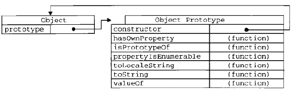

# JS 中的原型 -- prototype、\_\_proto\_\_ 以及原型链
## 零、参考
* [深入理解javascript原型和闭包（3）——prototype原型](https://www.cnblogs.com/wangfupeng1988/p/3978131.html)
* [三张图搞懂JavaScript的原型对象与原型链](https://www.cnblogs.com/shuiyi/p/5305435.html)

## 一、准备
打开浏览器控制台，任意定义一个对象(这样的形式 {})，打印出来后，会发现有最后一定有一个默认属性 “\_\_proto\_\_”，这是 js 的设计思路，类似于 java 中的继承  

<strong>注意：在本章中严格区分<font color=red>函数</font>与<font color=red>对象</font></strong>

## 二、prototype 与 \_\_proto\_\_
### (一)、区别：
  

```js
let a = {};
console.log(a.prototype); // undefined
console.log(a.__proto__); // Object {}

let b = function () {};
console.log(b.prototype); // b {}
console.log(b.__proto__); // function () {}
```

### (二)、\_\_proto\_\_ 的指向
  

```js
/* 1、字面量方式 */
let a = {};

console.log(a.__proto__);  // Object {}
console.log(a.__proto__ === a.constructor.prototype); // true
 
/* 2、构造器方式 */
let A = function(){};
let a = new A();

console.log(a.__proto__); // A {} 
console.log(a.__proto__ === a.constructor.prototype); // true
 
/* 3、Object.create()方式 */
let a1 = { a: 1 }
let a2 = Object.create(a1);

console.log(a2.__proto__); // Object { a: 1 } 
console.log(a2.__proto__ === a2.constructor.prototype); // false（此处即为图1中的例外情况)
```

### (三)、原型链


```js
let A = function(){};
let a = new A();

console.log(a.__proto__); // A {}（即构造器function A 的原型对象）
console.log(a.__proto__.__proto__); // Object {}（即构造器function Object 的原型对象）
console.log(a.__proto__.__proto__.__proto__); // null
```

### (四)、prototype
prototype 是函数(function)的一个属性，其值是一个对象(非函数)，这个对象只有一个属性 ```constructor```，这个属性指这个函数本身


```js
let fn = function () {}

console.log(fn.prototype.constructor === fn); // true
```

原型既然作为对象，属性的集合，不可能就只弄个 ```constructor``` 来玩玩，肯定可以自定义的增加许多属性。例如 ```Object``` 这个<font color=red>函数</font>，该函数的 ```prototype``` 里面，就有好几个其他属性。



那么，我们自己定义的函数/对象中，可不可以进行自定义内？ 答案：可以，如：

```js
function Fn() { }
 
Fn.prototype.name = '王福朋';
Fn.prototype.getYear = function () {
  return 1988;
};
```


这样做的意义在哪？
答：这种机制使得 JavaScript 能够实现复杂的继承关系，‌从而模拟出类似类（‌class）‌的行为，‌但又不受限于传统的类定义方式，‌提供了更大的灵活性和便利性

```js
function Fn() { }
 
Fn.prototype.name = '王福朋';
Fn.prototype.getYear = function () {
  return 1988;
};
 
var f1 = new Fn();
var f2 = new Fn();

console.log(f1.name, f2.name);    // 王福朋
console.log(f1.getYear());  // 1988
```

## 三、总结
* ```prototype``` 是<strong>函数</strong>特有的属性，```__proto__```是<strong>函数</strong>和<strong>对象</strong>都有的属性
* <strong>对象</strong>的```__proto__```的值引用了(等于)创建这个<strong>对象</strong>的<strong>函数</strong>的```prototype```（注意区分对象和函数）