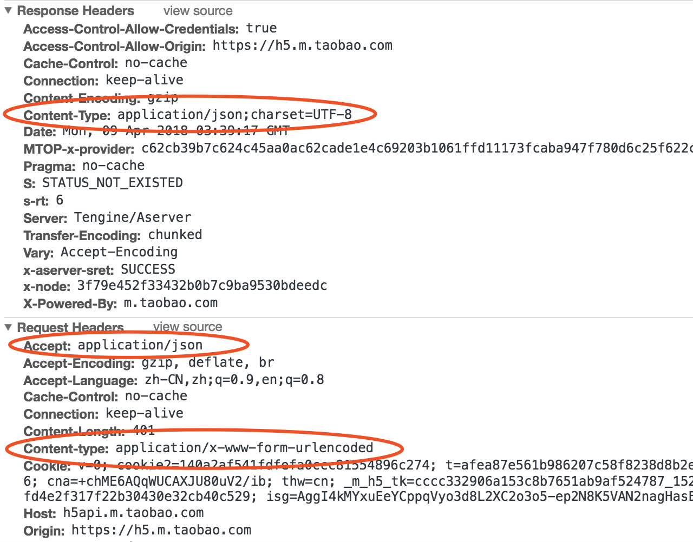

# TCP/IP 协议栈初识

## 零、原文
* [深入浅出 TCP/IP 协议栈](https://www.cnblogs.com/onepixel/p/7092302.html)

## 一、简介
```TCP/IP``` 协议栈是网络通信中一系列网络协议的综合，是核心骨架。它定义了电子设备接入因特网、以及数据在它们之间的传输方式，是一份标准。```TCP/IP``` 协议采用 4 层结构，分别是 **应用层**、**传输层**、**网络层**和**链路层**，每一层都呼叫它的下一层所提供的协议来完成自己的需求。我们大部分的工作是在看得见摸得着的应用层上，所以下层的事情不用太操心；其次网络协议本身是体系复杂庞大，想要精通需要花费大量时间经历，但这不妨碍简单探索一下一个主机上的数据要经过哪些过程才能发送到对方的主机上

## 二、物理介质
物理介质的重要性不言而喻，就是通过光纤、双绞线、无线电波等物理手段把电脑连接起来，电信号(0和1)在其中传输。物理介质的不同决定了电信号的出传输带宽、速率、传输距离以及抗干扰性等等。

```TCP/IP``` 协议栈分为四层，每一层都由特定的协议与对方进行通信，协议之间的通信最终会被转化成 0、1电信号通过物理介质传输才能到达对方电脑

下图是一张 ```TCP/IP``` 协议的基本框架：  
  

每当通过 http 发起一个请求的时候，应用层、传输层、网络层和链路层的相关协议依次对该请求进行包装并携带对应的首部，最终在链路层生成以太网数据包，以太网数据包通过物理介质传输给对方主机，对方接收到数据包以后，然后再一层一层采用对应的协议进行拆包，最后把应用层数据交给应用程序处理

网络通信就好比送快递，商品外面的一层层包裹就是各种协议，协议包含了商品信息、收货地址、收件人、联系方式等，然后还需要配送车、配送站、快递员，商品才能最终到达用户手中

一般情况下，快递是不能直达的，需要先转发到对应的配送站，然后由配送站再进行派件

配送车就是物理介质，配送站就是网关，快递员就是路由器，收货地址就是 ```IP地址```，联系方式就是 ```MAC``` 地址

快递员负责把包裹转发到各个配送站，配送站根据收获地址里的省市区，确认是否需要继续转发到其他配送站，当包裹到达了目标配送站以后，配送站再根据联系方式找到收件人进行派件

## 三、各层简析
### 1. 链路层
网络通信就是把有特定意义的数据通过物理介质传送给对方，单纯的发送 0 和 1 是没有意义的，要传输有意义的数据，就需要以字节为单位对 0 和 1 进行分组，并且要标识好每一组电信号的信息特征，然后按照分组的顺序依次发送。以太网规定一组电信号就是一个数据包，一个数据包被称为**一帧**， 制定这个规则的协议就是**以太网协议**。一个完整的以太网数据包（一帧）如下图所示：


一个数据帧是由**首部**、**数据**和**尾部**组成，首部固定14个字节，包含**目标 MAC 地址**、**源MAC地址**和**类型**；数据最短为46个字节，最长为1500个字节，如果需要传输的数据很长，就必须分割成多个帧进行发送；尾部固定为4个字节，表示**数据帧校验序列**，用于确定数据包在传输过程中是否损坏。因此，以太网协议通过对电信号进行分组并形成数据帧，然后通过物理介质把数据帧发送给接收方。那么以太网如何来识接收方的身份呢？

根据以太网协议的规定，接入网络的设备必须装有网络适配器，即网卡，数据包必须是从一块网卡传送到另一块网卡。而网卡的地址就是数据包的发送地址和接受地址，即帧首部包含的 MAC 地址，MAC 地址是每块网卡的身份标识，如同我们的身份证号，具有全球唯一性。MAC地址采用十六进制标识，共6个字节， 前三个字节是厂商编号，后三个字节是网卡流水号，例如 ```4C-0F-6E-12-D2-19```

在有了 MAC 地址之后，以太网会采用**广播**的形式，把数据包发送给该子网内所有的主机，子网内的每台主机在接收到这个包之后，都会读取首部的目标 MAC 地址，然后和自己的 MAC 对比，相同则交给上一层(协议)处理，不同则丢弃这个数据包

所以链路层的主要工作就是**对电信号进行分组并形成具有特定意义的数据帧，然后以广播的形式通过物理介质发送给接收方以及接受并比对数据包，然后将多个数据帧进行组合**

### 2. 网络层
对于上面的过程，有几个细节问题值得我们思考：
1. 发送者如何知道接收者的MAC地址？
2. 发送者如何知道接收者和自己同属一个子网？
3. 如果接收者和自己不在同一个子网，数据包如何发给对方？  

为了解决这些问题，网络层引入了三个协议，分别是IP协议、ARP协议、路由协议

#### 2.1 IP 协议
MAC 地址只与厂商有关，与所处的网络无关，所以根据 MAC 地址无法判断两台计算机处于同一个子网中。

因此，网络层引入了 IP 协议，制定了一套性的地址，使得我们能够区分两台主机是否在同一个网络中。这套地址就是网络地址，也就是所谓的 IP 地址。所以 IP 地址仅仅代表某台计算机在网络上的位置，就如快递中的省市区街道，换到其他网络段中就由该网络端分配 IP 地址。

IP 地址目前有两个版本 IPv4 和 IPv6。通常我们所说的是 **IP地址** 指的是 IPv4 版本。v4 的版本中 IP 地址只有 32 位，常采用 4 个十进制数字表示。IP 协议将这个 32 位地址分为两个部分（不是平均划分），前面部分代表网络地址，后面部分代表某计算机在局域网内的地址。IPv4 版本有 ABC 三类地址（这里不详述，有兴趣道友可自行 google），如 C 类地址 192.168.24.1 为例，其中前 24 位（192.168.24）是网络地址，后面 8 位（1）是主机地址。因此，如果两台计算机在同一个局域网内，那么它们 IP 地址中的网络地址部分一定是相同的（即前 24 位一致）。为了判断 IP 地址中的网络地址，IP 协议还引入了子网掩码，IP 地址和子网掩码通过按位与运算后就可以得到网络地址

由于发送者和接收者的 IP 地址是已知的（应用层的协议会传入），因此在网络层只需要通过子网掩码对这两个 IP 地址进行 AND 运算后就能够判断双发是否在同一个子网了

#### 2.2 ARP 协议
地址解析协议，是根据 IP 地址获取 MAC 地址的一个网络层协议，其工作原理如下：

ARP 首先会发起一个请求数据包，数据包的首部包含了目标主机的 IP 地址，然后这个数据包会在链路层进行再次包装，生成以太网数据包，最终由以太网广播给子网内的所有主机，每个主机都会收到这个数据包，并取出这个数据包中包含的 IP 地址，然后和自己的 IP 地址比对，如果相同就返回自己的 MAC 地址，如果不同则丢弃这个数据包。ARP 接受返回消息，以此拿到目标主机的 MAC 地址，同时，ARP 会将返回的 MAC 地址与对应的 IP 地址存入本机 ARP 缓存中并保留一定的时间，以便下次请求时直接查询，这样一定程度上节约资源。在 cmd 中 键入 ```arp -a``` 即可查询本机缓存的 ARP 数据

#### 2.3 路由协议
ARP 协议的 MAC 寻址还是局限在同一个子网中，因此网络层引入了路由协议，首先通过 IP 协议来判断是否在同一个子网中，如果在同一个子网中就通过 ARP 协议查询对应的 MAC 地址，然后广播发送数据包；如果不在同一个子网，以太网会将数据包转发给子网的网关进行路由。网关是互联网上子网与子网的桥梁，所以一个数据包可能会经过多个网关转发，最终将数据包转发到目标 IP 所在的子网中，然后再通过 ARP 获取目标 MAC，最终也是通过广播形式将数据包发送给接收方

而完成这个路由协议的物理设备就是路由器，在错综复杂的网络世界中，路由器扮演的是交通枢纽的角色，它会根据信道情况，选择并设定路由，以最佳路径来转发数据包

#### 2.4 IP 数据包


一个数据包由首部和数据组成，首部20个字节，主要包含目标 IP 地址和源 IP 地址，目标 IP 地址是网关路由的线索和依据；数据部分的理论最大长度 65515 字节，因此一个 IP 包的理论总长度可以达到 65535 字节，而以太网数据包最大长度是 1500 个字节，如果超过这个大小，链路层就会对 IP 数据包进行分割，分成多个数据帧发送

所以综上，网络层的主要工作是**定义网络地址，区分网段，子网内MAC寻址，对于不同子网的数据包进行路由**

### 3. 传输层
链路层定义了主机的身份，即 MAC 地址，网络层定义了 IP 地址，明确了主机所在的网段，有了这两个地址之后，数据包就能够从一个主机发送到另一个主机上。但实际上数据包是从一个主机的某个应用程序发出，然后由对方主机的对应应用程序接受。而每台主机上同一个时间内往往运行着多个应用程序，所以当数据包被发送到主机上之后，该怎么确定由哪个应用程序接受呢？

因此，在这一层上，又引入了 UDP 协议 来解决这个问题。为了给每个应用程序标识身份， UDP 协议定义了端口，同一个主机上的每个应用程序都需要指定唯一的端口号，并且规定网络传输的数据包必须加上端口信息。这样，当数据包到达主机以后，就可以根据端口号找到对应的应用程序了。UDP 定义的数据包叫做 UDP 数据包，结构如下：
  

UDP 数据包由首部和数据两部分组成，首部长度 8 个字符，主要包括源端口和目标端口；数据最大 65527 个字节，整个数据包的长度最大 65535 个字节

UDP 协议比较简单，实现容易，当它没有确认机制，数据包一旦发出，无法知道对方是否收到，因此可靠性较差。为解决这个问题，TCP 协议诞生，TCP 协议，即传输控制协议，是一种面向链接的、可靠的、基于字节流的通信协议，简单来说 TCP 就是有确认机制的 UDP 协议，每发出一个数据包都要求确认，如果一个数据包丢失，就收不到确认，发送方就必须重发这个数据包

为了保证传输的可靠性，TCP 协议在 UDP 基础上建立了三次对话的确认机制，也就是说，在正式发送数据之前，必须和对方简历可靠的链接，即 TCP 的三次握手。此处简略地描述下过程：
1. 主机A：我想发数据给你，可以吗
2. 主机B：好的，你什么时候发
3. 主机A：我马上发，你接着
  
经过三次对话之后，主机 A 才会向主机 B 发送正式数据。而 UDP 是面向非链接的协议，它不与对方建立链接，只管发就完事了，对方接不接得到看天意。所以 TCP 能保证数据包在传输过程中不被丢失，但代价是相较于 UDP，其实现过程复杂，消耗链接资源多，传输速度慢等。

TCP 数据包和 UDP 一样，都是由首部和数据两部分组成，唯一不同的是，TCP 数据包没有长度限制，理论上是无限长的，但是为了保证网络效率，通常 TCP 数据包长度不会超过 IP 数据包长度，以确保单个 TCP 数据包不必再分割

总结一下，传输层的主要工作是**定义端口，标识应用程序身份，实现端口到端口的通信，TCP协议可以保证数据传输的可靠性**

### 4. 应用层
这一层上都是日常开发中看得见摸得着的

理论上，在以上三层协议的支持下，数据已经可以从一个主机上的应用程序传输到另一个主机上的应用程序，但此时传过来的数据是字节流，不能很好的被程序识别，操作性差。因此，应用层定义了各种各样的协议来规范数据格式，常见的有 HTTP、FTP、SMTP 等。如 HTTP 是一种主要用于 B/S 架构之间的数据通信，其报文格式如下：


所以应用层的主要工作就是**定义数据格式并按照对应的格式解读数据**

### 5. 全流程总结
首先我们梳理一下每层模型的职责：
* 链路层：对0和1进行分组，定义数据帧，确认主机的物理地址，传输数据；
* 网络层：定义IP地址，确认主机所在的网络位置，并通过IP进行MAC寻址，对外网数据包进行路由转发；
* 传输层：定义端口，确认主机上应用程序的身份，并将数据包交给对应的应用程序；
* 应用层：定义数据格式，并按照对应的格式解读数据。  

然后再把每层模型的职责串联起来，用一句通俗易懂的话讲就是：

```
当你输入一个网址并按下回车键的时候，首先，应用层协议对该请求包做了格式定义；紧接着传输层协议加上了双方的端口号，确认了双方通信的应用程序；然后网络协议加上了双方的IP地址，确认了双方的网络位置；最后链路层协议加上了双方的MAC地址，确认了双方的物理位置，同时将数据进行分组，形成数据帧，采用广播方式，通过传输介质发送给对方主机。而对于不同网段，该数据包首先会转发给网关路由器，经过多次转发后，最终被发送到目标主机。目标机接收到数据包后，采用对应的协议，对帧数据进行组装，然后再通过一层一层的协议进行解析，最终被应用层的协议解析并交给服务器处理
```

## 四、总结
以上内容是只是对TCP/IP四层模型简单的介绍，而实际上每一层模型都有很多协议，每个协议要做的事情也很多，但我们首先得有一个清晰的脉络结构，掌握每一层模型最基本的作用，然后再去丰富细枝末节的东西，也许会更容易理解
