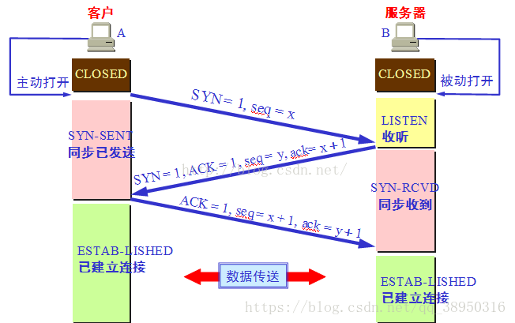
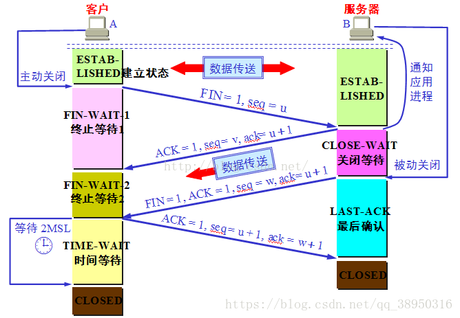

# TCP的三次握手和四次挥手

## 零、原文
* [TCP的三次握手与四次挥手理解及面试题](https://blog.csdn.net/qq_38950316/article/details/81087809)
* [Http协议三次握手和四次挥手](https://blog.csdn.net/qq_33535433/article/details/76396341)
* [TCP通信的三次握手和四次撒手的详细流程（顿悟）](https://www.cnblogs.com/cy568searchx/p/3711670.html)

## 基础
  

* 序号(也称序列号) - ```Sequence number``` - 占 4 个字节，用来标记数据段的顺序，TCP把连接中发送的所有数据字节都编上一个序号，第一个字节的编号由本地随机产生；给字节编上序号后，就给每一个报文段指派一个序号；序列号seq就是这个报文段中的第一个字节的数据编号
* 确认号 - ```Acknowledge number``` - 占 4 个字节，期待收到对方下一个报文段的第一个数据字节的序号；序列号表示报文段携带数据的第一个字节的编号；而确认号指的是期望接收到下一个字节的编号；因此当前报文段最后一个字节的编号 +1 即为确认号
* ```URG``` - 紧急 - urgent
* ```ACK``` - 确认 - acknowledgement - 占 1 位，仅当 ACK=1 时，确认号字段才有效。ACK=0 时，确认号无效
* ```PSH``` - 传送 - push
* ```RST``` - 重置 - reset
* ```SYN``` - 同步 - Synchronize Sequence Numbers - 连接建立时用于同步序号。当 SYN=1，ACK=0 时表示：这是一个连接请求报文段。若同意连接，则在响应报文段中使得 SYN=1，ACK=1。因此，SYN=1 表示这是一个连接请求，或连接接受报文。SYN 这个标志位只有在TCP建产连接时才会被置1，握手完成后 SYN 标志位被置 0
* ```FIN``` - 结束 - finish - 用来释放一个连接。FIN=1 表示：此报文段的发送方的数据已经发送完毕，并要求释放运输连接

## 三次握手
  

* 第一次握手：主机 A 发送位码为 syn＝1 ,随机产生 seq number=1234567 的数据包到服务器，主机 B 由 syn = 1 知道，A 要求建立联机
* 第二次握手：主机 B 收到请求后要确认联机信息，向 A 发送 ack number = (主机A的seq + 1) , syn = 1, ack = 1,随机产生 seq = 7654321 的包
* 第三次握手：主机 A 收到后检查 ack number 是否正确，即第一次发送的 seq number + 1 ,以及位码 ack 是否为 1，若正确，主机 A 会再发送 ack number = (主机B的seq + 1), ack = 1，主机B收到后确认 seq 值与 ack = 1 则连接建立成功

完成三次握手，主机A与主机B开始传送数据

## 四次挥手
  

由于 TCP 连接是全双工的，因此每个方向都必须单独进行关闭。这个原则是当一方完成它的数据发送任务后就能发送一个 FIN 来终止这个方向的连接。收到一个 FIN 只意味着这一方向上没有数据流动，一个 TCP 连接在收到一个 FIN 后仍能发送数据。首先进行关闭的一方将执行主动关闭，而另一方执行被动关闭

四次挥手过程如下：
* 客户端 A 发送一个FIN，用来关闭客户 A 到服务器 B 的数据传送
* 服务器 B 收到这个FIN，它发回一个ACK，确认序号为收到的序号加 1。和 SYN 一样，一个 FIN 将占用一个序号
* 服务器 B 关闭与客户端 A 的连接，发送一个 FIN 给客户端 A
* 客户端 A 发回 ACK 报文确认，并将确认序号设置为收到序号加 1

### 几个状态
* FIN_WAIT_1：这个状态要好好解释一下，其实 FIN_WAIT_1 和 FIN_WAIT_2 状态的真正含义都是表示等待对方的FIN报文。而这两种状态的区别是：FIN_WAIT_1 状态实际上是当 SOCKET 在 ESTABLISHED 状态时，它想主动关闭连接，向对方发送了 FIN 报文，此时该 SOCKET 即进入到 FIN_WAIT_1 状态。而当对方回应 ACK 报文后，则进入到 FIN_WAIT_2 状态，当然在实际的正常情况下，无论对方何种情况下，都应该马上回应 ACK 报文，所以 FIN_WAIT_1 状态一般是比较难见到的，而 FIN_WAIT_2 状态还有时常常可以用 netstat 看到
* FIN_WAIT_2：上面已经详细解释了这种状态，实际上 FIN_WAIT_2 状态下的 SOCKET ，表示半连接，也即有一方要求 close 连接，但另外还告诉对方，我暂时还有点数据需要传送给你，稍后再关闭连接
* TIME_WAIT：表示收到了对方的 FIN 报文，并发送出了 ACK 报文，就等 2MSL 后即可回到 CLOSED 可用状态了。如果 FIN_WAIT_1 状态下，收到了对方同时带 FIN 标志和 ACK 标志的报文时，可以直接进入到 TIME_WAIT 状态，而无须经过 FIN_WAIT_2 状态
* CLOSING：这种状态比较特殊，实际情况中应该是很少见，属于一种比较罕见的例外状态。正常情况下，当你发送 FIN 报文后，按理来说是应该先收到（或同时收到）对方的 ACK 报文，再收到对方的 FIN 报文。但是 CLOSING 状态表示你发送 FIN 报文后，并没有收到对方的 ACK 报文，反而却也收到了对方的 FIN 报文。什么情况下会出现此种情况呢？其实细想一下，也不难得出结论：那就是如果双方几乎在同时 close 一个 SOCKET 的话，那么就出现了双方同时发送 FIN 报文的情况，也即会出现 CLOSING 状态，表示双方都正在关闭 SOCKET 连接
* CLOSE_WAIT：这种状态的含义其实是表示在等待关闭。怎么理解呢？当对方 close 一个 SOCKET 后发送 FIN 报文给自己，你系统毫无疑问地会回应一个 ACK 报文给对方，此时则进入到 CLOSE_WAIT 状态。接下来呢，实际上你真正需要考虑的事情是察看你是否还有数据发送给对方，如果没有的话，那么你也就可以 close 这个 SOCKET，发送 FIN 报文给对方，也即关闭连接。所以你在 CLOSE_WAIT 状态下，需要完成的事情是等待你去关闭连接
* LAST_ACK：这个状态还是比较容易好理解的，它是被动关闭一方在发送 FIN 报文后，最后等待对方的 ACK 报文。当收到 ACK 报文后，也即可以进入到 CLOSED 可用状态了
    
## 常见面试:
#### 1. 为什么连接的时候是三次握手，关闭的时候却是四次握手？  
因为当 Server 端收到 Client 端的 SYN 连接请求报文后，可以直接发送 SYN+ACK 报文。其中 ACK 报文是用来应答的，SYN 报文是用来同步的。但是关闭连接时，当 Server 端收到 FIN 报文时，很可能并不会立即关闭 SOCKET， 所以只能先回复一个 ACK 报文，告诉 Client 端，"你发的 FIN 报文我收到了"。只有等到我 Server 端所有的报文都发送完了，我才能发送 FIN 报文，因此不能一起发送。故需要四步握手
> 简单来说，就是当 Server 收到 Client 的关闭报文时，可能还有其他任务在处理（也可能没有），分配不出资源来关闭，所以就先给 Client 一个回复，即"你的关闭报文我收到了"，这就是第二次握手。等其他的任务处理完成了，Server 关闭了 SOCKET，发个报文给 Client，即 "我这边已经把 SOCKET 给关了"，这就是第三次握手  
> 本质上其实就是三次握手模型，但是考虑到 Server 那边无法做到同步关闭 SOCKET，就多处一次握手来做兜底 

#### 2. 为什么 TIME_WAIT 状态需要经过 2MSL(最大报文段生存时间) 才能返回到 CLOSE 状态？
虽然按道理，四个报文都发送完毕，我们可以直接进入 CLOSE 状态了，但是我们必须假象网络是不可靠的，有可以最后一个 ACK 丢失。所以 TIME_WAIT 状态就是用来重发可能丢失的 ACK 报文。在 Client 发送出最后的 ACK 回复，但该 ACK 可能丢失。Server如果没有收到 ACK ，将不断重复发送 FIN 片段。所以 Client 不能立即关闭，它必须确认 Server 接收到了该 ACK。 Client 会在发送出 ACK 之后进入到 TIME_WAIT 状态。Client 会设置一个计时器，等待 2MSL 的时间。如果在该时间内再次收到 FIN ，那么 Client 会重发 ACK 并再次等待 2MSL。所谓的 2MSL 是两倍的 MSL(Maximum Segment Lifetime)。MSL 指一个片段在网络中最大的存活时间，2MSL 就是一个发送和一个回复所需的最大时间。如果直到 2MSL， Client 都没有再次收到 FIN，那么 Client 推断 ACK 已经被成功接收，则结束 TCP 连接

#### 3. 为什么不能用两次握手进行连接？
3 次握手完成两个重要的功能，既要双方做好发送数据的准备工作(双方都知道彼此已准备好)，也要允许双方就初始序列号进行协商，这个序列号在握手过程中被发送和确认

现在把三次握手改成仅需要两次握手，死锁是可能发生的。作为例子，考虑计算机 S 和 C 之间的通信，假定 C 给 S 发送一个连接请求分组，S 收到了这个分组，并发送了确认应答分组。按照两次握手的协定，S 认为连接已经成功地建立了，可以开始发送数据分组。可是，C 在 S 的应答分组在传输中被丢失的情况下，将不知道 S 是否已准备好，不知道 S建立什么样的序列号，C 甚至怀疑 S 是否收到自己的连接请求分组。在这种情况下，C 认为连接还未建立成功，将忽略 S 发来的任何数据分组，只等待连接确认应答分组。而 S 在发出的分组超时后，重复发送同样的分组。这样就形成了死锁

#### 4. 如果已经建立了连接，但是客户端突然出现故障了怎么办？
TCP 还设有一个保活计时器，显然，客户端如果出现故障，服务器不能一直等下去，白白浪费资源。服务器每收到一次客户端的请求后都会重新复位这个计时器，时间通常是设置为 2 小时，若两小时还没有收到客户端的任何数据，服务器就会发送一个探测报文段，以后每隔 75 秒钟发送一次。若一连发送 10 个探测报文仍然没反应，服务器就认为客户端出了故障，接着就关闭连接

## 其他
1. TCP/IP 数据包的封装过程：
  
