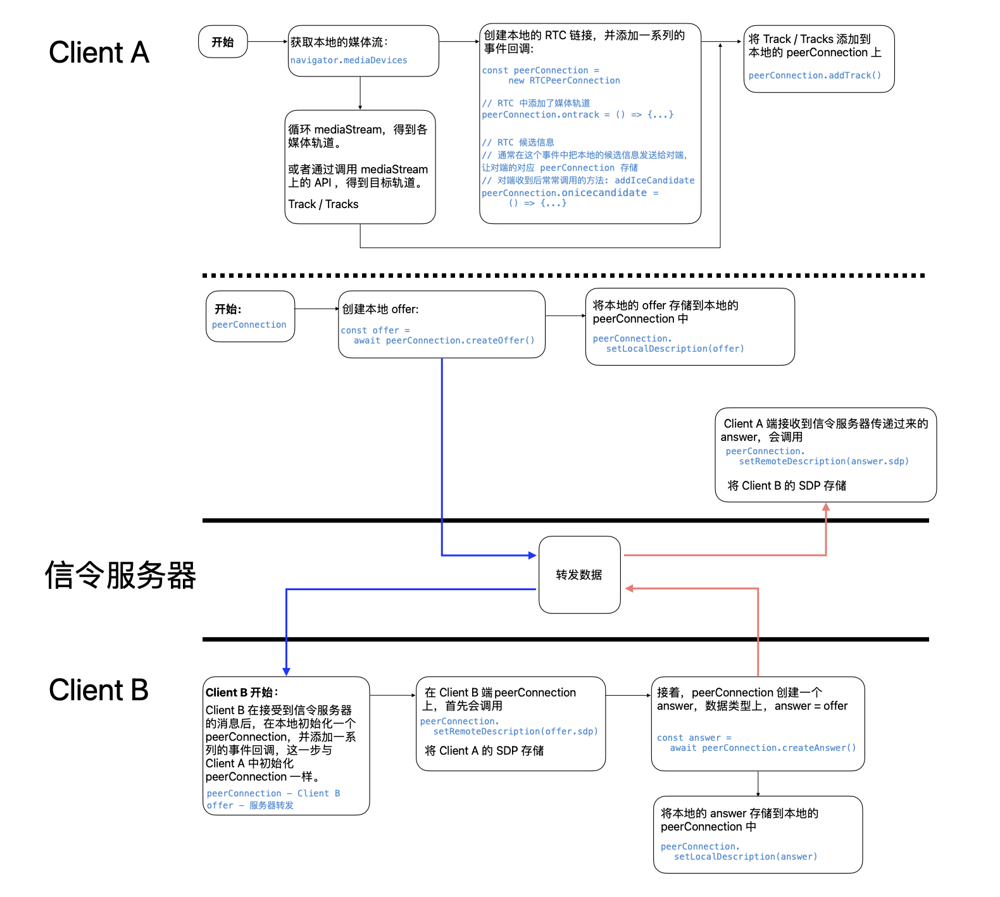

# WEB-RTC.FE 工作流整理

## 一、总结
  

## 二、流程详解
总流程可以参照 [Network.WEB-RTC.基础概念和架构](./Network.WEB-RTC.基础概念和架构.md) 的第二部分，本篇是对这个流程的 FE 代码的一个梳理

### (一) 前期准备
1. 首先发起端(以下统称 Client A 或者 A)通过 mediaDevices 原生接口获取当前设备的一些媒体输入/输出流(或者轨道，track)，这一部分只是一个对媒体数据的前期准备工作，并没有涉及 RTC 链接的相关内容，所以在上述文章的总流程中并没有显示
2. A 端初始化一个 RTC 链接对象(peerConnect-A)，并挂载一系列的事件回调
3. 将本地的媒体轨道 track 添加到本地的 peerConnect-A 上，进入下一个流程

### (二) Client A 端链接操作
1. peerConnect-A 在收集完媒体轨道 track 之后，创建 offer，这个 offer 中包含本地的一些信息，比如浏览器支持的编码格式、ICE 候选服务、媒体轨道等等一些列的 RTC 需要的数据，这些数据经过信令(中继)服务器的转发，最终传递给需要进行 P2P 链接的接受端 Client B
2. 在 offer 创建之后，Client-A 需要做两件事情(不严格需要前后顺序)：
   * 把 offer 信息存储到本地 peerConnect-A 中： ```peerConnect.setLocalDescription(offer);```
   * 把 offer 信息发送给信令(中继)服务器；

### (三) 信令服务器转发数据
转发 Client A 提供的 offer

### (四) Client B 端链接操作
1. Client B 端准备工作也没啥，同样也是初始化一个 RTC 链接对象(peerConnect-B)，挂载一系列的事件回调，这个基本上和 A 端 RTC 链接对象的初始化一样。当然，peerConnect-B 的初始化工作也可以在 Client B 接收到 A 端的 offer 再进行也不迟
2. Client B 收到服务器转发过来的 offer 之后，会调用 setRemoteDescription 方法把 Client A 的 offer 信息存储到本地的 peerConnect-B 中: ```peerConnect.setRemoteDescription(offer)```
3. 同时，Client B 创建一个 answer (在数据类型上，answer 与 offer 一致，只是为了区分接收端还是发送端才有不同的命名)，并做了两件事：
   * 把 answer 信息存储到本地 peerConnect-B 中：```peerConnect.setLocalDescription(answer)```
   * 把 answer 信息发送给信令(中继)服务器

### (五) 信令服务器转发数据
转发 Client B 提供的 answer

### (六) Client A 端链接操作
1. 这一步就相当于步骤 (四) 中的第 2 小步，只不过是 Client A(peerConnect-A) 存储 Client B 的 answer： ```peerConnect.setRemoteDescription(answer)``` 

至此，主要的链接步骤已经完成，Client A 中的 peerConnect-A 与 Client B 中的 peerConnect-B 完成映射，即 peerConnect-A 等价于 peerConnect-B，两台终端的 P2P 链接完成

## 三、RTC RTCPeerConnection 的一些主要事件
### (一) onicecandidate
ice candidate，一个描述候选链接信息的数据，因为有时候 P2P 并不能链接成功，就需要通过中间服务器(似乎与信令服务器不同)来链接，而 ice candidate，就是描述这个中间过程的数据。

按照 MDN 的描述，Client A(发起端) 获取到这个信息后，把这个数据经过信令服务器转发到 Client B，然后 Client B 会把这个信息通过调用 ```peerConnect.addIceCandidate(candidate)``` 方法存储到 peerConnect-B 中去。那么这里有个问题：peerConnect-A 中需要存储自身的 candidate 吗？ - 待实践

### (二) ontrack
发起端会把媒体轨道添加到 peerConnect 上，那么对应地在接受端需要在 peerConnect 上添加这个事件回调来获取传过来的媒体数据，并把这些数据赋值给对应的 HTML 元素，所以，当 P2P 链接完成之后，FE 的大部分工作其实是在这个回调中进行的
