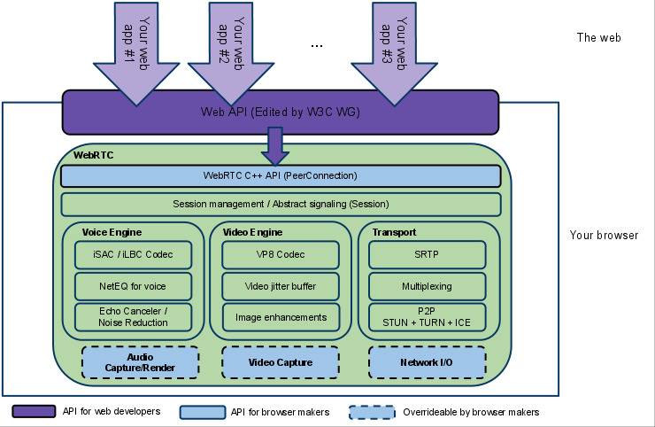
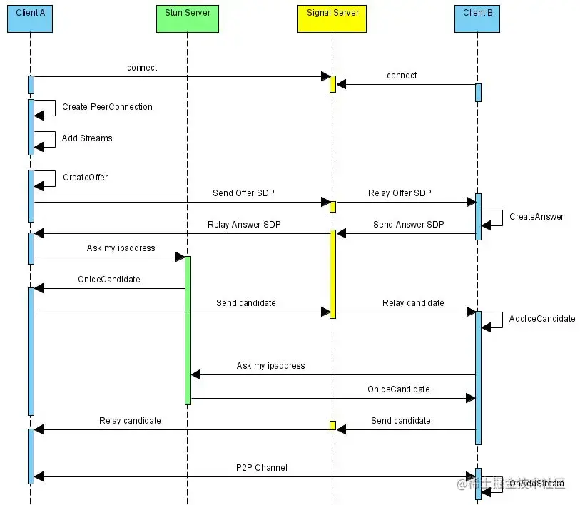

# WEB-RTC.基础概念和架构

## 零、参考文章
* [WebRTC简介](https://zhuanlan.zhihu.com/p/86751078)
* [从0搭建一个WebRTC，实现多房间多对多通话，并实现屏幕录制](https://juejin.cn/post/7129763930779418654)

## 一、架构
经典三层结构：  
 

* Web app 层(应用层)：Web 开发者开发的程序，Web 开发者可以基于集成 WebRTC 的浏览器提供的 web API 开发基于视频、音频的实时通信应用
* Web api 层：面向第三方开发者的 WebRTC 标准 API（Javascript），使开发者能够容易地开发出类似于网络视频聊天的 web 应用，需要注意的是可能在不同浏览器中 API 接口名会不太一样, 所以推荐使用这个 JS 适配器 来协调各个浏览器的不同接口。这些API可分成 Media API、RTCPeerConnection、Peer-to-peer Data API三类:
  * Media API：MediaStream用来表示一个媒体数据流。 MediaStreamTrack：在浏览器中表示一个媒体源
  * RTCPeerConnection：一个 RTCPeerConnection 对象允许用户在两个浏览器(客户端)之间直接通讯，代表一个由本地计算机到远端的 WebRTC 连接。该 API 提供了创建，保持，监控，关闭连接的方法的实现。包括 SDP、RTCIceCandidate、RTCIceServer 等概念，详见下文基础概念部分
    * SDP: 用来描述当前连接者想要传输的内容，支持的协议类型，支持的编解码类型等
    * RTCIceCandidate：一个 ICE 协议的候选者，简单讲，就是目标节点的IP以及端口
    * RTCIceServer：表示一个 ICE Server，其主要用于当前主机的 IP 发现，通过和 ICE Server 通讯，我们会得到一组可供连接使用的 IP:Port 候选值，双方通过交换 ICE 候选值来建立起连接
  * Peer-to-peer Data API：数据通道(DataChannel)接口表示一个在两个节点之间的双向的数据通道，该通道可以设置成可靠传输或非可靠传输。
* WebRTC 核心层
  * WebRTC C/C++ API (PeerConnection): 这层的 API 相对比较少，最主要就是实现 P2P 连接。在 PeerConnection 里面又包含了很多接口，如传输质量，传输质量报告，统计数据，各种流都是封装在 PeerConnection 模块里面。除此之外主要有音视频采集，音视频传输，非音视频数据传输等
  * Session Management/Abstract signaling (Session): 会话层，进行会话功能管理，用来管理音视频，非音视频数据传输，处理相关逻辑
  * 最核心的第三层，包含：音频引擎，视频引擎，传输，三大核心模块
  * 最底层是与硬件相关的硬件适配层：这层包含：音频的采集和渲染，视频的捕捉，网络 IO。注意到上图中底层的这个三个模块都是画的虚线，表示这些模块是可以自己去实现的，可以重载的，这样大大增加 WebRTC 的灵活性，为跨平台提供了基础

## 二、基础概念
1. WEB-RTC：WebRTC全称 Web Real-Time Communication，是一种实时音视频的技术，它最大优势是低延时。具体点，感觉更像是一种通信的协议控制，跨平台；核心是 p2p 链接，也可以使用服务器跳板当备份链接；
2. 信令：WebRTC 建立连接之前，需要进行一种发现和媒体格式协商，以使不同网络上的两个设备相互定位。这个过程被称为信令。是使呼叫成为可能的初始引导程序。交换信令消息后，WebRTC Agent 才可以直接相互通信
   * 信令消息只是文本。 WebRTC Agent 并不关心它们的传递方式。信令通常使用 Websockets 分享，但这不是必须的。
   * 作用 - 建立浏览器之间的通信
     * 用来控制通信开启或者关闭的连接控制消息
     * 发生错误时用来彼此告知的消息
     * 媒体适配：媒体流元数据，比如像解码器、解码器的配置、带宽、媒体类型等等
     * 用来建立安全连接的关键数据
     * 网络配置：外界所看到的网络上的数据，比如IP地址、端口等
   * 信令服务器 - 生成信令以及传输信令的服务，就是信令服务器。信令服务器的作用是作为一个中间人帮助双方在尽可能少的暴露隐私的情况下建立连接，同时也可以作为 P2P 链接失败后的一个中转服务器(备份方案)。
3. SD: 全称 Session Description - 会话描述，如果加上 Protocol，既是会话描述协议(SDP)。这个协议描述媒体协商的信息，是一个 key/value 协议，每一行是一个值。看起来类似于 INI 文件。 一个会话描述包含零个或多个媒体描述。一个媒体描述通常映射到单个媒体流。具体见文档。
4. NAT：网路地址转换(Network Address Translation)，可为你的装置提供公用IP地址。路由器具备公用IP地址，而连上路由器的所有装置则具备私有IP地址。接着针对请求，从装置的私有IP对应到路由器的公用IP与专属的通讯端口。如此一来，各个装置不需占用专属的公用IP，亦可在网路上被清楚识别。
5. STUN 和 TURN
   * STUN：NAT 的 UDP 简单穿越（Simple Traversal of UDP over NATs）是一种网络协议，它允许位于 NAT（或多重NAT）后的客户端找出自己的公网地址，查出自己位于哪种类型的 NAT 之后以及 NAT 为某一个本地端口所绑定的 Internet 端端口。这些信息被用来在两个同时处于 NAT 路由器之后的主机之间建立 UDP 通信。即使通过 STUN 服务器取得了公用 IP 地址，也不一定能建立连线。因为不同的 NAT 类型处理传入的 UDP 分组的方式是不同的。四种主要类型中有三种是可以使用 STUN 穿透：完全圆锥型 NAT、受限圆锥型 NAT 和端口受限圆锥型 NAT。但大型公司网络中经常采用的对称型 NAT（又称为双向NAT）则不能使用，这类路由器会通过 NAT 布署所谓的「Symmetric NAT」限制。也就是说，路由器只会接受你之前连线过的节点所建立的连线。这类网络就需要 TURN 技术
   * TURN：中继 NAT 实现的穿透（Traversal Using Relays around NAT）就是通过 TURN 服务器开启连线并转送所有数据，进而绕过 Symmetric NAT 的限制。你可通过 TURN 服务器建立连线，再告知所有端点传送封包至该服务器，最后让服务器转送封包给你。这个方法更耗时且更占频宽，因此在没有其他替代方案时才会使用这个方法
6. ICE：交互式连接创建（Interactive Connectivity Establishment，ICE）是一个允许你的浏览器和对端浏览器建立连接的协议框架。在实际的网络当中，有很多原因能导致简单的从 A 端到 B 端直连不能如愿完成。这需要绕过阻止建立连接的防火墙，给你的设备分配一个唯一可见的地址（通常情况下我们的大部分设备没有一个固定的公网地址），如果路由器不允许主机直连，还得通过一台服务器转发数据。ICE 通过使用上面几种技术（NAT，STUN，TURN）完成上述工作。ICE 使用 STUN 或者 TURN 服务（或者同时使用两者）来建立连接

## 三、WEB-RTC 链接过程
总体上和 TCP 的三次差不多：  

