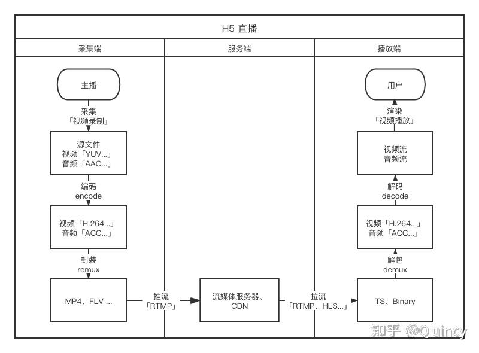

# 多媒体基础

## 零、参考
* [多媒体前端手册](https://www.yuque.com/webmedia/handbook)
* [「完全理解」video 标签到底能播放什么](https://zhuanlan.zhihu.com/p/421018189)

## 一、视频
视频的本质很简单，就是快速播放的图片

### （一）帧
* 帧：一帧即一幅静止的图像
* 帧率（fps）：每秒显示的图片数。帧率越大，画面越流畅；帧率越小，画面越卡
  * 12 fps：由于人类眼睛的特殊生理结构，如果所看画面之帧率高于每秒约10-12帧的时候，就会认为是连贯的
  * 24 fps：有声电影的拍摄及播放帧率均为每秒24帧，对一般人而言已算可接受
  * 30 fps：早期的高动态电子游戏，帧率少于每秒30帧的话就会显得不连贯，这是因为没有动态模糊使流畅度降低
  * 60 fps：在实际体验中，60帧相对于30帧有着更好的体验
  * 85 fps：一般而言，大脑处理视频的极限

### （二）源文件
* 像素是用来描述图片的最基础单位，那我们用什么来描述像素呢？RGB 通道。每一个字母代表一个通道，而每一个通道其值是 0～255，共 256 种可能，刚好 1 个字节(B)，所以一像素的大小就是 3B
* 分辨率 980 * 720 大小的图片需要 980 * 720 * 3B 的空间，大约在 2M 左右
* 一个帧率为 30 (fps) 的正常视频，即 1s 内播放 30 张图片。那么如果这个视频时长为 1 分钟，就需要 30 * 60 * 2M 的空间，大约为 3.5G - 恐怖如斯

这就是原始的 YUV、RGB 格式的视频源文件

### （三）编码
一个 1 min 的视频源文件就这么大，那还怎么愉快地看小视频呢？所以首要的任务就是压缩。即编码，视频的编码主要有两种：帧内编码和帧间编码
* 帧内编码：帧内编码就是压缩图片，比如把所有图片都压缩成 jpeg（原理是利用人眼对亮度的敏感程度要高于对色彩的敏感程度）。通常这一步之后就已经能减小视频 90% 的大小
* 帧间编码：帧间编码是利用帧与帧之间的相关性，比如相邻两张图片中，只有某些位置上的像素点发生了变化，那么第二张图其实就没必要了，在第二张图的位置只需要存储变化 (diff) 即可

### （四）编码格式
编码的思路有了，那么怎么实现就看各家组织、公司了，具体详见 [常用编解码器](https://developer.mozilla.org/zh-CN/docs/Web/Media/Formats/Video_codecs#%E5%B8%B8%E7%94%A8%E7%BC%96%E8%A7%A3%E7%A0%81%E5%99%A8)

对于 FE 来说，目前最流行、广泛使用的是 H.264 编码规范
### （五）封装格式
我们常见的视频文件的后缀是 MP4/AVI/FLV 这种，准确讲，这些是封装格式，是一种数据容器，数据按照编码格式进行编码(转换)，然后封到容器中去，就能形成我们常见视频文件。当然，这种视频容器不仅可以包含视频编码，也可以包含音频编码，以及一些同步信息、字幕和元数据（如标题）等

## 二、音频
音频的基础知识点如编码等和视频差不多，也是从源文件到编码，再到封装，目前使用最广泛的音频编码格式为 AAC

## 三、多媒体的消费
其实就是播放器对音、视频的播放

### （一）封装与解包
* 封装（remux）: 把编码封装成文件的步骤
* 解包（demux）: 把文件拆解成编码的步骤

播放器能否播放一个音、视频，关键取决于其编码格式，但是封装格式也无法被忽略，比如 H.264 的二进制文件，分别封装成 MP4 和 FLV 文件，浏览器能直接播放前者，需要另外安装插件才能播放后者

### （二）Media Source Extensions API(MSE)
这个 API 提供了实现无插件且基于 Web 的流媒体的功能。使用 MSE，媒体串流能够通过 JavaScript 创建，并且能通过使用 ```<audio>``` 和 ```<video>``` 元素进行播放

换句话说，就是通过网络，浏览器不一定需要再拿到整个视频文件了，直接传输编码后的二进制流，就能播放了，当然，要看浏览器支持哪些编码标准  

不过现阶段这个有点占用客户机器的资源，```<audio>``` 和 ```<video>``` 标签直接下载多媒体资源更好一点

## 四、直播
直播讲究一个实时，肯定不能等视频完全下载完再播放

  

### （一）流媒体协议
每一个在网络上观看的视频或音频媒体都是依靠特定的网络协议进行数据传输，基本分布在会话层（Session Layer）、表示层（Presentation Layer）、应用层（Application Layer）  

大部分底层协议内容前端无需感知，直播场景下接触较多的上层协议有 RTMP、RTP、HLS、DASH 等  

常用流媒体协议如下 4 种：
| 协议 | 传输方式 | 视频封装格式 | 延时 | 数据分段 | HTML5 播放 |
| :---- | :----: | :----: | :----: | :----: | :----: |
| RTMP | tcp | flv、tag | 低 | 连续流 | 不支持 |
| HTTP-FLV | http | flvg | 低 | 连续流 | 可通过 html5 解包播放（flv.js） |
| HLS | http | TS 文件 | 高 | 切片文件 | 原生支持、或通过hls.js |
| DASH | http | Mp4、3gp、webm 切片 | 高 | 切片文件 | 直接播放或者 HTML5 解封包播放 |

### （二）视频传输
所以，目前对于直播有两种解决方案：
* 切片文件：把视频分割成 3 ~ 10s 的视频片段，一段段下载播放，兼容性好，适合视频点播
* 连续流：把视频做成流，按数据帧传输、播放（本质就是更小的分段），时效性好，适合直播

但是这两个方案其实只解决了传输的问题，本质上还是不停的播放视频文件，因此这里就会产生一个用户体验的问题

### （三）视频播放(消费)
随着浏览器和协议的不断发展，视频消费(技术层面)的方式也越来越方便
* 比如 HLS 协议和浏览器配合，使得 ```<video>``` 标签能够直接消费 m3u8 地址(链接)
* 比如 WebRTC 技术的出现，就能够直接传输多媒体数据流，然后在客户端直接处理这个数据流，跳过 封装/解包 过程
* MSE
