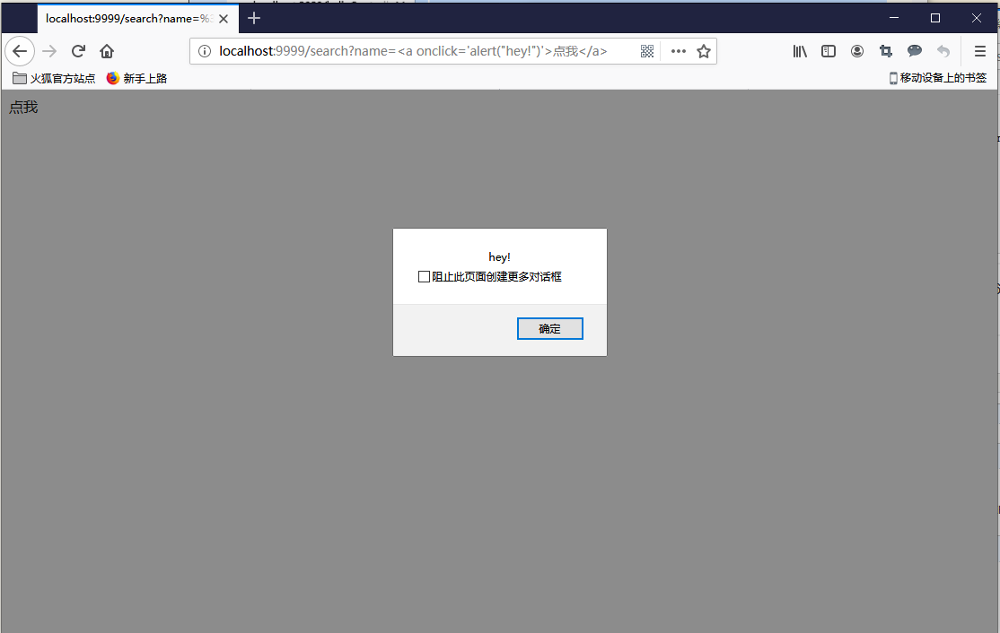
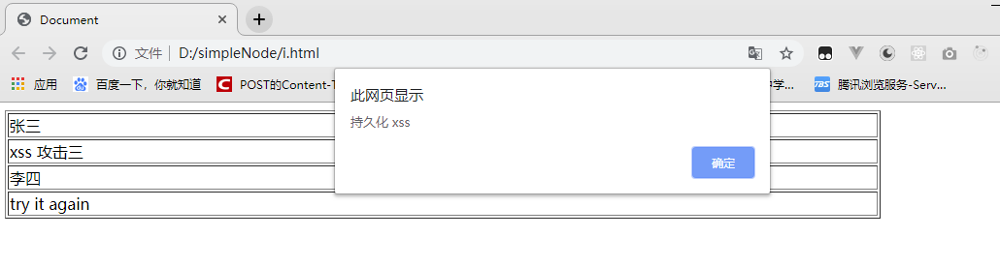
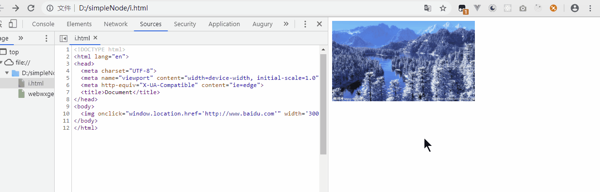

# WEB 安全 - XSS 初探

## 零、参考
* [网络攻击-XSS攻击详解](https://www.cnblogs.com/mao2080/p/9460397.html)
* [前端安全之XSS攻击](https://www.cnblogs.com/unclekeith/p/7750681.html)

## 一、概念
跨站脚本攻击Cross-site scripting (XSS)是一种安全漏洞，攻击者可以利用这种漏洞在网站上注入恶意的客户端代码。当被攻击者登陆网站时就会自动运行这些恶意代码，从而，攻击者可以突破网站的访问权限，冒充受害者。(转自 [MDN](https://developer.mozilla.org/zh-CN/docs/Glossary/Cross-site_scripting))。

在以下2种情况下，容易发生XSS攻击：
* 数据从一个不可靠的链接进入到一个web应用程序
* 没有过滤掉恶意代码的动态内容被发送给web用户

恶意内容一般包括 JavaScript，但是，有时候也会包括HTML，FLASH。XSS攻击的形式千差万别，但是，它们的共同点为：将一些隐私数据像cookie、session发送给攻击者，将受害者重定向到一个由攻击者控制的网站，在受害者的机器上进行一些恶意操作。

## 二、攻击
xss 的攻击分为 3 种：反射型、持久性、DOM 型

#### 反射型
反射型的攻击一般出现在 URL 中。这是一种非持久性的攻击，通常将 xss 代码添加至请求 URL 中，作为参数提交到服务器，服务器解析并响应。响应结果中如果包含 xss 代码，则在浏览器中可能会被解析出来并执行。所以这种类型的 xss 攻击分为三个阶段：url 中植入 xss 代码，然后服务器端解析，最后浏览器解析并执行 xss 代码  

举个例子：
```
http://localhost:8080/helloController/search?name=<script>alert("hey!")</script>
http://localhost:8080/helloController/search?name=
http://localhost:8080/helloController/search?name=<a onclick='alert("hey!")'>点我</a>
```

使用 node.js 搭建的一个简单服务器：
```js
var http = require('http');
var url = require('url');
 
var server = http.createServer((req, res) => {
   
  res.writeHead(200, {
    // 注意 Content-type 的值，
    // text/plain 中代码会被包含在 <pre></pre>块中而达不到攻击效果
    "Content-type":"text/html; charset=utf-8"
  });
 
  var params = url.parse(req.url, true).query;
 
  if (params.name) res.write(`<div>${params.name}</div>`);
   
  res.end();
 
});
 
server.listen(9999);var http = require('http');
var url = require('url');
 
var server = http.createServer((req, res) => {
   
  res.writeHead(200, {
    // 注意 Content-type 的值，
    // text/plain 中代码会被包含在 <pre></pre>块中而达不到攻击效果
    "Content-type":"text/html; charset=utf-8"
  });
 
  var params = url.parse(req.url, true).query;
 
  if (params.name) res.write(`<div>${params.name}</div>`);
   
  res.end();
 
});
 
server.listen(9999);
```
> 使用 chromium 引擎的浏览器（chrome, 360 急速模式）均作过特殊处理，会进行拦截，firefox、ie 则没有拦截，故建议在 firefox 下测试

结果如下：


#### 存储型
存储型XSS，也叫持久型XSS，主要是将XSS代码发送到服务器（不管是数据库、内存还是文件系统等。），然后在下次请求页面的时候就不用带上XSS代码了。最典型的就是留言板XSS。用户提交了一条包含XSS代码的留言到数据库。当目标用户查询留言时，那些留言的内容会从服务器解析之后加载出来。浏览器发现有XSS代码，就当做正常的HTML和JS解析执行。XSS攻击就发生了。

常用来获取用户信息，如：

张三发了一篇帖子，李四进行回复：但内容却是一段js脚本，这篇帖子被他人浏览的时候就会中招，例子中的只是一个alert()，但脚本可以写的比较复杂一点，进行盗用用户cookie等等操作
```html
<!DOCTYPE html>
<html lang="en">
<head>
  <meta charset="UTF-8">
  <meta name="viewport" content="width=device-width, initial-scale=1.0">
  <meta http-equiv="X-UA-Compatible" content="ie=edge">
  <title>Document</title>
</head>
<body>
  <table border="1" width="80%">
    <tr>
      <td>张三</td>
      <td>1楼</td>
    </tr>
    <tr>
      <td colspan="2">xss 攻击三</td>
    </tr>
    <tr>
      <td>李四</td>
      <td>2楼</td>
    </tr>
    <tr>
      <td colspan="2">try it again<script>alert('持久化 xss')</script></td>
    </tr>
 
  </table>
</body>
</html>
```


另外，除了这种hacker还有个很惯用的伎俩，例如存储型XSS生成一些诱人的图片，文字（你懂的！），然后用户去点击的时候就可以执行某些坏事，窃取信息或者诱导到钓鱼网站，如：
```html

```


也可以通过在```<head></head>```中植入重定向的```script```来劫持流量实现恶意跳转，如：
```html
<script>window.location.href="http://www.baidu.com";</script>
```

## 三、防范
* 入参字符过滤：在源头控制，把输入的一些不合法的东西都过滤掉，从而保证安全性。如移除用户提交的的DOM属性如onerror，移除用户上传的```style```节点，```<iframe>```, ```<script>```，```<a>```节点等；
* 出参进行编码：像一些常见的符号，如```<>```在输出的时候要对其进行转换编码，这样做浏览器是不会对该标签进行解释执行的，同时也不影响显示效果。例如：对```<>```做编码：```<```用```&lt;```,```>```用```&gt;```来代替；
* 入参长度限制：通过以上的案例我们不难发现 xss 攻击要能达成往往需要较长的字符串，因此对于一些可以预期的输入可以通过限制长度强制截断来进行防御。
* 设置cookie 的 ```HttpOnly```为 ```true```，这样就能禁止 javascript 的读取

## 四、其他
1. 不过怎么讲呢，千里之堤，只要有一个蚁穴，整个堤坝就不安全。安全攻防双方的博弈永远不会停止，因此诞生了信息安全这一个领域，并不断发展。或者说任何事物自诞生之初就有其本身的缺陷，于是就出现了矛盾双方的不断转化。
2. Web For Pentester - 一个 web 脚本漏洞的演练平台，介绍及安装见：[web for pentester介绍与安装](https://blog.csdn.net/Jone_Dom/article/details/89502369)。
