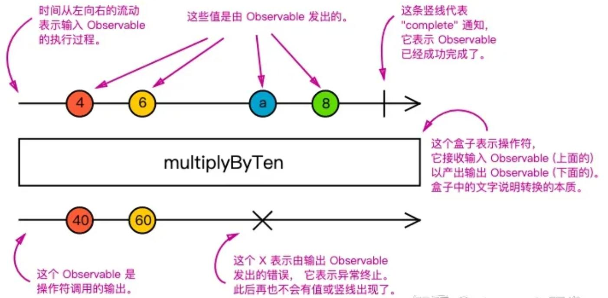

# Rxjs入门 - 一些基础概念

## 零、参考
* [Rxjs入门指南](https://juejin.cn/post/7340084472333107211)
* [RxJS 快速入门](https://zhuanlan.zhihu.com/p/53618435)
* [最简Rxjs入门教程--别再被Rxjs的概念淹没了](https://juejin.cn/post/7003328753556258846)
* [理解 RxJS：四次元编程](https://blog.crimx.com/2018/02/16/understanding-rxjs/)

## 一、简介
Rxjs, FRP(响应式编程) 和 FP(函数式编程) 思想的结合，JavaScript的扩展库，是一个基于可观察序列的库，用于处理异步事件和编写基于事件驱动的程序。它是 ReactiveX（Reactive Extensions）的 JavaScript 实现之一，提供了丰富的操作符和工具，用于处理和组合异步数据流。  
从核心原理上看，Rxjs 是一种基于观察者模式的异步编程模型；从实现上看，是对 Promise 的扩展，Promise 是 Rxjs 的基础。

  

Rxjs 官方是这样说的: Think of RxJS as Lodash for events. 把 Rxjs 想像成针对 events 的 lodash，也就是说， Rxjs 本质是个工具库，处理的是事件。这里的events，可以称之为流。  
那么流是指什么呢？举个例子，代码中每 1s 输出一个数字，用户每一次对元素的点击，就像是在时间这个维度上，产生了一个数据集。这个数据集不像数组那样，它不是一开始都存在的，而是随着时间的流逝，一个一个数据被输出出来。这种异步行为产生的数据，就可以被称之为一个流，在 Rxjs 中，称之为 Observable（抛开英文，本质其实就是一个数据的集合，只是这些数据不一定是一开始就设定好的，而是随着时间而不断产生的）。而 Rxjs，就是为了处理这种流而产生的工具，比如流与流的合并，流的截断，延迟，消抖等等操作。

## 一、Rxjs 与 Promise 的主要区别
### 1. 异步编程模型
Rxjs 是一种基于观察者模式的异步编程模型，而 Promise 是一种基于回调函数的异步编程模型。

### 2. 取消操作
Promise 的特点是无论有没有人关心它的执行结果，它都会立即开始执行，并且你没有机会取消这次执行。显然，在某些情况下这么做是浪费的甚至错误的。  
而 Rxjs 则进行了拓展，增加了取消操作的能力。

## 二、Rxjs 的主要概念
1. 可观察对象（Observable）：是 Rxjs 中的一个核心概念，是一个可迭代的对象，代表一个异步数据流，可以发送零个或多个值，并在完成或出错时发出信号。Observable 可以被订阅，以便观察它发出的值或通知，订阅后会返回一个订阅对象，订阅对象可以用来取消订阅。
2. 观察者（Observer）：是一个对象(或者集合)，它定义了如何处理 Observable 发出的值或通知。包含了三个方法：next 用于处理正常的值，error 用于处理错误，complete 用于处理完成通知。基于观察者模式，一个 Observable 可以被多个 Observer 订阅，每个 Observer 都会接收到 Observable 发出的值或通知。
3. 订阅（Subscription）：表示 Observable 和 Observer 之间的连接。订阅可以用于取消 Observable 的执行，释放资源或停止观察者接收值。
4. 操作符（Operators）：用于处理 Observable 发出的数据流的函数。RxJS 提供了许多内置的操作符，如 map、filter、merge、concat 等，以及许多其他用于数据转换、筛选和组合的操作符。
5. 主题（Subject）：是一个特殊类型的 Observable，它允许将值多路推送给多个观察者。
6. 调度器（Scheduler）：用于控制何时和如何执行 Observable 的操作。RxJS 提供了不同类型的调度器，如 async、queue、asap 等，可以用来控制异步代码的执行顺序和调度方式。

### 一些注意事项
1. 初学的时候，很多概念具有迷惑性，特别是其他的设计模式/思想也有相同/类似的用词时，这时候，需要暂时忘记以前学习的概念，也别着急理解原理，可以先大概记一下，然后在实践中去具体理解。
2. 官网文档中的很多概念比较抽象，会着重于设计思路，比如 ```pull\push``` 一类的，这个不需要过于纠结，结合真实使用场景去理解，就很容易了。
3. 不要纠结操作符，就像其他库里的 API 一样，边用边学。

## 三、基础概念的简易代码实践
### （一）、Observable, Observer, Subscription
我们在前面提到，将一系列数据按照时间线串起来，就可以称之为一个流，这个流就可以称之为一个 Observable，于是，我们构建这样一个 Observable：500ms 输出一个数组 [1, 2, 3]，1s 时输出一个对象 { a: 100 }，3s 时输出一个字符串 'end'， 4s 时终止这个流，代码如下
```js
import { Observable } from "rxjs";

// 定义一个 Observable
const stream$ = new Observable(observer => {
  setTimeout(() => {
    observer.next([1, 2, 3]);
  }, 500);
  setTimeout(() => {
    observer.next({ a: 1000 });
  }, 1000);
  setTimeout(() => {
    observer.next('end');
  }, 3000);
  setTimeout(() => {
    observer.complete();
  }, 4000);
});

// 启动
const subscription = stream$.subscribe({
  complete: () => console.log('complete'),
  next: v => console.log(v),
  error: () => console.log('error'),
});
```

从上面的代码我们可以知道：
1. ```new Observable()``` 的时候仅仅只是定义一个异步流，并没有执行(即这个数据流还没有开始流动)，只有在 ```Observable.subscribe()``` 的时候才会执行(数据开始流动)。
2. ```Observable.subscribe``` 的 ```subscribe``` 在用词上是'订阅'的意思，然而在功能上不能看作是观察者模式中订阅某个事件，挂载对应的处理(回调)函数。这个之后在详细分析。

#### 一些其他的问题和解答：
1. 有启动，必然需要关闭，如何关闭？
```js
import { Observable } from "rxjs";

// 定义一个 Observable
const stream$ = new Observable(observer => {
  setTimeout(() => {
    observer.next([1, 2, 3]);
  }, 500);
  setTimeout(() => {
    observer.next({ a: 1000 });
  }, 1000);
  setTimeout(() => {
    observer.next('end');
  }, 3000);
  setTimeout(() => {
    observer.complete();
  }, 4000);
});

const observer = {
  complete: () => console.log('complete'),
  next: v => console.log(v),
  error: () => console.log('error'),
}

// 启动并生成订阅关系
const subscription = stream$.subscribe(observer);

// 关闭
// 1s后，关闭流
setTimeout(() => {
  subscription.unsubscribe();
}, 1000);

// output:
// [1, 2, 3]
// { a: 1000 }
```
在控制台中，我们可以看到，1s 后，流被"关闭"了，而且，后续的结果也不会被输出了。但是这里需要注意的是，我们虽然"关闭"了流，但是在构造函数中，3s 和 4s 的定时器仍然是会执行的，只是内部的 ```observer.next``` 和 ```observer.complete``` 不会被执行(即作为 ```next``` 和 ```complete``` 的回调不会执行)。  
**另外， ```subscribe``` 和 ```unsubscribe``` 不是在同一个对象上的！！！**

2. 构造函数中的任务管理(副作用管理)
在构造 ```Observable``` 的时候，我们传入的是一个订阅函数，这个函数描述了 ```Observer``` 订阅之后流应该做的动作。既然这是一个函数，那么是否可以有返回值呢？  
是可以的，而且我们通常可以通过这个返回值来管理一些任务(副作用)，比如下面的代码：
```js
import { Observable } from "rxjs";

// 定义一个 Observable
const stream$ = new Observable(subscriber => {
  const intervalId = setInterval(() => {
    // console.log('interval');
    subscriber.next('hi');
  }, 1000);
 
  return function unsubscribe() {
    // console.log('constructor unsubscribe');
    clearInterval(intervalId);
  };
});

// 启动
const subscription = stream$.subscribe({
  complete: () => console.log('complete'),
  next: v => console.log(v),
  error: () => console.log('error'),
});

setTimeout(() => {
  subscription.unsubscribe();
}, 5000);
```

在上面的代码中，我们可以先把构造函数中的 ```return``` 语句注释掉看看结果：控制台中每隔 1s 打印出一个 'hi'，即使在 5s 后，我们取消了订阅，控制台仍然保持输出，所以这就带来了副作用。  
接着，我们把 ```return``` 语句打开看看结果：控制台中每隔 1s 打印出一个 'hi'，在 5s 后，控制台不再输出了，这就证明了 ```return``` 语句中的代码被执行了。  
所以，构造器中的入参函数，其返回值如果是一个函数，我们就可以在这个函数中进行副作用管理，这其实和 React 的 ```useEffect``` 思路是一样的。

3. 对于同一流，是否可以多次启动(订阅)？
回答：可以的，比如下面的代码：
```js
import { Observable } from "rxjs";

// 定义一个 Observable
const stream$ = new Observable(observer => {
  setTimeout(() => {
    observer.next([1, 2, 3]);
  }, 500);
  setTimeout(() => {
    observer.next({ a: 1000 });
  }, 1000);
  setTimeout(() => {
    observer.next('end');
  }, 3000);
  setTimeout(() => {
    observer.complete();
  }, 4000);
});

const observer1 = {
  complete: () => console.log('stream-1 complete'),
  next: v => console.log('stream-1', v),
  error: () => console.log('error'),
};

const observer2 = {
  complete: () => console.log('stream-2 complete'),
  next: v => console.log('stream-2', v),
  error: () => console.log('error'),
};

// 启动并生成订阅关系
const subscription1 = stream$.subscribe(observer1);
setTimeout(() => { // 延迟 1s 启动另一个
  const subscription2 = stream$.subscribe(observer2);
}, 1000);

// output
// stream-1 (3) [1, 2, 3]
// stream-1 {a: 1000}
// stream-2 (3) [1, 2, 3]
// stream-2 {a: 1000}
// stream-1 end
// stream-1 complete
// stream-2 end
// stream-2 complete
```

从上面的代码中，我们可以看到，流的执行发生在 ```subscribe``` 的时候，而且每次 ```subscribe``` 都会生成一个新的订阅关系，即每次启动都会生成一个新的执行，互不干扰。

#### 总结
1. ```new Observable()``` 构造一个数据流。
2. ```Observer``` 是一个对象，包含了 ```next```, ```error```, ```complete``` 三个回调函数，用于处理数据流中的数据和通知。
3. ```Observable.subscribe(observer)``` 启动数据流，返回一个订阅关系 ```subscription```。
> 这里不得不吐槽一句，按照一般性的理解，```subscribe``` 更应该叫 ```addXXX```, 这样就能更符合语义。

### （二）、Subject
按照定义，这是一个特殊的 Observable，有多特殊呢，上代码：
```js
import { Subject } from "rxjs";

const { Subject } = rxjs;

const subject$ = new Subject();

// 订阅一个 subject
subject$.subscribe(v => console.log('stream $1', v));
// 再订阅一个 subject
subject$.subscribe(v => console.log('stream $2', v));

// 再订阅一个 subject
setTimeout(() => {
  subject$.subscribe(v => console.log('stream $3', v));
}, 2000);

subject$.next(1);
subject$.next(2);
setTimeout(() => {
  subject$.next(3);
}, 1000);
setTimeout(() => {
  subject$.next(4);
}, 3000);

// output
// stream $1 1  // 立即输出
// stream $2 1  // 立即输出
// stream $1 2  // 立即输出
// stream $2 2  // 立即输出

// stream $1 3  // 1s后输出
// stream $2 3  // 1s后输出

// stream $1 4  // 3s后输出
// stream $2 4  // 3s后输出
// stream $3 4  // 3s后输出
```

可以看到，```Subject``` 采用的就是发布订阅模式，```subscribe``` 去订阅，```next``` 触发。  
其实，这里我们就能发现 ```Subject``` 和 ```Observable``` 的区别了，```Observable``` 的执行流的产生是在 ```subscribe``` 的时候，这意味着每次调用 ```subscribe``` 都会产生一份独一无二的执行流，并和一个 ```Observer``` 绑定，这样就形成了一对一的关系(单播)。  
而 ```Subject``` 则不同，其 ```subscribe``` 只是维护一个列表，每次调用 ```next``` 都会通知所有的 ```Observer```，这就形成了一对多的关系(组播/多播)。

## 四、一些其他的相关概念
### （一）、Hot & Cold
简单而言，```Hot``` 的实现就是 ```Subject```，```Cold``` 的实现就是 ```Observable```。
为什么会有这两个概念？在前文中，我们提到过，```Observable.subscribe()``` 每次调用都会生成一个新的执行流，即重走一遍 ```new Observable()``` 中的代码，这岂不是很浪费性能？没错，但是如果 ```Observable.subscribe()``` 只走了一遍，那么维护一个订阅者列表，也是没必要的。所以，Rxjs 就引入了这两个概念，来解决这个问题。  
当然，Hot & Cold 的概念，将在后续的文章中详细展开。
