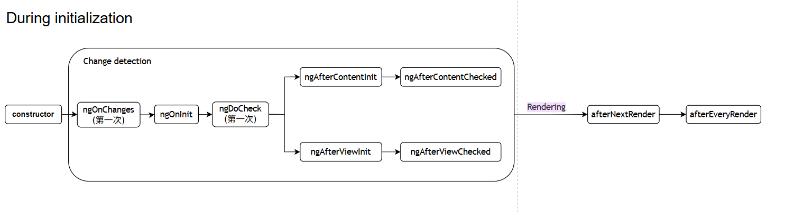
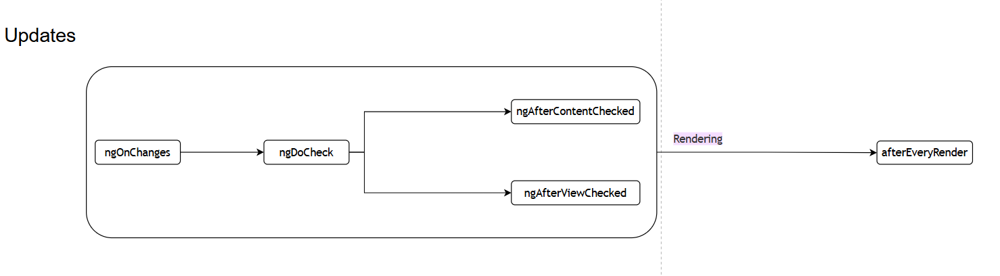

# Angular 组件生命周期

## 零、参考资料
- https://angular.dev/guide/components/lifecycle
- https://www.techfliez.com/angular-ngafterviewinit-vs-ngaftercontentinit

## 一、各生命周期的 Hooks
### constructor
起始第一步，执行于 Angular 开始实例化组件

通常用于 DI(依赖注入) 和其他一些初始化操作，不建议执行复杂的逻辑和异步操作

### ngOnInit
严格意义上的组件初始化。执行时序是第一次 ```ngOnChanges``` 之后，且在组件自身的模板(html template)初始化之前
> This step happens before the component's own template is initialized. This means that you can update the component's state based on its initial input values.

通常用于执行初始化逻辑，如订阅服务、设置定时器等

### ngOnChanges(多次)
组件会接受上层(父)组件的传值，即 ```@Input```(数据绑定)，而当传入的值(```inputs```) 发生改变的时候，这个 ```hook``` 均会调用

- 在 ```ngOnInit``` 之前，也会有一次该 ```hook``` 的调用

### ngDoCheck(多次)
在 Angular 每次检查组件模板的更改之前运行，此 ```hook``` 的调用非常频繁，应该尽量避免调用此 ```hook```。通常用于自定义变更检查逻辑

> You can use this lifecycle hook to manually check for state changes outside of Angular's normal change detection, manually updating the component's state.

- 第一次的运行是在 ```ngOnInit``` 之后

### ngAfterContentInit
在 Angular 将外部的内容(如通过 ```<ng-content />``` 形式)的子组件**初始化**以后执行
> 当 Angular 把外部内容投影进组件视图或指令所在的视图之后调用

- 第一次 ```ngDoCheck``` 之后调用

### ngAfterContentChecked(多次)
在外部的内容(如内嵌)的子组件**变更检测**以后执行
> 每当 Angular 检查完被投影到组件中的内容之后调用

- ```ngAfterContentInit``` 和每次 ```ngDoCheck``` 之后调用

### ngAfterViewInit
在 Angular 将视图(模板)**初始化**以后执行
> 当 Angular 初始化完组件视图及其子视图调用

- 第一次 ```ngAfterContentChecked``` 之后调用

### ngAfterViewChecked(多次)
在视图(模板)**变更检测**以后执行
> 每当 Angular 做完组件视图和子视图或包含该指令的视图的变更检测之后调用

- ```ngAfterViewInit``` 和每次 ```ngAfterContentChecked``` 之后调用

### ngOnDestroy
在组件被销毁之前调用，通常用于执行清理操作，取消订阅，清除定时器，防止内存泄漏

可以使用 ```DestroyRef``` 来代替 ```ngOnDestroy``` 来简化代码书写方式，示例如下：
```ts
@Component({
  /* ... */
})
export class UserProfile {
  constructor() {
    /**
     * 使用 DI 来注入一个 DestroyRef，
     * 这样就不必再写 ngOnDestroy 的 hook
     */
    inject(DestroyRef).onDestroy(() => {
      console.log('UserProfile destruction');
    });
  }
}
```

### afterEveryRender & afterNextRender
这两个不算是严格意义上的生命周期，在 Angular 将所有的东西都渲染成真实 DOM 以后执行，因此，可以进行真实的 DOM 操作

## 二、总结
时序图：

- 初始化  

- 更新  


## 三、其他
父子组件  

- 子组件在父组件内部(以下称之为内部子组件)  
父 Constructor -> 子 Constructor ->  
父 OnInit -> 父 DoChecked ->   
父 AfterContentInit -> 父 AfterContentChecked ->  
子 OnInit -> 子 DoChecked -> 子 AfterContentInit -> 子 AfterContentChecked ->  
子 AfterViewInit -> 子 AfterViewChecked ->  
父 AfterViewInit -> 父 AfterViewChecked  

- 子组件通过 ```<ng-content />``` 的形式(以下称之为外部子组件)  
父 Constructor -> 子 Constructor ->  
父 OnInit -> 父 DoChecked ->   
子 OnInit -> 子 DoChecked -> 子 AfterContentInit -> 子 AfterContentChecked ->   
父 AfterContentInit -> 父 AfterContentChecked ->  
子 AfterViewInit -> 子 AfterViewChecked ->   
父 AfterViewInit -> 父 AfterViewChecked  

> 这个正好说明了 ```AfterContentXXX``` 和 ```AfterViewXXX``` 的区别

- 两个子组件，子1 在内部，子2 以 ```<ng-content />``` 的形式
父 Constructor -> 子2 Constructor -> 子1 Constructor ->  
父 OnInit -> 父 DoChecked ->  
子2 OnInit -> 子2 DoChecked -> 子2 AfterContentInit -> 子2 AfterContentChecked ->  
父 AfterContentInit -> 父 AfterContentChecked ->  
子1 OnInit -> 子1 DoChecked -> 子1 ngAfterViewInit -> 子1 AfterContentChecked ->  子1 AfterViewInit -> 子1 AfterViewChecked ->  
子2 AfterViewInit -> 子2 AfterViewChecked ->  
父 AfterViewInit -> 父 AfterViewChecked  

> 1. 以父组件 ```DoChecked``` 为分界点，外部子组件会在这之后完成自己的 ```OnInit/DoChecked/AfterContentInit/AfterContentChecked``` 阶段  
> 2. 父组件继续完成自己的  ```AfterContentInit/AfterContentChecked``` 阶段  
> 3. 内部子组件完成自己的  ```OnInit/DoChecked/AfterContentInit/AfterContentChecked/AfterViewInit/AfterContentChecked``` 阶段  
> 4. 外部子组件完成自己的  ```AfterViewInit/AfterViewChecked``` 阶段  
> 5. 父组件完成自己的  ```AfterViewInit/AfterViewChecked``` 阶段  

> 需要注意的是，以上的时序和两种子组件在父组件的顺序是**无关**的！
