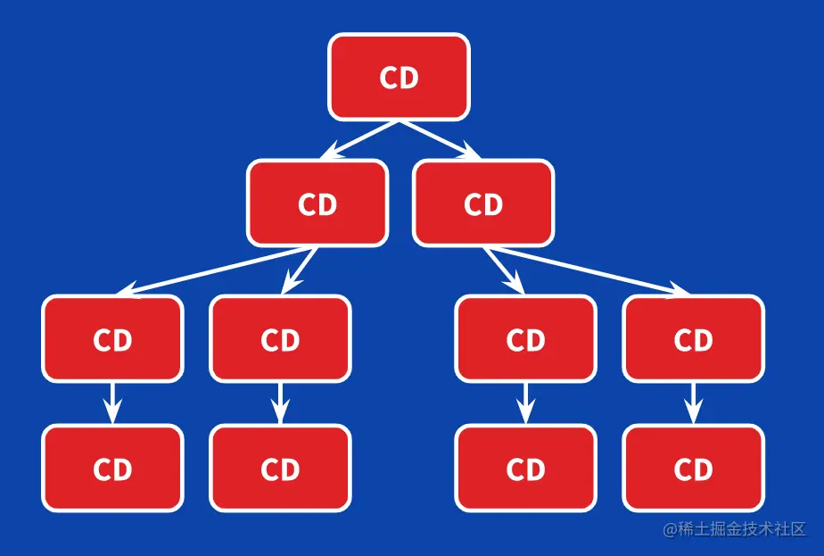
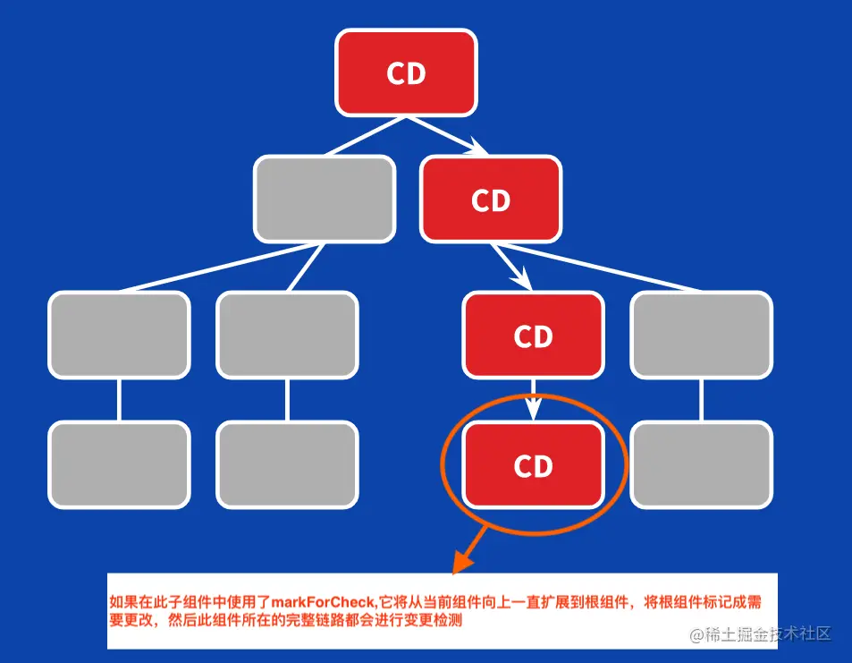
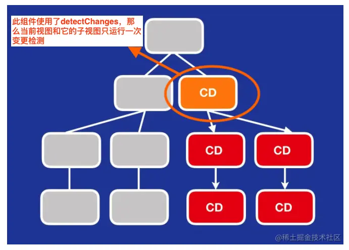

# Angular 变更检测 - Change Detection 
> 本篇只是对 Angular 的数据改变 -> UI 改变过程的一个初步学习和记录，很多细节暂时会被忽略

## 零、参考资料
* [浅谈 Angular 变更检测](https://juejin.cn/post/7217482458773274679)
* [[译]深入理解Angular onPush变更检测策略](https://juejin.cn/post/6844904017836032007)

## 一、简介
### 概念
WEB 应用大多数是人机交互的，当状态发生改变时，需要将变化反射到用户 UI 上，这就是变更检测机制的主要工作。而反应在 Angular 中，就是如何确认变更以通知 UI 进行改变  
简单而言，就是 Angular 的变更检测器去遍历组件树并访问组件属性新值，将其与旧值对比，决定是否更新视图

### Angular 变更检测树
Angular 在实例化组件的时候，会根据开发者选择的策略生成一个变更检测器，即当组件数生成的时候，逻辑上相应的变更检测树(Change Detection Tree)也生成了
> 每一个组件都有一个变更检测器。Angular 会为每一个组件生成一个变化监测器 change Detector ，记录组件的变化状态
默认情况下，每次 Change Detector 被触发，CD树会被遍历一遍，决定对应组件是否需要更新视图

## 二、哪些行为会引起 Angular 变更检测
默认情况(策略)下：
- 浏览器事件：点击、鼠标、键盘等事件；
- 定时器：setTimeout、setInterval 等；
- 异步 API：Ajax、fetch、promise.then 等；
当有上述行为发生时，Angular 变更检测器会被触发，这将遍历整个 Change Detection Tree，以确保视图的正确渲染。但是当应用足够复杂时，Change Detection Tree 会变得非常庞大，这时，遍历一遍会十分地耗费性能。于是，Angular 又提供了另外一套策略：onPush 策略，也称之为按需变更策略，当遍历 Change Detection Tree 时候，一般会跳过开启了 onPush 策略的组件(以及其后代)，而在开启了 onPush 策略的组件中，只有当下列情况发生时候，才会触发变更检测：
- 输入(@Input)发生改变；
- Dom 事件触发，其他异步事件更换内部数据都不会触发
- 手动触发

## 三、默认策略


```ts
// 父组件
@Component({
  template: `
    <hello></hello>
    <button (click)="onClick()">Trigger change detection</button>
  `
})
export class AppComponent  {
  onClick() {}
}
```

```ts
// 子组件
@Component({
  template: `
    <h1>Hello {{name}}!</h1>
    {{runChangeDetection}}
  `
})
export class HelloComponent {
  @Input() name: string;

  get runChangeDetection() {
    console.log('Checking the view');
    return true;
  }
}
```
以上面的代码为例，当在父组件中触发点击事件时，子组件的数据并没有发生改变，但子组件内部的逻辑却执行了，会在控制台打印日志，这个其实是没必要的

## 四、onPush 策略
开启这个策略很简单，如下就行：
```ts
@Component({
  selector: '...',
  templateUrl: '...',
  styleUrls: ['...'],
  changeDetection: ChangeDetectionStrategy.OnPush, // 使用Angular的onPush策略
})
```

### 输入(@Input)改变时
这个需要注意的是，当输入的值是一个对象(引用类型)数据的时候，如果是直接修改的对象的属性的话，并不能触发 onPush 策略下的自动检测的，如下面的代码：
```ts
// 子组件
@Component({
  selector: 'tooltip',
  template: `
    <h1>{{config.position}}</h1>
    {{runChangeDetection}}
  `,
  changeDetection: ChangeDetectionStrategy.OnPush
})
export class TooltipComponent  {
  @Input() config;
  get runChangeDetection() {
    console.log('Checking the view');
    return true;
  }
}

// 父组件
@Component({
  template: `
    <tooltip [config]="config"></tooltip>
  `
})
export class AppComponent  {
  config = {
    position: 'top'
  };

  // 错误：
  // onClick() {
  //   this.config.position = 'bottom'; // 这样是无法触发子组件的变更检测，即控制台看不到 'Checking the view' 日志
  // }

  // 正确：
  onClick() {
    // 修改引用地址，触发子组件变更检测
    this.config = {
      position: 'bottom'
    }
  }
}
```

### Dom 事件触发，其他异步事件更换内部数据都不会触发
当组件触发了 Dom 事件，触发变更检测：
```ts
@Component({
  template: `
    <button (click)="add()">Add</button>
    {{count}}
  `,
  changeDetection: ChangeDetectionStrategy.OnPush
})
export class CounterComponent {
  count = 0;
  add() {
    this.count++;
  }
}
```

但是，如果是异步事件或者 API，则无法触发变更检测：
```ts
@Component({
  template: `...`,
  changeDetection: ChangeDetectionStrategy.OnPush
})
export class CounterComponent {
  count = 0;

  constructor() {
    setTimeout(() => this.count = 5, 0);
    setInterval(() => this.count = 5, 100);
    Promise.resolve().then(() => this.count = 5); 
    this.http.get('https://count.com').subscribe(res => {
      this.count = res;
    });
  }

  add() {
    this.count++;
  }
```
需要注意的是，尽管上述代码中的一系列异步事件无法触发变更检测，但是属性是被切实改变了的，所以，当触发点击事件后，count 的值会变成 6 (5 + 1)

### 手动触发
手动触发主要依赖 ```changeDetectorRef``` 这个 DI，使用方法就是在组件的 ```constructor``` 中注入，并在需要触发的地方调用这个对象提供的特点方法即可即可：
```ts
@component({ .... })
export class Comp {
  let count;
  constructor(
    private cdr: changeDetectorRef // 注入变化检测对象
  ) {
    // ...
  }

  change() {
    this.count = 1;
    this.cdr.detectChanges(); // 特殊方法之一
  }
}
```

```changeDetectorRef``` 这个对象在 Angular 中的抽象如下：
```ts
abstract class ChangeDetectorRef {
  abstract markForCheck() : void 
  abstract detectChanges() : void
  abstract detach() : void
  abstract reattach() : void 
  abstract checkNoChanges() : void
}
```

#### markForCheck()
这个方法并不直接触发变更检测，只会将所有设置了 onPush 策略的祖先标记，在当前或者下一次变更检测循环中进行检测，当然，也有说是从当前组件开始，一级一级向上地标记父组件，其示意图如下：  


#### detectChanges()
这个方法会触发变更检测，其次，这个方法并**不依赖** onPush 策略。这个方法的作用是对**当前视图和子视图**运行一次变更检测，其示意图如下：  


#### detach()
这个方法并**不依赖** onPush 策略。这个方法的作用是从 Change Detection Tree 中剥离自己的变化检测器，即：当前和后续的变化检测循环不再执行该组件的变化检测器，其子组件也不会执行(相当于子组件的变化检测器也被剥离了)，除非手动调用了 reattach() 方法  

#### reattach()
这个方法并**不依赖** onPush 策略。这个方法的作用是和 detach 相反，将当前组件的变化检测器添加回 Change Detection Tree 中去。但是需要注意的是，如过当前组件有父组件，且父组件**没有启用变化检测**(脏检测，即从 CD Tree 中剥离?)，这个方法将不起作用


### 其他注意事项
#### 概念：Immutables
当开启了 onPush 策略的时候，组件的输入值均会被当成不可变对象(Immutables)，因此，如果输入的是应用类型的对象的话，那么直接修改该对象内部的属性并**不会**触发变化检测，即我们在上文中在 ```TooltipComponent``` 组件中的演示

#### Async pipe
开启了 onPush 策略，而且输入(@Input)的值又是一个 Observable 或者 Promise 的话，需要使用 ```async``` 这个 ```pipe```, 否则同样不会触发变更检测，如下下面的例子：
```ts
// 父组件
@Component({
  template: `
    <button (click)="add()">Add</button>
    <app-list [items$]="items$"></app-list>
  `
})
export class AppComponent {
  items = [];
  items$ = new BehaviorSubject(this.items);

  add() {
    this.items.push({ title: Math.random() })
    this.items$.next(this.items);
  }
}

// 子组件
@Component({
  // 不使用 async
  template: `
    <div *ngFor="let item of _items">{{item.title}}</div>
  `,
  // 使用 async
  // template: `
  //   <div *ngFor="let item of _items | async">{{item.title}}</div>
  // `,
  changeDetection: ChangeDetectionStrategy.OnPush
})
export class ListComponent implements OnInit {
  @Input() items: Observable<Item>;
  _items: Item[];
  
  ngOnInit() {
    this.items.subscribe(items => {
      this._items = items;
    });
  }
}
```
在上述的代码中，如果不使用 ```async```，则触发点击事件后，视图上将看不到我们新增的那条数据，只有加上了以后才能看见

## 其他
* signal 系统对变更检测策略有无影响？
