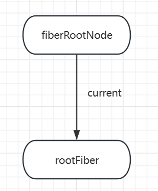
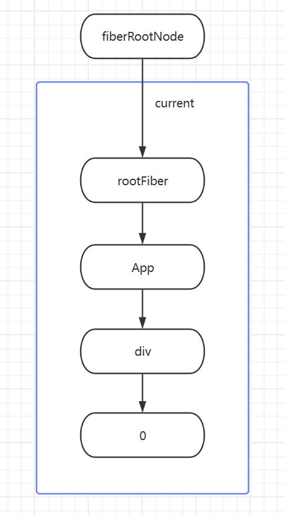
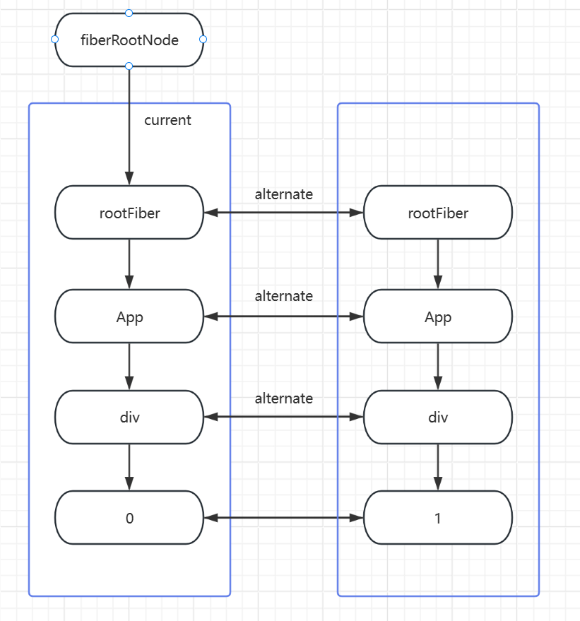
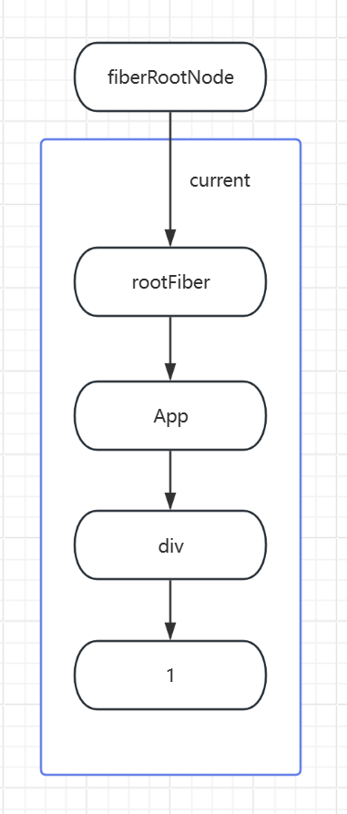

# React Fiber 架构初探

## 零、参考资料
- [深入理解 React 的 Fiber 架构](https://juejin.cn/post/7395079370795663414)
- [React Fiber 源码解析](https://juejin.cn/post/6859528127010471949)
- [一文看懂react渲染原理](https://juejin.cn/post/7472970155224711178)

## 一、前言
React 团队在 2017 年(React V16)的时候对 React 进行了一次重构，其目的是为了解决传统 React 架构在处理高频更新和复杂组件树时的一些性能瓶颈问题，于是便诞生了 Fiber 架构。这是一种全新的协调引擎，旨在提高 React 应用的性能，尤其是在复杂和高频更新的场景下

### 传统架构的一些局限性
- 单次渲染时间过长：当组件树较大时，一次完整的渲染更新可能会占用大量的时间，这会导致主线程被阻塞，无法响应用户的输入，进而影响用户体验。这是因为在传统架构下，React 是从根节点开始，以深度优先进行递归遍历整个组件树的
- 中断和恢复困难：递归遍历是同步的，一旦开始，几乎不可能停止和恢复
- 缺乏优先级管理：这点意味着传统架构无法根据任务的重要程度分配优先级，所有任务一视同仁，所以往往会出现关键任务(比如用户输入)等会被不重要的任务阻塞的情况

### Fiber 架构相对传统架构的优势
- 增量渲染：Fiber 将渲染过程分为可以中断的小任务，这样即使组件树非常庞大，每个任务的执行时间会得到控制，避免长时间的阻塞
- 任务分片：通过任务分片技术，Fiber 可以在空闲时间片段进行渲染，从而最大限度地利用浏览器的空闲时间，提升整体性能
> RIC & RAF & 内部的 Scheduler 实现 
- 响应性能提升：通过将任务拆分并分配优先级，Fiber 可以确保优先级高的用户交互等任务先执行
- 平滑的用户体验：由于渲染过程是可中断以及可恢复的，Fiber 可以更加灵活地处理动画和过渡效果，提供更加丝滑的用户体验(感觉这是针对大部分用 JS 来实现的动画/过渡)

## 二、基本概念
### Work
React Reconciliation 过程中出现的各种必须执行计算的活动，比如 state update，props update 或 refs update 等，这些活动我们可以统一称之为 work，是 Fiber 架构最小的活动单元

### Fiber 对象(节点)
也可以称之为 Fiber 节点，是一个数据结构，其中包含了该节点的上/下/同级的信息，用以构成 Fiber 树，当然也包含了一些其他信息

Fiber 对象的主要属性：
```js
Fiber = {
  tag: WorkTag,  // 标识 fiber 类型的标签，详情参看下述 WorkTag
  return: Fiber | null,   // 指向父节点
  child: Fiber | null,    // 指向子节点
  sibling: Fiber | null,  // 指向兄弟节点
  pendingProps: any,  // 在开始执行时设置 props 值
  memoizedProps: any,  // 在结束时设置的 props 值
  memoizedState: any,  // 当前 state
  effectTag: SideEffectTag,  // Effect 类型，详情查看以下 effectTag
  nextEffect: Fiber | null,  // effect 节点指针，指向下一个 effect
  firstEffect: Fiber | null,  // effect list 是单向链表，第一个 effect
  lastEffect: Fiber | null,  // effect list 是单向链表，最后一个 effect
  expirationTime: ExpirationTime,  // work 的过期时间，可用于标识一个 work 优先级顺序，最新的似乎已经改成新的字段
};
```

workTag: 用于标识一个 React 元素的类型，如下所示:
```js
export const FunctionComponent = 0;
export const ClassComponent = 1;
export const IndeterminateComponent = 2; // Before we know whether it is function or class
export const HostRoot = 3; // Root of a host tree. Could be nested inside another node.
export const HostPortal = 4; // A subtree. Could be an entry point to a different renderer.
export const HostComponent = 5;
export const HostText = 6;
export const Fragment = 7;
export const Mode = 8;
export const ContextConsumer = 9;
export const ContextProvider = 10;
export const ForwardRef = 11;
export const Profiler = 12;
export const SuspenseComponent = 13;
export const MemoComponent = 14;
export const SimpleMemoComponent = 15;
export const LazyComponent = 16;
export const IncompleteClassComponent = 17;
export const DehydratedSuspenseComponent = 18;
export const EventComponent = 19;
export const EventTarget = 20;
export const SuspenseListComponent = 21;
```

EffectTag: 每一个 fiber 节点都有一个和它相关联的 effectTag 值。我们把不能在 render 阶段完成的一些 work 称之为副作用，React 罗列了可能存在的各类副作用，如下所示：
```js
export const NoEffect = /*              */ 0b000000000000;
export const PerformedWork = /*         */ 0b000000000001;

export const Placement = /*             */ 0b000000000010;
export const Update = /*                */ 0b000000000100;
export const PlacementAndUpdate = /*    */ 0b000000000110;
export const Deletion = /*              */ 0b000000001000;
export const ContentReset = /*          */ 0b000000010000;
export const Callback = /*              */ 0b000000100000;
export const DidCapture = /*            */ 0b000001000000;
export const Ref = /*                   */ 0b000010000000;
export const Snapshot = /*              */ 0b000100000000;
export const Passive = /*               */ 0b001000000000;

export const LifecycleEffectMask = /*   */ 0b001110100100;
export const HostEffectMask = /*        */ 0b001111111111;

export const Incomplete = /*            */ 0b010000000000;
export const ShouldCapture = /*         */ 0b100000000000;
```

### Fiber 树
由 Fiber 节点构成

#### 创建
- 根据 JSX 构建 vDom 树
- 对于每个 vDom 节点生成对应的 Fiber 节点，然后建立起 Fiber 树的层级结构
> 根据 Fiber 节点中的属性(如 child, sibling, return 等)相互链接，构成 Fiber 树
- 从根节点开始遍历，执行组件的生命周期和渲染函数，将组件树渲染到 DOM 中(初次渲染)

在 Fiber 架构中，Fiber 树的构建是一个增量的过程，即渲染过程可以在任意时刻中断，并在下一个空闲时间片段恢复。这就给予了 React 根据需要调整更新优先级的空间 

#### 更新
- 当组件的状态或者属性发生变化时，React 调用相应的更新函数，标记组件为需要更新的状态
- 根据新的状态或者属性生成一颗新的 vDom，表示更新后的组件树
- 使用协调算法比较新旧 vDom，找出需要更新的部分
- 根据上一步的结果，更新 Fiber 树的相应节点，执行组件的生命周期和渲染函数，将组件树渲染到 DOM 中

### Reconciliation 协调
在 React 中，协调是指确定组件树的更新方式，即如何将新的状态映射到 UI 上。所以，在 React 中，协调过程包含了 vDom 的 diff 过程

协调过程也是 Fiber 架构的优势，React 在这个过程中用新的增量渲染算法代替了传统算法，即将协调过程分解成多个小任务，并使用任务调度器(Scheduler)来动态调度这些任务，这就使得一个大任务有了暂停和恢复的可能性，于是就能利用浏览器的空闲时间来进行非核心的运算，提高了渲染的灵活性和效率。同时，增量渲染也为 React 奠定了优先级的基础，从而更细致地控制任务的执行

## 三、Fiber 架构的工作原理
### 双缓存
在 React 中，双缓存是一种用于解决 UI 渲染过程中闪烁和视觉不连续的技术。传统的渲染过程中，更新操作会直接修改 DOM，导致在更新过程中用户可能会看到中间状态的 UI，造成视觉上的不连续和不稳定。双缓存技术通过在内存中维护两份 UI 状态，一份用于渲染当前帧，另一份用于计算下一帧的状态，从而避免了直接在 DOM 上进行更新操作
> 说白了，就是将一个渲染周期内的所有的更改/变动先缓存下来，然后统一渲染，就是 vDom 的意义之一，尽量减少非必要的渲染

#### 两颗 Fiber 树
在React中最多会同时存在两棵Fiber树。当前屏幕上显示内容对应的Fiber树称为current Fiber树，正在内存中构建的Fiber树称为workInProgress Fiber树。
current Fiber树中的Fiber节点被称为current fiber，workInProgress Fiber树中的Fiber节点被称为workInProgress fiber，他们通过alternate属性连接
```js
currentFiber.alternate === workInProgressFiber;
workInProgressFiber.alternate === currentFiber;
```
React 的根节点通过使 current 指针在不同 Fiber 树的 rootFiber 间切换来完成 current Fiber 树指向的切换，即当 workInProgress Fiber 树构建完成交给 Renderer 渲染在页面上后，应用根节点的 current 指针指向 workInProgress Fiber 树，此时 workInProgress Fiber 树就变为 current Fiber 树，每次状态更新都会产生新的 workInProgress Fiber 树，通过 current 与 workInProgress 的替换，完成 DOM 更新

#### # mounted

```jsx
function App() {
  const [count, add] = useState(0);
  return (
    <div onClick={() => add(count + 1)}>{count}</div>
  )
}
ReactDOM.render(<App/>, document.getElementById('root'));
```

##### 首次创建  

首次执行 ReactDom.render 时候会创建 fiberRootNode(源码中叫做 fiberRoot) 和 rootFiber。其中 fiberRootNode 是整个应用的根节点，rootFiber 是 <APP /> 所在组件树的根节点  

之所以要区分 fiberRootNode 与 rootFiber ，是因为在应用中我们可以多次调用 ReactDOM.render 渲染不同的组件树，他们会拥有不同的 rootFiber 。但是整个应用的根节点只有一个，那就是 fiberRootNode  

fiberRootNode 的 current 会指向当前页面上已渲染内容对应 Fiber 树，即 current Fiber 树。由于是首屏渲染，页面中还没有挂载任何 DOM ，所以 fiberRootNode.current 指向的 rootFiber 没有任何子 Fiber 节点（即 current Fiber 树为空）

<!--    -->
  

##### 渲染
接下来进入 render 阶段，根据组件返回的 JSX 在内存中依次创建 Fiber 节点并连接在一起构建 Fiber 树，被称为 workInProgress Fiber 树

在构建 workInProgress Fiber 树时会尝试复用 current Fiber 树中已有的 Fiber 节点内的属性，在首屏渲染时只有 rootFiber 存在对应的 current fiber (即 rootFiber.alternate)

下图中左侧为页面显示的树，右侧为内存中构建的树：

  

##### 提交
已构建完的 workInProgress Fiber 树 在 commit 阶段 渲染到页面

此时 DOM 更新为右侧树对应的样子。fiberRootNode 的 current 指针指向 workInProgress Fiber 树 使其变为 current Fiber 树：

  

#### # update

```jsx
function App() {
  const [count, add] = useState(0);
  return (
    <div onClick={() => add(count + 1)}>{count}</div>
  )
}
ReactDOM.render(<App/>, document.getElementById('root'));
```

##### 点击，触发状态更新

这会开启一次新的 render 阶段并构建一棵新的 workInProgress Fiber 树。和 mount 时一样，workInProgress fiber 的创建可以复用 current Fiber 树对应的节点数据

  

##### 提交

workInProgress Fiber 树在 render 阶段 完成构建后进入 commit 阶段 渲染到页面上。渲染完毕后，workInProgress Fiber 树变为current Fiber 树

  


### 时间切片
这里没啥太多好说的，就是任务队列那一套，代码实现上除了使用 RIC & RAF，React 内部弄了一套 Scheduler，通过 MessageChannel 和 postMessage 来进行。同时因为有了任务分片，Fiber 就能顺理成章地将递归遍历改成循环遍历

### 优先级调度
在 React 中，任务被划分为不同的优先级，以便根据任务的重要性进行调度。通常情况下，React 将任务分为以下几个优先级：

- 同步任务：最高优先级的任务，通常用于处理用户交互事件和页面加载过程中的同步操作
- 异步任务：中等优先级的任务，包括普通的更新任务和网络请求等异步操作
- 空闲任务：最低优先级的任务，通常用于执行一些不紧急的任务，如日志记录或统计信息收集等

常用的一些任务字典(伪)：
```js
// 无优先级任务
export const NoPriority = 0;
// 立即执行任务
export const ImmediatePriority = 1;
// 用户阻塞任务
export const UserBlockingPriority = 2;
// 正常任务
export const NormalPriority = 3;
// 低优先级任务
export const LowPriority = 4;
// 空闲执行任务
export const IdlePriority = 5;
```
