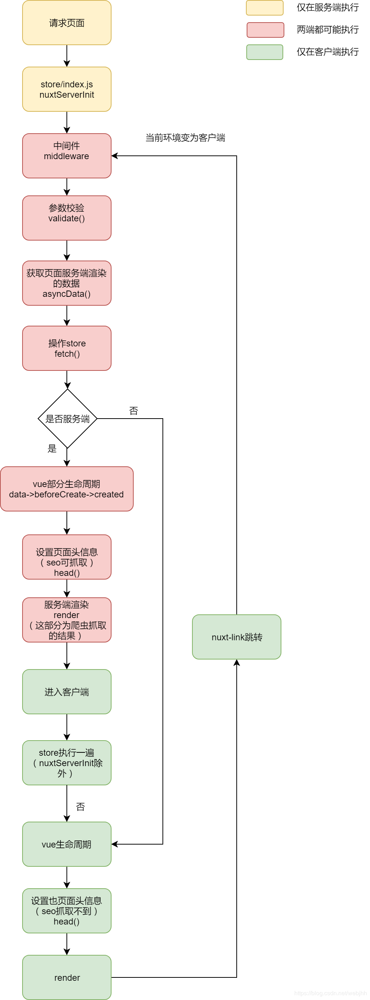

# Nuxt.js 踩坑笔记 - 缓存向(V 2.0)
## 零、前言
最近参与了一个立足 seo 的移动端项目，公司前端工程主栈 vue，所以理所当然的用上了 Nuxt，UI 主要选择了 Vant

## 一、公共列表页的缓存
公共列表页由于数据量较大，故需要滚动触发分次加载以模拟分页，当客户端加载到了一定页数之后(>= 2)，点击某条数据进去查看详情，然后返回列表页，这时候如果没有缓存的话，列表页会按照初始参数(即从分页 1 开始)发请求拉数据，并且丢失浏览位置。一方面，浪费请求资源，另一方面，用户体验不佳。因此，针对这两个问题，最后决定开启缓存

vue 中的缓存直接使用 ```<keep-live>``` 组件即可，配合上 ```vue-router``` 中的 ```scrollBehavior``` 往往能比较容易地实现。当然这里容易有忽略：
> “scrollBehavior 只在支持 history.pushState 的浏览器中可用。” 接受三个参数，to, from, savedPosition, 而 savedPosition “当且仅当 popstate 导航 (通过浏览器的 前进/后退 按钮触发) 时才可用。”  

这意味这个参数着只有 ```this.$router.go(...)``` 有效，```this.$router.push()``` 时是无效的！并且，我们在使用 ```<keep-live>``` 时，通常会在自定义的路由中添加某些字段，但 Nuxt 的路由是自动生成的，这里是最大的限制

这里有一个需要注意的是，在 Nuxt.js 的 1.x 某个更新中， ```<nuxt>``` 和 ```<nuxtChild>``` 组件添加了 ```keepAlive``` 属性。于是我们可以在 ```default.vue``` 中定制这个属性：
```jsx
<nuxt :keep-alive='viewCache' :keepAliveProps="{include: includeArr}"/>

data() {
  return {
    cache: false,
    includeArr: ['list-name-1', 'list-name-2'] // 组件的 name
  }
}
 
watch: {
  '$route': function(new, old) {
    if (...) {
      this.cache = true;
    } else {
      this.cache = false;
    }
  }
}
```
然后，在跳转进入列表页的组件上绑定相应的参数，从而控制是否需要缓存，如：
```jsx
this.$router.push({
  name: 'list-name-1',
  params: {
    cache: true
  }
})
```

最后，绑定 keepAliveProps 是为了避免多余组件的缓存.
另外，从列表页跳转详情页的时候，也需要加上控制字段，如：
```jsx
this.$router.push({
  name: 'details-name-1',
  params: {
    details_id: xxxxx,
    cache: true
  }
})
```
并且，从详情页返回时，也需要加上控制字段，如:
```
this.$router.push({
  name: 'list-name-1',
  params: {
    cache: true
  }
})
```
至此，可以解决请求浪费，列表数据缓存的问题，同时，缺点也比较明显，需要在父组件/列表页/详情页同时添加控制字段才能实现，耦合度较高，并且，用户在列表页刷新一下即失效。

其次，对于滚动条位置记录，在多番尝试之后，也没有一个较便捷的方法。原因除上文中提到的 ```savedPosition``` 的限制以外，与列表数据的缓存也有关系：整个页面的高度需要由数据撑开，然后才能进行滚动。下面是我的解决方案，依赖上文中的组件(数据)缓存：
  
由于列表页不进行 ssr, 故在使用 ```keepAlive``` 时同时可以使用 ```vue``` 的 ```activated/deactivated``` 这两个生命周期：
```jsx
activated() {
  setTimeout(() => {
    window.scrollTo(0, this.scrollPosition);
    // window.scrollTo({
    //   top: this.scrollPosition,
    //   behavior: "smooth"
    // });
  }, 0)
},
deactivated(){
  this.scrollPosition = window.pageYOffset || document.documentElement.scrollTop || document.body.scrollTop || 0;
}
```

这里需要注意的是要使用 ```setTimeout``` (或者 ```this.$nextTick()```，不过我尝试的时候没有效果)，否则不会滚动  

当然，这里也存在一定的问题，```window.scrollTo(x, y)``` 动作是瞬间完成的，因此可能会存在一定的闪烁情况，而使用 ```window.scrollTo({..., behavior: "smooth" })``` 则在每次用户返回的时候都会有个明显的下滑动作，所以，如何取舍，应当依据实际情况

附上对列表数据缓存的实践和资料：
* (未尝试) 使用服务器缓存 - https://juejin.im/post/5b2b62096fb9a00e61494b0b
* ✗ 使用 ```van-popup/dialog``` 组件 - 但是会引起 ```asyncData``` 中的传值收值
* ✗ ```this.$router.go``` 函数 - 无法缓存
* ✗ 使用 ```$store + van-popup/dialog```，```_details``` 是页面级组件，如果使用 ```import``` 导入将不会触发 ```asyncData``` 方法，从而导致某些依赖性数据为 ```undefined```, 最终在 ```rendering``` 过程报错。

## 二、动态路由
同一个文件夹下不应该存在两个及以上的 _xxx.vue (动态)组件

## 三、生命周期

